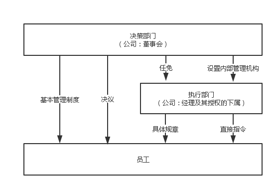
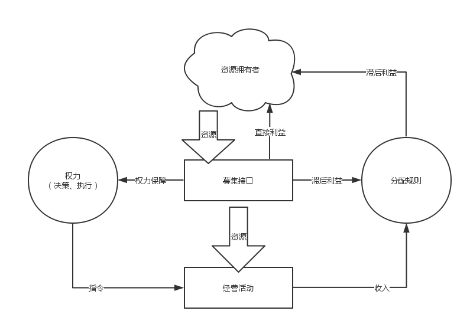
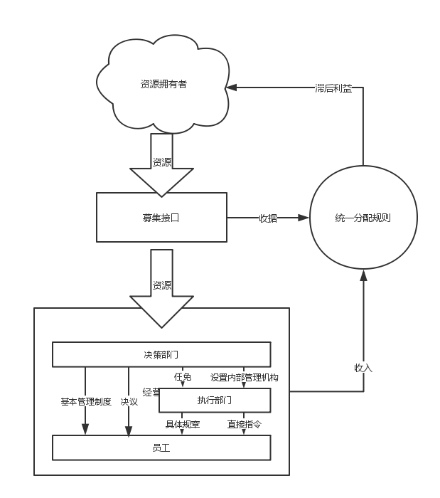

##共同体
适应力和资源募集

共同体需要不断重组以适应外界变化。常见的安排是两层机制：决策机构制定基本管理制度、发布决议，执行团队制定具体规章、下达指令。具体规章、执行指令不得违反基本管理制度、决议，从而在获得适应力的同时，也防止执行团队舞弊。

募集资源有许多方式：以现有资源交换的成本较高，以权力交换的风险较高，而以未来收入换取资源则没有这些缺点，但资源投入方的未兑现利益需要强有力的保护，尤其不能在重组时被牺牲。

###规章的修订
一般来说，员工依赖五类信息决定自己的行为：

* 历史经验（个人经验或非正式的指导）
* 直接指令
* 具体规章
* 决策部门决议
* 基本管理制度

它们需要不断修订以适应外界情况，消除内部矛盾。

只要在五种信息互相矛盾时成员清楚怎么应对，零规章起步是可以实现的。部署初期可以完全通过指令管理，执行团队不定期整理记录，把重复性的指令整理为具体规章。当执行团队由于能力或利益局限出现偏差，决策部门颁布决议和基本管理制度。一开始整理周期比较频密，稳定后可以逐渐拉长，在外界条件急剧变化时可以再次提高频率。

产品和服务是很容易参考（抄袭）的，规章的修订能力则较难复制。优秀的产品经理可以带来一定的独占期，优秀的决策部门则意味着持续的竞争优势。独占是无法持久的，竞争中获胜才是赢家。

决策者和其他成员一样，在计时模式下松懈、保守，在考核数量和质量时勇于拼搏。要组建优秀的决策部门，建模者应该设立明确的结果验收和大幅度的奖惩。良性竞争的决策部门、明确指令优先级的成员，可以纯指令、零规章启动，逐步建立竞争优势。

###常见的募集方法
以未来收入换取资源的难点在于控制（分配前的）支出。要保障资源投入方的未兑现利益，这些支出应控制在经营必须的水平上。控制方法有两种：把权力直接交给资源投入方；或设计一种难以违反的预算制度。两种方法都可能削弱竞争力，资源投入方的决策质量低下，预算制度缺乏弹性。

公司以股份募集资源，它是滞后利益与权力相结合的产物。相应的，缺乏判断力的股东是公司的最大隐患。合伙企业、合作社企业的权力归合伙人、社员，他们以高度透明的规章保障资源投入方的利益，而力图保留权力。在技术密集型的公司里，智力投入者通常控制大部分股份，它们接近于合伙企业 -- 需要以高质量的规章换取资金等资源投入。

当国内法（包括企业法规、会计制度...）所能保障的最高透明度仍然不能满足需要，共同体需要设计更高标准的规章，否则资源拥有者会要求优先兑现。优先级最高时就是从收入直接兑现，前面不安排任何支出，因而也不需要参与支出控制。

收支数额的核实也有许多种情况，数据公布的人员范围有：

* 全面开放，从内部成员、资源投入方到竞争对手，均可查阅。
* 只对未兑现利益的资源投入方开放，除了“未兑现利益”外不设置额外条件。
* 介于以上两个极端之间，核实者范围越大，执行团队舞弊难度越高。

发布方式：

* 收支发生时发布数额
* 滞后发布数额：收支发生时发布数字摘要，滞后一定时间发布详细数据

如果规则清晰到各方独立计算、结果严格一致，而且执行环节不受任何一方控制，可以用公布规则代替公布支出数额。这时，规章设计与收支核实是一体的。同样有两种实现方法：

* 规则制定后发布内容
* 滞后发布：规则制定后发布数字摘要，失效后发布详细内容

以上提及的发布方式，应该是共同体所无法删改的。至少是删改成本高于资源投入方未兑现利益的。
另外，把监事和财务人员的人事权交给资源投入方也是常见的安排。

###两种能力的矛盾
规章除了组织协作以外也要规定分配。规章修订就意味着分配规则的变化。  
而资源募集需要保障资源投入方的未兑现利益。

平衡这两种能力的矛盾是建模者的核心工作之一。

资金密集型公司通常牺牲适应力换取资源。技术密集型公司、合伙企业、合作社企业如果拥有优秀的决策部门，可以优越的制度吸引资源，保障资源投入方而不丧失权力；否则并没有优势。

一些更新颖的做法，实质上是以决策层管理模型作为募集主体：

* 决策部门公开招募、择优录用、严格淘汰，其人力资源纳入统一的资源募集接口；
* 包括执行团队在内的所有利益回报纳入统一利益分配规则，逐步兑现；

既不以现有资源换取资源，也不以权力换取资源，仅仅按照能力聘任决策者。而决策部门、执行部门的利益与资源投入者使用统一的分配规则，不能分割因而难以单方面违约。这样的机制才能同时保证两种能力优势。 

这些做法需要新的基础设施，国内法及行政管理很难表达这些模型。