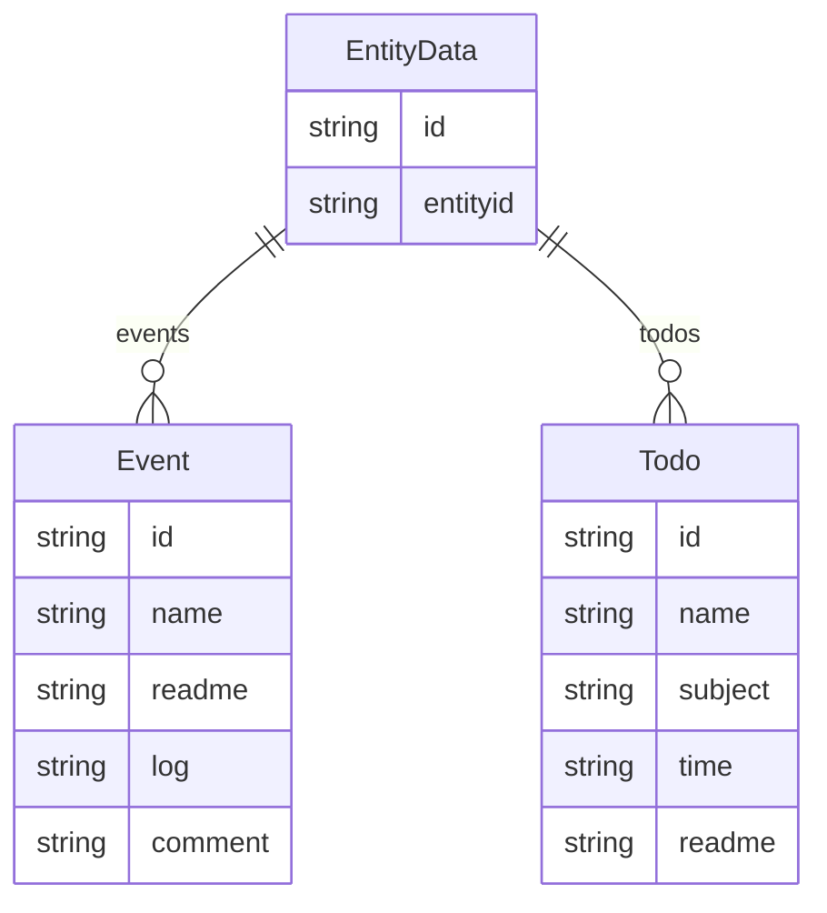

# 2024.06.11.
日小结  

<a id="top"></a>
根据[ego模型时间接口](https://gitee.com/hyg/blog/blob/master/timeflow.md)，六月中上旬补足前两月缺勤。今天绑定模版2。

<a id="index"></a>
- 07:45	[entity,ego draft](#20240611074500)  
- 14:00	[格里申法案](#20240611140000)  
- 16:00	[linkml, yaml-ld](#20240611160000)  

---
season stat:

| task | alloc | sold | hold | todo |
| --- | --- | --- | --- | --- |
| total | 16475 | 16353 | 122 | 2550 |
| PSMD | 7250 | 7236 | 14 | 465 |
| learn | 1250 | 1362 | -112 | 1080 |
| ego | 4700 | 4654 | 46 | 450 |
| js | 1375 | 1248 | 127 | 300 |
| xuemen | 1300 | 1253 | 47 | 255 |
| raw | 600 | 570 | 30 | 0 |
| infra | 0 | 30 | -30 | 0 |

---

waiting list:


- 30分钟时间片：
  - js的第1号事项：学习AMD规范，如果适用就开发范例
  - ego的第2号事项：用commander的.command()或.addCommand()改写入口
  - js的第4号事项：日期格式化
  - learn的第4号事项：寻找可编程的,去中心化的信息发布方式

- 60分钟时间片：
  - PSMD的第1号事项：格里申法案
  - learn的第1号事项：linkml, yaml-ld
  - js的第2号事项：学习 nodejs test框架
  - xuemen的第2号事项：term.e6f0caec -> xuemen COD metadata-S2状态下的部门模型

- 90分钟时间片：
  - ego的第1号事项：ego draft, metadata
  - learn的第2号事项：拟制说、目的财产说、实在说
  - ego的第3号事项：根据ego对外信息接口编写页面代码
  - PSMD的第3号事项：以1406为例检查知识图谱和blawx的语法

- 195分钟时间片：
  - xuemen的第1号事项：重新设计S2状态下的学门基本管理制度
  - PSMD的第2号事项：term + COM matedata -> deploy metadata -> deploy view
  - learn的第14号事项：rust入门

---

<a href="mailto:huangyg@mars22.com?subject=关于2024.06.11.[entity,ego draft]任务&body=日期: 20240611%0D%0A序号: 0%0D%0A手稿:../../draft/2024/06/20240611074500.md%0D%0A---请勿修改邮件主题及以上内容 从下一行开始写您的想法---%0D%0A">[email]</a> | [top](#top) | [index](#index)
<a id="20240611074500"></a>
## 7:45~10:59
ego  [entity,ego draft]

- 跨层沟通
    - 同层沟通各自定义protocol，自动对接
        - 自用模型互相开放的protocol
            - 相兼容protocol互相访问metadata和view
                - 与浅层沟通的protocol是其中内容
    - 跨层由深层定义沟通protocol
        - 深层->浅层: metadata->定制view
        - 浅层->深层: 定制UI->metadata
- 再次设计划分层级的定义
    - 方案一：沿着浅层->深层: 定制UI->metadata 接口，直接提交metadata。
        - 进一步，自动生成metadata，提供代码和数据，可以部署到第三方运行；
    - 方案二：沿着深层->浅层: metadata->定制view接口，直接复原metadata。
        - 进一步，自动处理metadata，提供代码和数据，可以部署到第三方运行；
    - 进一步，跨层接口和反接口抵消，双方确认同层关系。

---

<a href="mailto:huangyg@mars22.com?subject=关于2024.06.11.[格里申法案]任务&body=日期: 20240611%0D%0A序号: 1%0D%0A手稿:../../draft/2024/06/20240611140000.md%0D%0A---请勿修改邮件主题及以上内容 从下一行开始写您的想法---%0D%0A">[email]</a> | [top](#top) | [index](#index)
<a id="20240611140000"></a>
## 14:00~15:29
PSMD  [格里申法案]

- https://www.secrss.com/articles/11191
- https://www.faxin.cn/lib/flwx/FlqkContent.aspx?gid=F662676
- 继续追加时间。

---

<a href="mailto:huangyg@mars22.com?subject=关于2024.06.11.[linkml, yaml-ld]任务&body=日期: 20240611%0D%0A序号: 2%0D%0A手稿:../../draft/2024/06/20240611160000.md%0D%0A---请勿修改邮件主题及以上内容 从下一行开始写您的想法---%0D%0A">[email]</a> | [top](#top) | [index](#index)
<a id="20240611160000"></a>
## 16:00~16:59
learn  [linkml, yaml-ld]

- https://linkml.io/linkml/schemas/models.html
- https://linkml.io/linkml/intro/tutorial02.html
    - https://linkml.io/linkml-model/latest/docs/tree_root/
    - https://linkml.io/linkml-model/latest/docs/multivalued/
    - https://linkml.io/linkml-model/latest/docs/inlined_as_list/
        - https://linkml.io/linkml/schemas/inlining.html
    - https://linkml.io/linkml-model/latest/docs/range/
- 在entity.yaml中增加Event、Todo、EntityData类。
    - gen-json-schema entity.yaml 通过
- 把Entity类的event、todo合并为data，range设为EntityData，通过。
```
D:\huangyg\git\ego\data>gen-yuml entity.yaml
https://yuml.me/diagram/nofunky;dir:TB/class/[EntityData|id:string %3F;entityid:string %3F]++- todos 0..*>[Todo|id:string %3F;name:string %3F;subject:string %3F;time:string %3F;readme:string %3F],[EntityData]++- events 0..*>[Event|id:string %3F;name:string %3F;readme:string %3F;log:string %3F;comment:string %3F],[Entity|id:string %3F;name:string %3F;aliases:string %3F;cognize:string %3F]++- data 0..1>[EntityData],[Entity]^-[Ego|id:string;name:string;protocol:string %3F;offer:string %3F;aliases(i):string %3F;cognize(i):string %3F],[Ego]
D:\huangyg\git\ego\data>gen-plantuml entity.yaml
@startuml
skinparam nodesep 10
hide circle
hide empty members
class "EntityData" {
    {field} id: string [opt]
    {field} entityid: string [opt]
}
class "Todo" {
    {field} id: string [opt]
    {field} name: string [opt]
    {field} subject: string [opt]
    {field} time: string [opt]
    {field} readme: string [opt]
}
"EntityData" *--> "0..*" "Todo" : "todos"
class "Event" {
    {field} id: string [opt]
    {field} name: string [opt]
    {field} readme: string [opt]
    {field} log: string [opt]
    {field} comment: string [opt]
}
"EntityData" *--> "0..*" "Event" : "events"
class "Entity" {
    {field} id: string [opt]
    {field} name: string [opt]
    {field} aliases: string [opt]
    {field} cognize: string [opt]
}
"Entity" *--> "0..1" "EntityData" : "data"
class "Ego" {
    {field} id: string [req]
    {field} name: string [req]
    {field} protocol: string [opt]
    {field} offer: string [opt]
    {field} aliases(i): string [opt]
    {field} cognize(i): string [opt]
}
"Entity" ^-- "Ego"
@enduml
```

- D:\huangyg\git\ego\data>gen-erdiagram entity.yaml
WARNING:rdflib.term:C:\Users\hyg\AppData\Local\Programs\Python\Python312\Lib\site-packages\linkml_runtime\linkml_model\model\schema\types does not look like a valid URI, trying to serialize this will break.

- gen-yuml -f png -d . entity.yaml 成功
- 继续学习：
    - '60': linkml, yaml-ld
      readme: |
        - https://linkml.io/linkml/schemas/models.html
        - https://linkml.io/linkml/intro/tutorial03.html
