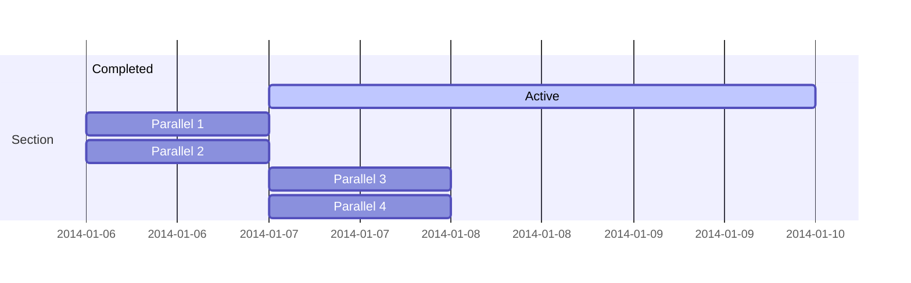

# 2024.07.14.
日小结  

<a id="top"></a>
根据[ego模型时间接口](https://gitee.com/hyg/blog/blob/master/timeflow.md)，今天绑定模版1。

<a id="index"></a>
- 14:00	[Query fundamentals https://console.neo4j.io](#20240714140000)  
- 14:30	[mermaid](#20240714143000)  
- 16:00	[syncthing sample](#20240714160000)  

---
season stat:

| task | alloc | sold | hold | todo |
| --- | --- | --- | --- | --- |
| total | 17700 | 2647 | 15053 | 3465 |
| PSMD | 7000 | 402 | 6598 | 630 |
| ego | 4000 | 862 | 3138 | 510 |
| infra | 2000 | 90 | 1910 | 0 |
| xuemen | 1500 | 30 | 1470 | 645 |
| raw | 500 | 90 | 410 | 60 |
| learn | 1500 | 722 | 778 | 1110 |
| js | 1200 | 451 | 749 | 510 |

---

waiting list:


- 30分钟时间片：
  - learn的第6号事项：Query fundamentals https://console.neo4j.io
  - js的第8号事项：text->id,protobuf-javascript
  - js的第9号事项：用day.js改写util.js

- 60分钟时间片：
  - learn的第1号事项：hypercore sample
  - raw的第1号事项：自动从网页提取营养成分表
  - js的第2号事项：git sample
  - ego的第3号事项：设计subtask与todo的关系，保持工作的持续连贯。

- 90分钟时间片：
  - ego的第1号事项：使用新版day、season、waitinglist的ego.js
  - js的第1号事项：helia and orbitdb sample
  - PSMD的第2号事项：term metadata的序号，分为显示序号和唯一id两种。
  - ego的第2号事项：根据ego对外信息接口编写页面代码

- 195分钟时间片：
  - PSMD的第1号事项：data -> schema 迭代范例
  - xuemen的第1号事项：关于对《北京市自动驾驶汽车条例（征求意见稿）》公开征集意见的公告
  - xuemen的第2号事项：kernel模型升级
  - PSMD的第3号事项：term + COM matedata -> deploy metadata -> deploy view

---

<a href="mailto:huangyg@mars22.com?subject=关于2024.07.14.[Query fundamentals https://console.neo4j.io]任务&body=日期: 20240714%0D%0A序号: 0%0D%0A手稿:../../draft/2024/07/20240714140000.md%0D%0A---请勿修改邮件主题及以上内容 从下一行开始写您的想法---%0D%0A">[email]</a> | [top](#top) | [index](#index)
<a id="20240714140000"></a>
## 14:00~14:29
learn: [Query fundamentals https://console.neo4j.io]

- https://console.neo4j.io/连接不上。
- 先完成后面任务。

---

<a href="mailto:huangyg@mars22.com?subject=关于2024.07.14.[mermaid]任务&body=日期: 20240714%0D%0A序号: 1%0D%0A手稿:../../draft/2024/07/20240714143000.md%0D%0A---请勿修改邮件主题及以上内容 从下一行开始写您的想法---%0D%0A">[email]</a> | [top](#top) | [index](#index)
<a id="20240714143000"></a>
## 14:30~14:59
js: [mermaid]

- https://mermaid.nodejs.cn/
    - D:\huangyg\git\js.sample\chart\mermaid.html firefox和edge都只显示文本。
    - https://www.npmjs.com/package/mermaid
    - https://github.com/mermaid-js/mermaid/blob/HEAD/README.zh-CN.md
        - npm install mermaid
    - 在vscodium安装mermaid editer插件。
        - 创建mmd后缀的纯文本文件，按照mermaid语法编辑。
        - 点击右上方眼睛按键、ctrl+alt+[ ，都可以查看图。
        - 右键生成图形，同路径下出现svg文件，但是已损坏。
        - 在插件设置里改为生成png文件，成功。
    - draw.io中，调整图形-插入-高级-mermaid
        - https://www.drawio.com/blog/mermaid-diagrams
    - md文件中嵌入mermaid，在vscodium中不安装插件，在preview没有正确效果。也许github们可以。


---
title: My PR
---
Figure 17 shows a simple A to B process.
some markdown text
...
 
    graph TB
    A --> B


Figure 17. A to B
more text

- https://www.mermaidchart.com/
    - Mermaid Chart 是一个基于 Web 的图表编辑器，允许你在浏览器中创建和编辑图表。它是由 Mermaid 背后的团队构建的。

- 以后可以用来mermaid作为工作语言，纯文本方便git管理。

---

<a href="mailto:huangyg@mars22.com?subject=关于2024.07.14.[syncthing sample]任务&body=日期: 20240714%0D%0A序号: 2%0D%0A手稿:../../draft/2024/07/20240714160000.md%0D%0A---请勿修改邮件主题及以上内容 从下一行开始写您的想法---%0D%0A">[email]</a> | [top](#top) | [index](#index)
<a id="20240714160000"></a>
## 16:00~16:59
js: [syncthing sample]

- https://docs.syncthing.net/dev/rest.html
```
D:\huangyg\git\js.sample\syncthing>curl -H "X-API-Key: your key" localhost:8384/rest/system/browse?current=d:\\
[
  "d:\\$RECYCLE.BIN",
  "d:\\0-download",
  "d:\\BaiduNetdiskDownload",
  "d:\\D.2023",
  "d:\\SYDownload",
  "d:\\System Volume Information",
  "d:\\huangyg"
]
```
- https://github.com/JodusNodus/node-syncthing
    - npm i node-syncthing --save
    - https://blog.csdn.net/u014378628/article/details/134555420
    - 其实就是REST API的封装，把 /rest/endpoint/method/  映射到 syncthing.endpoint.method(option...
```
D:\huangyg\git\js.sample\syncthing>node sync
(node:17164) [DEP0040] DeprecationWarning: The `punycode` module is deprecated. Please use a userland alternative instead.
(Use `node --trace-deprecation ...` to show where the warning was created)
{
  '5VUN4GT-LD6OWJV-GSNEDSH-MRF5KAN-EPZWBBS-OJYUKJ4-Q76XX36-FOANBAR': { lastSeen: '1970-01-01T08:00:00+08:00', lastConnectionDurationS: 0 },
  'U6U7A32-W7SKQBO-M7A57W6-XPMZF52-Z55LGQT-D3EID5L-UIAHK7A-PC7LDAV': {
    lastSeen: '2024-07-05T11:48:30+08:00',
    lastConnectionDurationS: 104.4984509
  }
}
pong
pong
{
  default: {
    lastFile: { at: '0001-01-01T00:00:00Z', filename: '', deleted: false },
    lastScan: '2024-07-14T16:19:52+08:00'
  },
  draft2407: {
    lastFile: { at: '0001-01-01T00:00:00Z', filename: '', deleted: false },
    lastScan: '2024-07-14T16:19:52+08:00'
  }
}
```
- 依赖于syncthing desktop的外挂，不是独立节点。不适合终端用户，适合自己使用，能让syncthing自动化一点。等需求明朗再根据业务需求试试。
