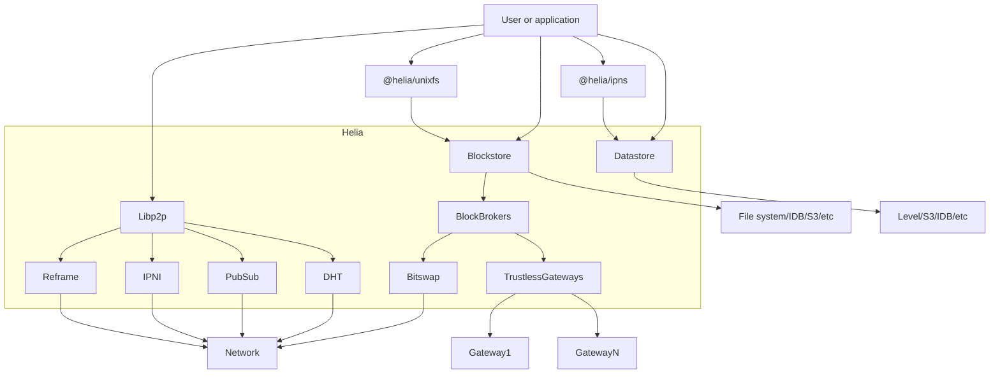

# 2024.07.15.
日小结

<a id="top"></a>
根据[ego模型时间接口](https://gitee.com/hyg/blog/blob/master/timeflow.md)，今天绑定模版2(2)。

<a id="index"></a>
- 09:30~11:29	ego: [undefined](#20240715093000)
- 14:00~15:39	js: [undefined](#20240715140000)
- 16:00~17:29	learn: [undefined](#20240715160000)

---
season stat:

| task | alloc | sold | hold | todo |
| :---: | ---: | ---: | ---: | ---: |
| total | 17700 | 2887 | 14813 | 3405 |
| PSMD | 7000 | 402 | 6598 | 630 |
| ego | 4000 | 952 | 3048 | 420 |
| infra | 2000 | 90 | 1910 | 0 |
| xuemen | 1500 | 30 | 1470 | 645 |
| raw | 500 | 90 | 410 | 60 |
| learn | 1500 | 782 | 718 | 1050 |
| js | 1200 | 541 | 659 | 600 |

---
waiting list:


- 30分钟时间片：
  - js的第1号事项：限定nodejs版本
  - learn的第5号事项：Query fundamentals https://console.neo4j.io
  - js的第9号事项：text->id,protobuf-javascript
  - js的第10号事项：用day.js改写util.js

- 60分钟时间片：
  - raw的第1号事项：自动从网页提取营养成分表
  - ego的第2号事项：设计subtask与todo的关系，保持工作的持续连贯。
  - learn的第2号事项：schema in ipld
  - learn的第3号事项：linkml, yaml-ld

- 90分钟时间片：
  - ego的第1号事项：根据ego对外信息接口编写页面代码
  - learn的第1号事项：pear api sample
  - PSMD的第2号事项：term metadata的序号，分为显示序号和唯一id两种。
  - js的第2号事项：try "@helia/ipns" sample

- 195分钟时间片：
  - PSMD的第1号事项：data -> schema 迭代范例
  - xuemen的第1号事项：关于对《北京市自动驾驶汽车条例（征求意见稿）》公开征集意见的公告
  - xuemen的第2号事项：kernel模型升级
  - PSMD的第3号事项：term + COM matedata -> deploy metadata -> deploy view

---
<a href="mailto:huangyg@mars22.com?subject=关于2024.07.15.[无名任务]任务&body=日期: 2024.07.15.%0D%0A序号: 0%0D%0A手稿:../../draft/2024/07/20240715093000.md%0D%0A---请勿修改邮件主题及以上内容 从下一行开始写您的想法---%0D%0A">[email]</a> | [top](#top) | [index](#index)
<a id="20240715093000"></a>
# 9:30~10:59
ego: [使用新版day、season、waitinglist的ego.js]

- 整理maketomorowinfo()、testdayplan()到新版day.js
- maketomorrowinfo: function ()
    - 函数名拼写错误。
    - 不需要参数，只生成明天计划。
```
D:\huangyg\git\ego\src>node --test
maketomorrowinfo> dayinfo file name:
../../blog/release/time/d.20240716.md
content:
# 2024.08.16.

根据[ego模型时间接口](https://gitee.com/hyg/blog/blob/master/timeflow.md)，每天早起根据身心状况绑定模版。

---
如果绑定模版2a可能安排以下任务：

- 07:45 data -> schema 迭代范例 -PSMD[0]
- 14:00 根据ego对外信息接口编写页面代码 -ego[0]
- 16:00 git sample -js[0]

---
如果绑定模版2b可能安排以下任务：

- 09:30 根据ego对外信息接口编写页面代码 -ego[0]
- 14:00 pear api sample -learn[0]
- 16:00 git sample -js[0]

---
如果绑定模版2c可能安排以下任务：

- 14:00 根据ego对外信息接口编写页面代码 -ego[0]
- 16:00 git sample -js[0]

---
如果绑定模版1a可能安排以下任务：

- 07:45 git sample -js[0]
- 09:30 根据ego对外信息接口编写页面代码 -ego[0]
- 14:00 Query fundamentals https://console.neo4j.io -learn[4]
- 14:30 text->id,protobuf-javascript -js[6]
- 16:00 自动从网页提取营养成分表 -raw[0]

---
如果绑定模版1b可能安排以下任务：

- 09:30 根据ego对外信息接口编写页面代码 -ego[0]
- 14:00 Query fundamentals https://console.neo4j.io -learn[4]
- 14:30 text->id,protobuf-javascript -js[6]
- 16:00 git sample -js[0]

---
如果绑定模版1c可能安排以下任务：

- 14:00 Query fundamentals https://console.neo4j.io -learn[4]
- 14:30 text->id,protobuf-javascript -js[6]
- 16:00 git sample -js[0]

---
如果绑定模版1d可能安排以下任务：

- 14:00 Query fundamentals https://console.neo4j.io -learn[4]
- 14:30 text->id,protobuf-javascript -js[6]
- 16:00 git sample -js[0]

---
如果绑定模版1e可能安排以下任务：

- 16:00 git sample -js[0]

---
如果绑定模版1f可能安排以下任务：


---
对任务排序的建议请点击这个链接<a href="mailto:huangyg@mars22.com?subject=关于2024.08.16.任务排序的建议&body=date: Fri Aug 16 2024 00:00:00 GMT+0800 (中国标准时间)%0D%0Afile: ../../blog/release/time/d.20240716.md%0D%0A---请勿修改邮件主题及以上内容---%0D%0A">发送电子邮件</a>，日计划确定后会在本页 面发布。
```
- testdayplan()
    - 取消这个函数，合并到maketomorrowinfo里。
    - 浮动作息情况，无法生成精确的时间表，只列出工作任务就可以了。
- https://github.com/tj/commander.js/blob/HEAD/Readme_zh-CN.md#%E5%91%BD%E4%BB%A4
```
D:\huangyg\git\ego\src>node ego day
Usage: ego day [options] [command]

以天为单位的自我管理功能

Options:
  -h, --help      display help for command

Commands:
  init <mode>     初始化：绑定时间模版，创建日计划、次日规划、手稿及元数据文件。
  over [diff]     工作结束，生成日小结、更新次日规划。
  plan            显示次日规划，不更新任何文件。
  test [data]     测试新代码
  help [command]  display help for command
  ```
  - D:\huangyg\git\ego\src\node_modules\commander\typings\index.d.ts 中options()有defaultValue，command没有。
  - over后面的参数不能是diff，因为负数会转成参数，如果强行写字符串，后面用parseint()转成NaN，原因未明。
  - str2time()中new Date()的月份是monthindex，因此要减1，字符串可以直接减，会自动转换。
  - init,over,plan,test测试通过，可以开始实际使用。稳定后可以删除ego1.js、start.js、finish.js。
  
---
<a href="mailto:huangyg@mars22.com?subject=关于2024.07.15.[无名任务]任务&body=日期: 2024.07.15.%0D%0A序号: 1%0D%0A手稿:../../draft/2024/07/20240715140000.md%0D%0A---请勿修改邮件主题及以上内容 从下一行开始写您的想法---%0D%0A">[email]</a> | [top](#top) | [index](#index)
<a id="20240715140000"></a>
## 14:00~15:29
js: [helia and orbitdb sample]

- https://helia.io/

- https://github.com/ipfs/helia
- https://www.npmjs.com/package/helia
- helia是ipfs的js包，做由内容生成的固定地址的。它上面应该用内容可变的地址封装一层，以便用户读取。ipns和OrbitDB 两种都试试。
- npm install helia 报错。
- npm cache clean --force 之后再装还是报错。
- npm  config set registry http://registry.npm.taobao.org 之后还是报错。
- https://github.com/ipfs-examples
    - https://github.com/ipfs-examples/helia-examples/blob/main/examples/helia-script-tag 把index.js、index.html在本地运行，没有响应。
- 去ubuntu机器nodejs v10.8.1.下测试
    - 同一个js文件可以put、get。
    - 把cid复制到另一个js文件，无法get。
- https://api.orbitdb.org/
    - npm install @orbitdb/core
    - npm install libp2p
    - helia安装失败，去ubuntu机器nodejs v10.8.1下测试。
    - 网页中范例不能正常运行。line 8 “const mydb = await orbitdb.open('mydb')”出错。
- 不能确定helia、orbitdb是否适合，追加todo项：
    - '30': 限定nodejs版本
      readme: |
        - https://segmentfault.com/q/1010000042599510
      bind:
        - '60': helia, orbitdb sample
          readme: |
            - readme 2024.07.15. 14:00 draft
    - '90': @helia/ipns sample
      readme: |
        - https://github.com/ipfs/helia-ipns
        - https://github.com/ipfs/js-ipns

---
<a href="mailto:huangyg@mars22.com?subject=关于2024.07.15.[无名任务]任务&body=日期: 2024.07.15.%0D%0A序号: 2%0D%0A手稿:../../draft/2024/07/20240715160000.md%0D%0A---请勿修改邮件主题及以上内容 从下一行开始写您的想法---%0D%0A">[email]</a> | [top](#top) | [index](#index)
<a id="20240715160000"></a>
## 16:00~16:59
learn: [hypercore sample]

- https://github.com/holepunchto/hypercore/tree/main/examples
- D:\huangyg\git\js.sample\dat\hypercore.js
- npm i hyperswarm
```
D:\huangyg\git\js.sample\dat>node hypercore
core.id:  bc1wwrypornf96o3dtkf14ribhuxhzhdf115b1a3o41xb3csicgo
core.key:  <Buffer 0b 25 4a 10 0d 81 04 5f fa 19 1c 54 59 68 95 0f 26 fe 5f 83 2c a5 b0 cb 19 86 a4 f0 e5 96 ab 0d>
core: Hypercore(
  id: bc1wwrypornf96o3dtkf14ribhuxhzhdf115b1a3o41xb3csicgo
  key: 0b254a100d81045ffa191c545968950f26fe5f832ca5b0cb1986a4f0e596ab0d
  discoveryKey: d6e20f7d6a9131b16a7e2acab9294b1b4ca4dc323d46f6a31038dd7c1a334062
  opened: true
  closed: false
  snapshotted: false
  sparse: true
  writable: true
  length: 27
  fork: 0
  sessions: [ 1 ]
  activeRequests: [ 0 ]
  peers: [ 0 ]
)
core was updated? false length is 27
has: true
block 2: batch block 2
```
- D:\huangyg\git\js.sample\dat\lookup.js
```
D:\huangyg\git\js.sample\dat>node lookup 0b254a100d81045ffa191c545968950f26fe5f832ca5b0cb1986a4f0e596ab0d
core.id:  bc1wwrypornf96o3dtkf14ribhuxhzhdf115b1a3o41xb3csicgo
core.key:  <Buffer 0b 25 4a 10 0d 81 04 5f fa 19 1c 54 59 68 95 0f 26 fe 5f 83 2c a5 b0 cb 19 86 a4 f0 e5 96 ab 0d>
core: Hypercore(
  id: bc1wwrypornf96o3dtkf14ribhuxhzhdf115b1a3o41xb3csicgo
  key: 0b254a100d81045ffa191c545968950f26fe5f832ca5b0cb1986a4f0e596ab0d
  discoveryKey: d6e20f7d6a9131b16a7e2acab9294b1b4ca4dc323d46f6a31038dd7c1a334062
  opened: true
  closed: false
  snapshotted: false
  sparse: true
  writable: false
  length: 0
  fork: 0
  sessions: [ 1 ]
  activeRequests: [ 0 ]
  peers: [ 0 ]
)
batch block 2
I am a block of data
batch block 1
```
- 在ubuntu机器运行lookup
```
huangyg@dev:~/git/js.sample/dat$ node lookup 0b254a100d81045ffa191c545968950f26fe5f832ca5b0cb1986a4f0e596ab0d
core.id:  bc1wwrypornf96o3dtkf14ribhuxhzhdf115b1a3o41xb3csicgo
core.key:  <Buffer 0b 25 4a 10 0d 81 04 5f fa 19 1c 54 59 68 95 0f 26 fe 5f 83 2c a5 b0 cb 19 86 a4 f0 e5 96 ab 0d>
core: Hypercore(
  id: bc1wwrypornf96o3dtkf14ribhuxhzhdf115b1a3o41xb3csicgo
  key: 0b254a100d81045ffa191c545968950f26fe5f832ca5b0cb1986a4f0e596ab0d
  discoveryKey: d6e20f7d6a9131b16a7e2acab9294b1b4ca4dc323d46f6a31038dd7c1a334062
  opened: true
  closed: false
  snapshotted: false
  sparse: true
  writable: false
  length: 0
  fork: 0
  sessions: [ 1 ]
  activeRequests: [ 0 ]
  peers: [ 0 ]
)
batch block 2
I am a block of data
batch block 1
```
- 在xuemen.com执行，因为ubnutu版本低，需要控制nodejs版本不要太高。
```
huangyg@debug010000002015:~/git/js.sample/dat$ node lookup 0b254a100d81045ffa191c545968950f26fe5f832ca5b0cb1986a4f0e596ab0d
core.id:  bc1wwrypornf96o3dtkf14ribhuxhzhdf115b1a3o41xb3csicgo
core.key:  <Buffer 0b 25 4a 10 0d 81 04 5f fa 19 1c 54 59 68 95 0f 26 fe 5f 83 2c a5 b0 cb 19 86 a4 f0 e5 96 ab 0d>
core: Hypercore(
  id: bc1wwrypornf96o3dtkf14ribhuxhzhdf115b1a3o41xb3csicgo
  key: 0b254a100d81045ffa191c545968950f26fe5f832ca5b0cb1986a4f0e596ab0d
  discoveryKey: d6e20f7d6a9131b16a7e2acab9294b1b4ca4dc323d46f6a31038dd7c1a334062
  opened: true
  closed: false
  snapshotted: false
  sparse: true
  writable: false
  length: 0
  fork: 0
  sessions: [ 1 ]
  activeRequests: [ 0 ]
  peers: [ 0 ]
)
batch block 2
I am a block of data
batch block 1
```
- 在xuemen.com运行服务端hypercore.js
```
huangyg@debug010000002015:~/git/js.sample/dat$ node hypercore
core.id:  osfs3d5pixbbgqh9hcn5uzwhidmcpfb161esjkrf4h8re3d3izko
core.key:  <Buffer 85 8b 6c 8f 6d ab c2 13 3b 9f e3 05 b9 de 9c a8 d6 c6 94 32 f4 91 64 a8 85 d7 0e 44 64 79 ad d5>
core: Hypercore(
  id: osfs3d5pixbbgqh9hcn5uzwhidmcpfb161esjkrf4h8re3d3izko
  key: 858b6c8f6dabc2133b9fe305b9de9ca8d6c69432f49164a885d70e446479add5
  discoveryKey: 1f2ce11e02711b496e8dcfb54a7afc8060d2d2dce0924be110d12ba0bb9c6b63
  opened: true
  closed: false
  snapshotted: false
  sparse: true
  writable: true
  length: 6
  fork: 0
  sessions: [ 1 ]
  activeRequests: [ 0 ]
  peers: [ 0 ]
)
has: true
block 2: batch block 12
Core: 858b6c8f6dabc2133b9fe305b9de9ca8d6c69432f49164a885d70e446479add5
```
- 在本地运行客户端lookup.js
```
D:\huangyg\git\js.sample\dat>node lookup 858b6c8f6dabc2133b9fe305b9de9ca8d6c69432f49164a885d70e446479add5
core.id:  osfs3d5pixbbgqh9hcn5uzwhidmcpfb161esjkrf4h8re3d3izko
core.key:  <Buffer 85 8b 6c 8f 6d ab c2 13 3b 9f e3 05 b9 de 9c a8 d6 c6 94 32 f4 91 64 a8 85 d7 0e 44 64 79 ad d5>
core: Hypercore(
  id: osfs3d5pixbbgqh9hcn5uzwhidmcpfb161esjkrf4h8re3d3izko
  key: 858b6c8f6dabc2133b9fe305b9de9ca8d6c69432f49164a885d70e446479add5
  discoveryKey: 1f2ce11e02711b496e8dcfb54a7afc8060d2d2dce0924be110d12ba0bb9c6b63
  opened: true
  closed: false
  snapshotted: false
  sparse: true
  writable: false
  length: 0
  fork: 0
  sessions: [ 1 ]
  activeRequests: [ 0 ]
  peers: [ 0 ]
)
batch block 12
```
- hypercore,hyperswarm可以进一步在项目中使用，分发root metadata用。
