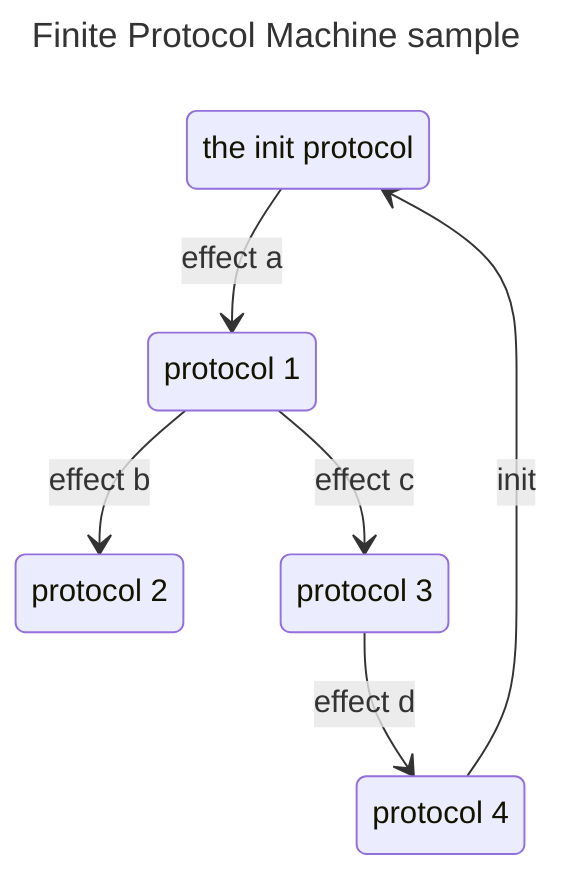

# 2024.07.23.
日小结

根据[ego模型时间接口](https://gitee.com/hyg/blog/blob/master/timeflow.md)，今天绑定模版2(2a)。

- 07:45~09:14	PSMD: [整理新版本term的manifest code](#20240723074500)
- 14:00~14:59	ego: [schema level 2 schema for code v1](#20240723140000)
- 16:00~16:59	PSMD: [knowledge model(protocol.log -> protocol + effect)](#20240723160000)

---
season stat:

| task | alloc | sold | hold | todo |
| :---: | ---: | ---: | ---: | ---: |
| total | 17700 | 5162 | 12538 | 3480 |
| PSMD | 7000 | 1037 | 5963 | 555 |
| ego | 4000 | 1472 | 2528 | 765 |
| infra | 2000 | 90 | 1910 | 0 |
| xuemen | 1500 | 120 | 1380 | 450 |
| raw | 500 | 150 | 350 | 180 |
| learn | 1500 | 1207 | 293 | 870 |
| js | 1200 | 1086 | 114 | 660 |

---
waiting list:

- 30分钟时间片：
  - js的第1号事项：learn helia ipns,reading time.
  - learn的第2号事项：linkml, yaml-ld, reading time.
  - js的第2号事项：learn ssb db,reading time.
  - learn的第3号事项：Decentralized Identifiers

- 60分钟时间片：
  - raw的第1号事项：自动从网页提取营养成分表
  - learn的第1号事项：learn ipld,reading time.
  - ego的第2号事项：eventemitter sample
  - raw的第2号事项：设计新版raw.js架构。

- 90分钟时间片：
  - PSMD的第1号事项：FPM(finite protocol machine) model
  - PSMD的第2号事项：整理新版本term的manifest code
  - PSMD的第4号事项：以1406为例检查知识图谱和blawx的语法
  - PSMD的第5号事项：term metadata的序号，分为显示序号和唯一id两种。

- 195分钟时间片：
  - ego的第1号事项：新版ego, instance or model, any manifest
  - xuemen的第1号事项：kernel模型升级
  - xuemen的第2号事项：重新设计S2状态下的学门基本管理制度
  - PSMD的第3号事项：term + COM matedata -> deploy metadata -> deploy view

---
<a href="mailto:huangyg@mars22.com?subject=关于2024.07.23.[整理新版本term的manifest code]任务&body=日期: 2024.07.23.%0D%0A序号: 5%0D%0A手稿:../../draft/2024/07/20240723074500.md%0D%0A---请勿修改邮件主题及以上内容 从下一行开始写您的想法---%0D%0A">[email]</a> | [top](#top) | [index](#index)

## 7:45~10:59
PSMD: [整理新版本term的manifest code]

- readme: |
      - read 2024.07.22. 09:30 draft
      - read D:\huangyg\git\draft\2024\07\20240721160000.md
      - 设计前置protocol的定义和数据表现
      - 逐个条款签署和整份protocol签署的关系，是否还需要嵌套term。
        - 设计每项知识的思考和案例积累锚点。
- 前置protocol的公示，可以作为实践结果，不作为要求。真正可以作为要求的是：
    - 自身的行为及其原因，可以自述的范围：标出理性与非理性（下意识）行为的边界。
    - 对待自身与其他方采取相同标准的范围：标出公平与（无法自控、无法意识到的）歧视的边界。
    - 上述范围与边界对合作行为有明显影响，是protocol可以要求参与者公示的。为了展示自身的范围和边界，最佳方式就是展示前置protocol和历史记录，今后发现更好的展示方式（前置protocol无法表达的）可以随之修订。
- 新版term的切分，主要考虑manifest code 中fsm的完整性。关于执行效果的积累锚点应该也是这样。
- 在个人领域视角，protocol是个人的补丁，protocol所定义的术语、资产map（映射）到个人的术语、资产列表中，protocol所定义的行为并入到个人的行为中。映射和并入是个人领域的原生操作。
- 今天主要还是补充manifest text的内容，登记90分钟，再追加时间。
    - '90': 整理新版本term的manifest code
      readme: |
        - read 2024.07.23. 07:45 draft
        - read 2024.07.22. 09:30 draft
        - read D:\huangyg\git\draft\2024\07\20240721160000.md
        - 设计前置protocol的定义和数据表现
        - 逐个条款签署和整份protocol签署的关系，是否还需要嵌套term。
          - 设计每项知识的思考和案例积累锚点。
        - 随之修订manifest text。

---
<a href="mailto:huangyg@mars22.com?subject=关于2024.07.23.[schema level 2 schema for code v1]任务&body=日期: 2024.07.23.%0D%0A序号: 7%0D%0A手稿:../../draft/2024/07/20240723140000.md%0D%0A---请勿修改邮件主题及以上内容 从下一行开始写您的想法---%0D%0A">[email]</a> | [top](#top) | [index](#index)

## 14:00~15:29
ego: [schema level 2 schema for code v1]

- read manifest text: D:\huangyg\git\js.sample\schema\schema.md
- schema for data are linkml, json schema, ipld's DSL or DMT files.
- schema for code is
    - infra使用的方案：event and emit 机制，使用共享的event名称穿透两方的代码。
    - 自定义module接口规范。
- D:\huangyg\git\js.sample\schema\schemeforcodev0.yaml
- 登记60分钟，插入复习任务：
    - '60': eventemitter sample
      readme: |
        - event listener in module
        - auto load the event listener in main js file
          - load them in a function in module
          - load them in main js file use metadata
      bind:
        - '60': schema level 2 schema for code v1
          readme: |
            - schema means "task level and stage defined by schema"
            - schema manifest code: generate tasks by level and stage define by schema
            - schame level 2 schema for code: schema for develop "generate tasks by level and stage define by schema
    
---
<a href="mailto:huangyg@mars22.com?subject=关于2024.07.23.[knowledge model(protocol.log -> protocol + effect)]任务&body=日期: 2024.07.23.%0D%0A序号: 9%0D%0A手稿:../../draft/2024/07/20240723160000.md%0D%0A---请勿修改邮件主题及以上内容 从下一行开始写您的想法---%0D%0A">[email]</a> | [top](#top) | [index](#index)

## 16:00~16:59
PSMD: [knowledge model(protocol.log -> protocol + effect)]

- read D:\huangyg\git\draft\2024\07\20240722160000.md
- (protocol.log -> protocol + effect) 不用knowledge这个词，缩小为有限协议机FPM（finite protocol machine：
    - （p0,{p},{e},F{(p)->(p,e)}）
    - p0：初始protocol
    - {p}：protocol的集合。其中protocol可以用FSM定义:
        - (s0,{s},{e},{a},F{(s,e)->(s,a)})
        - s0：初始状态
        - {s}： state的集合
        - {e}：event的集合
        - {a}：action的集合
        - F：(s,e)->(s,a)的函数
    - {e}：effect的集合
    - F：(p)->(p,e)的函数。(protocol.log -> protocol + effect)

- protocol deployment：协议的部署表现为FSM合并。
    - (s0,{s},{e},{a},F(s,e)->(s,a)) 的合并：joint(FSM1,(sn1,e,a),{newname: oldname})
        - FSM1的s01作为合并后的s0
        - 增加F(sn1,e)->(s02,a)，接入S02
        - 旧名称到新名称的映射，其它四个集合都合并
    - role,asset,interface,alloc的合并: joint(protocol1,protocol1.alloc.n)
        - role、asset、interface可以自动合并（改名）
        - alloc部分：
            - protocol1的不可修订条款、自修订条款不变
            - protocol2的不可修订条款，由protocol1的某个决策程序(protocol1.alloc.n)修订
            - protocol2的自修订条款不变
            - 其他部分应该可以自动合并，具体情形在实践中验证。
    - 更复杂的情况人工处理，实际上是重新设计。
- 今天知识厘清概念，继续：
    - '60': FPM(finite protocol machine) model
      readme: |
        - a sample instance of FPM in manifest code 
        - schema for code of FPM
