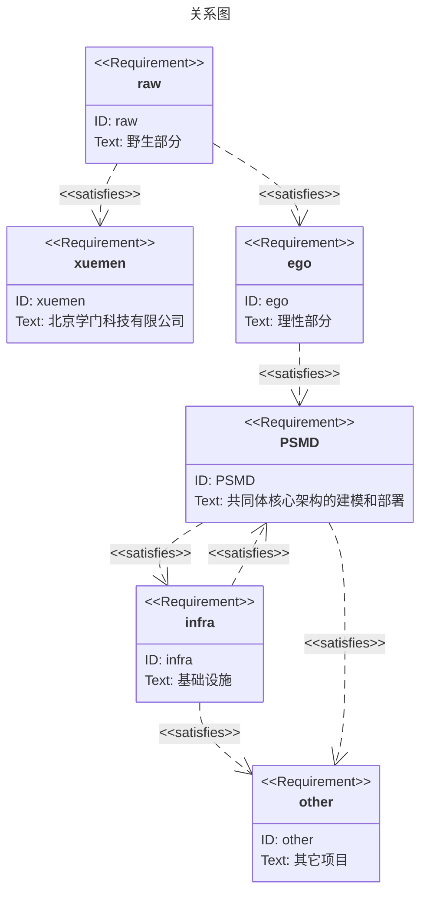

# 2024.09.08.
日小结

根据[ego模型时间接口](https://gitee.com/hyg/blog/blob/master/timeflow.md)，九月上旬补足前两月缺勤。今天绑定模版2(2b)。

- 09:30~10:59	PSMD: [整理近期讨论，按照新版manifest text提炼几个有代表性的场景。](#20240908093000)
- 14:00~14:44	PSMD: [整理新版本term的manifest code](#20240908140000)
- 16:00~16:59	learn: [https://proto.school/merkle-dags IPLD,Merkle DAGs, Structuring Data for the Distributed Web](#20240908160000)

---
season stat:

| task | alloc | sold | hold | todo |
| :---: | ---: | ---: | ---: | ---: |
| total | 17700 | 10257 | 7443 | 4365 |
| PSMD | 7000 | 3182 | 3818 | 840 |
| ego | 4000 | 1573 | 2427 | 795 |
| infra | 2000 | 90 | 1910 | 0 |
| xuemen | 1500 | 241 | 1259 | 450 |
| raw | 500 | 1235 | -735 | 480 |
| learn | 1500 | 2123 | -623 | 990 |
| js | 1200 | 1813 | -613 | 810 |

---
waiting list:

- 30分钟时间片：
  - ego的第1号事项：整理ubuntu工作环境
  - raw的第1号事项：在心率曲线上增加其它运动种类。
  - js的第3号事项：js class framework
  - raw的第4号事项：熟悉内脏之间的关系

- 60分钟时间片：
  - js的第1号事项：js class
  - learn的第1号事项：https://proto.school/merkle-dags IPLD,Merkle DAGs, Structuring Data for the Distributed Web
  - js的第2号事项：js class
  - ego的第3号事项：eventemitter sample

- 90分钟时间片：
  - PSMD的第1号事项：整理新版本term的manifest code
  - PSMD的第2号事项：整理近期讨论，按照新版manifest text提炼几个有代表性的场景。
  - learn的第2号事项：learn IPLD ADLs https://ipld.io/docs/advanced-data-layouts/
  - raw的第2号事项：整理代码，理顺food.js几个成员函数之间的调用关系

- 195分钟时间片：
  - xuemen的第1号事项：kernel模型升级
  - ego的第2号事项：新版ego, instance or model, any manifest
  - xuemen的第2号事项：重新设计S2状态下的学门基本管理制度
  - PSMD的第4号事项：machines model

---
<a href="mailto:huangyg@mars22.com?subject=关于2024.09.08.[整理近期讨论，按照新版manifest text提炼几个有代表性的场景。]任务&body=日期: 2024.09.08.%0D%0A序号: 5%0D%0A手稿:../../draft/2024/09/20240908093000.md%0D%0A---请勿修改邮件主题及以上内容 从下一行开始写您的想法---%0D%0A">[email]</a> | [top](#top) | [index](#index)

# 9:30~10:59
PSMD: [整理近期讨论，按照新版manifest text提炼几个有代表性的场景。]

- 去室外边走边整理思路。
- 需要他们自己走，但是辅助工具要详尽、随着实践不断修订，设计上要向未来兼容。

---
<a href="mailto:huangyg@mars22.com?subject=关于2024.09.08.[整理新版本term的manifest code]任务&body=日期: 2024.09.08.%0D%0A序号: 7%0D%0A手稿:../../draft/2024/09/20240908140000.md%0D%0A---请勿修改邮件主题及以上内容 从下一行开始写您的想法---%0D%0A">[email]</a> | [top](#top) | [index](#index)

## 14:00~15:29
PSMD: [整理新版本term的manifest code]

- D:\huangyg\git\ego\README.md 中增加配图。

- 需求图约束太多，类图应该更合适。

---
<a href="mailto:huangyg@mars22.com?subject=关于2024.09.08.[https://proto.school/merkle-dags IPLD,Merkle DAGs, Structuring Data for the Distributed Web]任务&body=日期: 2024.09.08.%0D%0A序号: 9%0D%0A手稿:../../draft/2024/09/20240908160000.md%0D%0A---请勿修改邮件主题及以上内容 从下一行开始写您的想法---%0D%0A">[email]</a> | [top](#top) | [index](#index)

## 16:00~16:59
learn: [https://proto.school/merkle-dags IPLD,Merkle DAGs, Structuring Data for the Distributed Web]

- schema是有环的。不适合Merkle DAG。
- 不过term、FSM这些是无环的，可以使用。
- https://proto.school/merkle-dags/06
