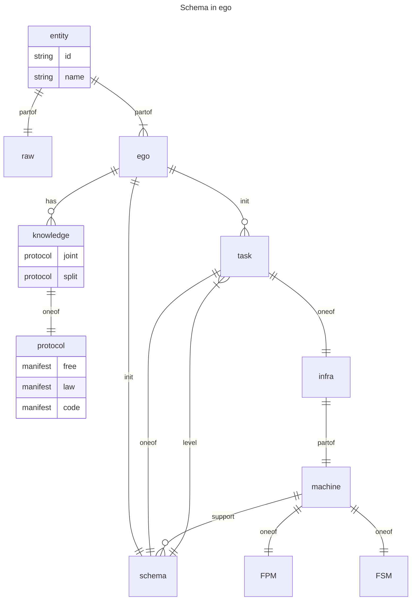

# 2024.09.19.
日小结

根据[ego模型时间接口](https://gitee.com/hyg/blog/blob/master/timeflow.md)，九月中上旬补足前两月缺勤。今天绑定模版2(2c)。

- 14:00~15:29	infra: [schema立项。](#20240919140000)
- 16:30~17:29	ego: [draft文件名改为序号](#20240919163000)

---
season stat:

| task | alloc | sold | hold | todo |
| :---: | ---: | ---: | ---: | ---: |
| total | 17700 | 11837 | 5863 | 4515 |
| PSMD | 7000 | 3962 | 3038 | 870 |
| ego | 4000 | 1833 | 2167 | 825 |
| infra | 2000 | 200 | 1800 | 120 |
| xuemen | 1500 | 241 | 1259 | 450 |
| raw | 500 | 1415 | -915 | 480 |
| learn | 1500 | 2258 | -758 | 990 |
| js | 1200 | 1928 | -728 | 780 |

---
waiting list:

- 30分钟时间片：
  - PSMD的第1号事项：根据近期交流情况整理入口protocol
  - ego的第1号事项：ego day各参数中增加已实现的diff
  - ego的第2号事项：day.js makedaylog() 根据日期读取正确的season obj
  - infra的第2号事项：动态菜单设计。

- 60分钟时间片：
  - js的第1号事项：js class
  - raw的第1号事项：熟悉内脏之间的关系
  - js的第2号事项：js class
  - learn的第2号事项：learn Blogging on the Decentralized Web https://proto.school/blog

- 90分钟时间片：
  - infra的第1号事项：schema立项。
  - learn的第1号事项：learn IPLD ADLs https://ipld.io/docs/advanced-data-layouts/
  - PSMD的第2号事项：整理新版本term的manifest code
  - raw的第2号事项：整理代码，理顺food.js几个成员函数之间的调用关系

- 195分钟时间片：
  - xuemen的第1号事项：kernel模型升级
  - xuemen的第2号事项：重新设计S2状态下的学门基本管理制度
  - ego的第3号事项：新版ego, instance or model, any manifest
  - PSMD的第5号事项：machines model

---
<a href="mailto:huangyg@mars22.com?subject=关于2024.09.19.[schema立项。]任务&body=日期: 2024.09.19.%0D%0A序号: 6%0D%0A手稿:../../draft/2024/09/20240919140000.md%0D%0A---请勿修改邮件主题及以上内容 从下一行开始写您的想法---%0D%0A">[email]</a> | [top](#top) | [index](#index)

## 14:00 ~ 15:29
infra: [schema立项。]

- 概念草图

- 继续追加时间，准备和以前手稿融合。
---
<a href="mailto:huangyg@mars22.com?subject=关于2024.09.19.[draft文件名改为序号]任务&body=日期: 2024.09.19.%0D%0A序号: 8%0D%0A手稿:../../draft/2024/09/20240919160000.md%0D%0A---请勿修改邮件主题及以上内容 从下一行开始写您的想法---%0D%0A">[email]</a> | [top](#top) | [index](#index)

## 16:30 ~ 17:29
ego: [draft文件名改为序号]

- day init:
	- day metadata output field:  
	- draft filename: yyyymmddHHMMSS.yaml -> yyyymmdd.nn.yaml
	- draft file: hh:mm:ss~hh:mm:ss -> nothing
- day over:
	- modify day metadata begin and amount field 
	- make index by metadata file, from every output file include non-working time