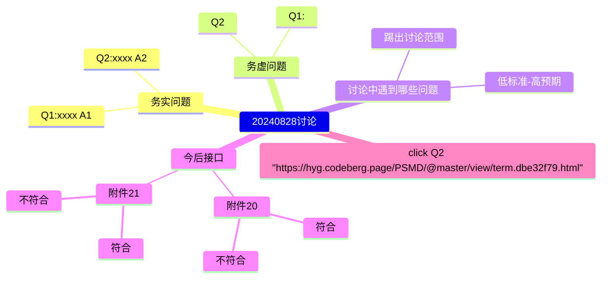
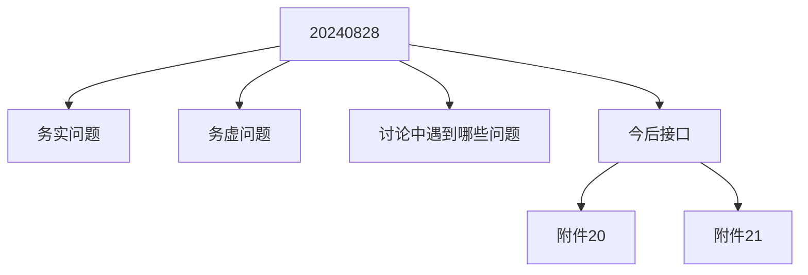

# 2024.09.22.
日小结

根据[ego模型时间接口](https://gitee.com/hyg/blog/blob/master/timeflow.md)，九月补足前两月缺勤。今天绑定模版1(1b)。

- 09:30~10:59	PSMD: [整理近期讨论，按照新版manifest text提炼几个有代表性的场景。](#20240922093000)
- 14:00~15:14	infra: [动态菜单设计。](#20240922140000)
- 15:15~15:19	ego: [day.js maketomorrowinfo()并行增加一个函数，支持diff项。然后把plan参数转向新函数。](#20240922151500)
- 16:00~17:29	js: [js class](#20240922160000)

---
season stat:

| task | alloc | sold | hold | todo |
| :---: | ---: | ---: | ---: | ---: |
| total | 17700 | 12437 | 5263 | 4485 |
| PSMD | 7000 | 4182 | 2818 | 840 |
| ego | 4000 | 2048 | 1952 | 765 |
| infra | 2000 | 275 | 1725 | 210 |
| xuemen | 1500 | 241 | 1259 | 450 |
| raw | 500 | 1415 | -915 | 480 |
| learn | 1500 | 2258 | -758 | 1020 |
| js | 1200 | 2018 | -818 | 720 |

---
waiting list:

- 30分钟时间片：
  - learn的第1号事项：mermaid with links, 1609 as sample.

- 60分钟时间片：
  - infra的第1号事项：动态菜单设计。
  - js的第1号事项：js class
  - raw的第1号事项：熟悉内脏之间的关系
  - ego的第2号事项：eventemitter sample

- 90分钟时间片：
  - PSMD的第1号事项：整理近期讨论，按照新版manifest text提炼几个有代表性的场景。
  - PSMD的第2号事项：整理新版本term的manifest code
  - learn的第2号事项：learn IPLD ADLs https://ipld.io/docs/advanced-data-layouts/
  - raw的第2号事项：整理代码，理顺food.js几个成员函数之间的调用关系

- 195分钟时间片：
  - ego的第1号事项：新版ego, instance or model, any manifest
  - xuemen的第1号事项：kernel模型升级
  - xuemen的第2号事项：重新设计S2状态下的学门基本管理制度
  - PSMD的第4号事项：machines model

---
<a href="mailto:huangyg@mars22.com?subject=关于2024.09.22.[整理近期讨论，按照新版manifest text提炼几个有代表性的场景。]任务&body=日期: 2024.09.22.%0D%0A序号: 5%0D%0A手稿:../../draft/2024/09/20240922.01.md%0D%0A---请勿修改邮件主题及以上内容 从下一行开始写您的想法---%0D%0A">[email]</a> | [top](#top) | [index](#index)

## 09:30 ~ 10:59
## PSMD: [整理近期讨论，按照新版manifest text提炼几个有代表性的场景。]

- 统一回复，eneity：
    - 近期讨论
        - yyyymmdd讨论
            - 1. xxx -> link
            - 2. xxx -> link
            - 3. ......
        - yyyymmdd讨论中遇到哪些问题
            - 低标准-高预期：link
            - 踢出讨论范围：link
    - 今后接口：
        - event：link
        - event：link
        - 图示：mermaid with links
- 增加学习todo项：
    - '30': mermaid with links, 1609 as sample.
    - '60': 范例--利用js模块组合实现合同条款的组合。

- mermaid的mindmap如何嵌入url还需要学习。

- flowchart已实现。

---
<a href="mailto:huangyg@mars22.com?subject=关于2024.09.22.[动态菜单设计。]任务&body=日期: 2024.09.22.%0D%0A序号: 7%0D%0A手稿:../../draft/2024/09/20240922.02.md%0D%0A---请勿修改邮件主题及以上内容 从下一行开始写您的想法---%0D%0A">[email]</a> | [top](#top) | [index](#index)

## 14:00 ~ 15:14
## infra: [动态菜单设计。]

- vuejs  https://vuejs.ac.cn
    - https://deepinout.com/vue-js/vue-js-questions/70_tk_1704071661.html
    - 单文件组件（也称为 *.vue 文件，缩写为 SFC）这个思路可以借鉴。
- 其实使用起来并没有节省多少复杂度，自己实现也差不多。
    - 不需要后台，直接在页面调取各处的metadata，构造菜单。
    - 不介意美观，可以接受极简风格，换取极高的效率和可靠度。

---
<a href="mailto:huangyg@mars22.com?subject=关于2024.09.22.[day.js maketomorrowinfo()并行增加一个函数，支持diff项。然后把plan参数转向新函数。]任务&body=日期: 2024.09.22.%0D%0A序号: 8%0D%0A手稿:../../draft/2024/09/20240922.03.md%0D%0A---请勿修改邮件主题及以上内容 从下一行开始写您的想法---%0D%0A">[email]</a> | [top](#top) | [index](#index)

## 15:15 ~ 15:19
## ego: [day.js maketomorrowinfo()并行增加一个函数，支持diff项。然后把plan参数转向新函数。]

- 由于每天早餐确定身心状态，所以只能推算次日的计划。
- 时间用于上一个任务，继续设计动态菜单。

---
<a href="mailto:huangyg@mars22.com?subject=关于2024.09.22.[js class]任务&body=日期: 2024.09.22.%0D%0A序号: 10%0D%0A手稿:../../draft/2024/09/20240922.04.md%0D%0A---请勿修改邮件主题及以上内容 从下一行开始写您的想法---%0D%0A">[email]</a> | [top](#top) | [index](#index)

## 16:00 ~ 17:29
## js: [js class]

- 正好参考vue，结合PSMD长期需求设计。
- 需要在vue SFC基础上实现：
    - 可以嵌套的层级化的class--对应protocol条款。
    - 跨protocol的数据互通--有的事件响应需要使用广泛的背景数据。
    - 应该是yaml、code（js、ruby...）、view（txt、md、doc...）组合，现在可以加上vue文件。
