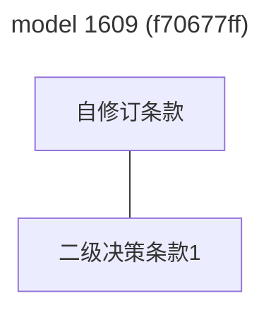

# 2024.09.23.
日小结

根据[ego模型时间接口](https://gitee.com/hyg/blog/blob/master/timeflow.md)，九月补足前两月缺勤。今天绑定模版1(1d)。

- 14:30~14:52	ego: [debug https://hyg.codeberg.page/blog/@master/release/entry.2day.html](#20240923143000)
- 14:53~16:53	learn: [mermaid with links, 1609 as sample.](#20240923145300)
- 16:54~16:54	infra: [动态菜单设计。](#20240923165400)

---
season stat:

| task | alloc | sold | hold | todo |
| :---: | ---: | ---: | ---: | ---: |
| total | 17700 | 12581 | 5119 | 4545 |
| PSMD | 7000 | 4182 | 2818 | 930 |
| ego | 4000 | 2071 | 1929 | 765 |
| infra | 2000 | 275 | 1725 | 210 |
| xuemen | 1500 | 241 | 1259 | 450 |
| raw | 500 | 1415 | -915 | 480 |
| learn | 1500 | 2379 | -879 | 990 |
| js | 1200 | 2018 | -818 | 720 |

---
waiting list:

- 30分钟时间片：
  - PSMD的第1号事项：整理闫岸家政能力讨论
  - PSMD的第2号事项：整理8.28.讨论
  - PSMD的第3号事项：整理9.5.讨论

- 60分钟时间片：
  - infra的第1号事项：动态菜单设计。
  - js的第1号事项：js class
  - raw的第1号事项：熟悉内脏之间的关系
  - ego的第2号事项：eventemitter sample

- 90分钟时间片：
  - learn的第1号事项：learn IPLD ADLs https://ipld.io/docs/advanced-data-layouts/
  - raw的第2号事项：整理代码，理顺food.js几个成员函数之间的调用关系
  - infra的第3号事项：schema立项。
  - PSMD的第4号事项：整理近期讨论，按照新版manifest text提炼几个有代表性的场景。

- 195分钟时间片：
  - ego的第1号事项：新版ego, instance or model, any manifest
  - xuemen的第1号事项：kernel模型升级
  - xuemen的第2号事项：重新设计S2状态下的学门基本管理制度
  - PSMD的第7号事项：machines model

---
<a href="mailto:huangyg@mars22.com?subject=关于2024.09.23.[debug https://hyg.codeberg.page/blog/@master/release/entry.2day.html]任务&body=日期: 2024.09.23.%0D%0A序号: 5%0D%0A手稿:../../draft/2024/09/20240923.01.md%0D%0A---请勿修改邮件主题及以上内容 从下一行开始写您的想法---%0D%0A">[email]</a> | [top](#top) | [index](#index)

## 14:30 ~ 14:52
## ego: [debug https://hyg.codeberg.page/blog/@master/release/entry.2day.html]

- 打开所有alert()，debug页面commit & push。
- LibreJS：Script uses a reserved object (XMLHttpRequest)
- github一直没有更新。
    - https://github.com/hyg/blog/blob/master/release/entry.2day.html  是新push的debug页面
    - hyg.github.io/blog/release/entry.2day.html 是旧页面
    - https://today.mars22.com/blog/release/entry.2day.html 是旧页面。

---
<a href="mailto:huangyg@mars22.com?subject=关于2024.09.23.[mermaid with links, 1609 as sample.]任务&body=日期: 2024.09.23.%0D%0A序号: 6%0D%0A手稿:../../draft/2024/09/20240923.02.md%0D%0A---请勿修改邮件主题及以上内容 从下一行开始写您的想法---%0D%0A">[email]</a> | [top](#top) | [index](#index)

## 14:53 ~ 16:53
## learn: [mermaid with links, 1609 as sample.]

- 手工编辑一段模版：

- 在 term.js的node term term id命令行中增加mermaid文件生成。
- 修改maketermview() 整理了
    - savemdfile(item);
    - savehtmlfile(item);
    - 因为有的upgradeby字段使用placeholder，只能人工对应termid，如果不扩容则无法自动生成mermaid。
    - 由于term.js已经不再维护，放弃。
- 在新版本protocol中，要注意文本和id的映射。

---
<a href="mailto:huangyg@mars22.com?subject=关于2024.09.23.[动态菜单设计。]任务&body=日期: 2024.09.23.%0D%0A序号: 8%0D%0A手稿:../../draft/2024/09/20240923.03.md%0D%0A---请勿修改邮件主题及以上内容 从下一行开始写您的想法---%0D%0A">[email]</a> | [top](#top) | [index](#index)

## 16:54 ~ 16:54
## infra: [动态菜单设计。]

- 时间被占用，任务顺延。
