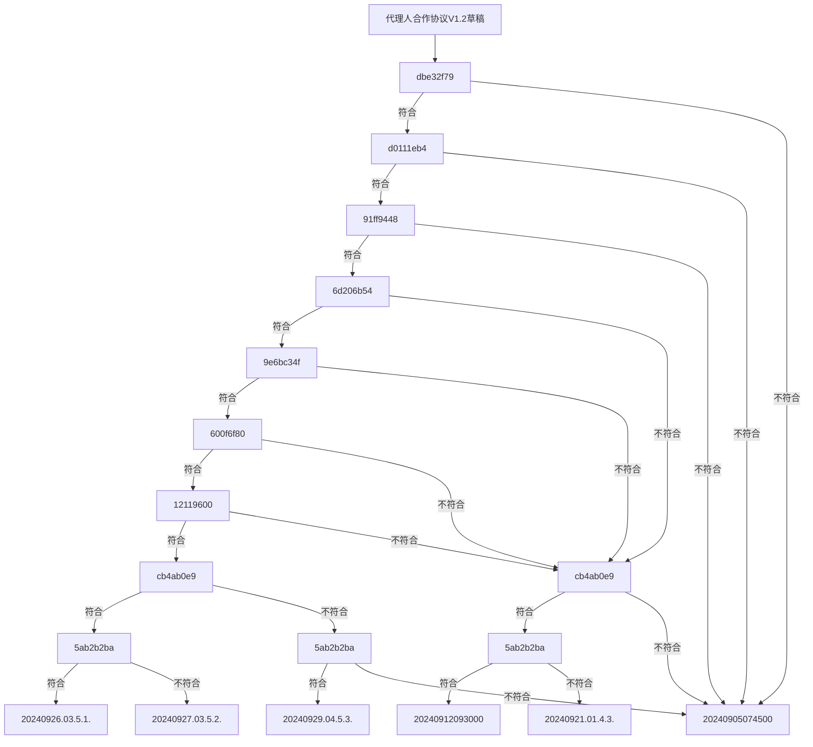

# 2024.09.29.
日小结

<a id="top"></a>
根据[ego模型时间接口](https://gitee.com/hyg/blog/blob/master/timeflow.md)，九月补足前两月缺勤。今天绑定模版1(1b)。

<a id="index"></a>
- 09:30~09:30	raw: [整理代码，理顺food.js几个成员函数之间的调用关系](#20240929093000)
- 14:00~14:14	ego: [day over [date]带有日期参数时，redo就不要插回season metadata了。](#20240929140000)
- 14:30~14:59	learn: [learn IPLD ADLs https://ipld.io/docs/advanced-data-layouts/](#20240929143000)
- 16:00~19:59	PSMD: [整理9.5.讨论和代理协议](#20240929160000)

---
season stat:

| task | alloc | sold | hold | todo |
| :---: | ---: | ---: | ---: | ---: |
| total | 17700 | 13756 | 3944 | 4830 |
| PSMD | 7000 | 5192 | 1808 | 1050 |
| ego | 4000 | 2206 | 1794 | 960 |
| infra | 2000 | 275 | 1725 | 210 |
| xuemen | 1500 | 241 | 1259 | 450 |
| raw | 500 | 1415 | -915 | 480 |
| learn | 1500 | 2409 | -909 | 960 |
| js | 1200 | 2018 | -818 | 720 |

---
waiting list:


- 30分钟时间片：

- 60分钟时间片：
  - PSMD的第1号事项：整理9.5.讨论和代理协议
  - infra的第1号事项：动态菜单设计。
  - js的第1号事项：js class
  - learn的第1号事项：https://proto.school/merkle-dags IPLD,Merkle DAGs, Structuring Data for the Distributed Web

- 90分钟时间片：
  - raw的第1号事项：整理代码，理顺food.js几个成员函数之间的调用关系
  - PSMD的第2号事项：整理default模型
  - infra的第3号事项：schema立项。
  - raw的第4号事项：整理代码，理顺food.js几个成员函数之间的调用关系

- 195分钟时间片：
  - ego的第1号事项：新版ego, instance or model, any manifest
  - xuemen的第1号事项：kernel模型升级
  - xuemen的第2号事项：重新设计S2状态下的学门基本管理制度
  - PSMD的第3号事项：machines model

---
<a href="mailto:huangyg@mars22.com?subject=关于2024.09.29.[整理代码，理顺food.js几个成员函数之间的调用关系]任务&body=日期: 2024.09.29.%0D%0A序号: 5%0D%0A手稿:../../draft/2024/09/20240929.01.md%0D%0A---请勿修改邮件主题及以上内容 从下一行开始写您的想法---%0D%0A">[email]</a> | [top](#top) | [index](#index)
<a id="20240929093000"></a>
## 09:30 ~ 09:30
## raw: [整理代码，理顺food.js几个成员函数之间的调用关系]

- 继续PSMD 2024.08.28.的后续引导。
    - 没有点开框图，以为要去别的地方找标准 -- 要增强提示。
    - 看不懂，按照不符合处理 -- 提前提示。
    - 对于不同情况有不同建议，不同时间处于不同情况，还需要再次说明。
- 本任务另外追加时间。

---
<a href="mailto:huangyg@mars22.com?subject=关于2024.09.29.[day over [date]带有日期参数时，redo就不要插回season metadata了。]任务&body=日期: 2024.09.29.%0D%0A序号: 7%0D%0A手稿:../../draft/2024/09/20240929.02.md%0D%0A---请勿修改邮件主题及以上内容 从下一行开始写您的想法---%0D%0A">[email]</a> | [top](#top) | [index](#index)
<a id="20240929140000"></a>
## 14:00 ~ 14:14
## ego: [day over [date]带有日期参数时，redo就不要插回season metadata了。]


- ego.js已经判断过，date参数下不产生次日计划。
- day.js在makedaylog()里面redo的处理代码外，增加一层判断。
```
            if(datestr == util.datestr()){
                if(timeperiod.redo == true){
                    season.addtodoitem(seasonobj,timeperiod.subject,timeperiod.title,timeperiod.amount,timeperiod.readme);
                    if(timeperiod.trueamount != null){
                        timeperiod.amount = timeperiod.trueamount ;
                    }
                }else if(timeperiod.redo != null){
                    if(timeperiod.readme != null){
                        season.addtodoitem(seasonobj,timeperiod.subject,timeperiod.title,timeperiod.redo,timeperiod.readme+"- read "+timeperiod.output+"\n");
                    }else{
                        season.addtodoitem(seasonobj,timeperiod.subject,timeperiod.title,timeperiod.redo,"- read "+timeperiod.output+"\n");
                    }
                    
                    if(timeperiod.trueamount != null){
                        timeperiod.amount = timeperiod.trueamount ;
                    }
                } 
            }else{
                log("not today, don't redo.");
            }
    ```
- 测试ok。

---
<a href="mailto:huangyg@mars22.com?subject=关于2024.09.29.[learn IPLD ADLs https://ipld.io/docs/advanced-data-layouts/]任务&body=日期: 2024.09.29.%0D%0A序号: 8%0D%0A手稿:../../draft/2024/09/20240929.03.md%0D%0A---请勿修改邮件主题及以上内容 从下一行开始写您的想法---%0D%0A">[email]</a> | [top](#top) | [index](#index)
<a id="20240929143000"></a>
## 14:30 ~ 14:59
## learn: [learn IPLD ADLs https://ipld.io/docs/advanced-data-layouts/]

- 随着DAG的学习，也看一下：https://ipld.io/docs/codecs/known/dag-json/
- https://github.com/ipld/js-dag-json
```
D:\huangyg\git\js.sample\ipld>node DAG-json.js
data: <Buffer 7b 22 78 22 3a 31 2c 22 79 22 3a 5b 32 2c 33 2c 7b 22 2f 22 3a 22 51 6d 61 6f 7a 4e 52 37 44 5a 48 51 4b 31 5a 63 55 39 70 37 51 64 72 73 68 4d 76 58 ... 109 more bytes>
decoded: {
  x: 1,
  y: [ 2, 3, CID(QmaozNR7DZHQK1ZcU9p7QdrshMvXqWK6gpu5rmrkPdT3L4) ],
  z: {
    a: CID(QmaozNR7DZHQK1ZcU9p7QdrshMvXqWK6gpu5rmrkPdT3L4),
    b: null,
    c: 'string'
  }
}
```

---
<a href="mailto:huangyg@mars22.com?subject=关于2024.09.29.[整理9.5.讨论和代理协议]任务&body=日期: 2024.09.29.%0D%0A序号: 10%0D%0A手稿:../../draft/2024/09/20240929.04.md%0D%0A---请勿修改邮件主题及以上内容 从下一行开始写您的想法---%0D%0A">[email]</a> | [top](#top) | [index](#index)
<a id="20240929160000"></a>
## 16:00 ~ 19:59
## PSMD: [整理9.5.讨论和代理协议]

- 规整这个任务的各时间片手稿：
    - 20240905074500.md：维持现状，量入为出。
    - 20240912093000.md：4.1.，先以个人建立精干渠道，对内逐渐积累制度。
    - 20240921.01.md：4.3.，个人以自有资金进铺开销路，对内逐渐积累制度。
    - 20240926.03.md：5.1.，以团队融资去建立分销渠道、研发配方。
    - 20240927.03.md：5.2.，以个人建立精干渠道，购买配方。
    - 20240929.04.md：5.3.，团队以自有资金铺开渠道，购买配方。
    - 20240930.04.md：全局建议和一览图





---

- 以下是2024.09.30.根据手稿统一整理。

- 条件：如果不符合附件42、符合附件43。
- 建议：先参考default+1406标准模型开展业务。
- 在这前提条件下：

### 5.3.