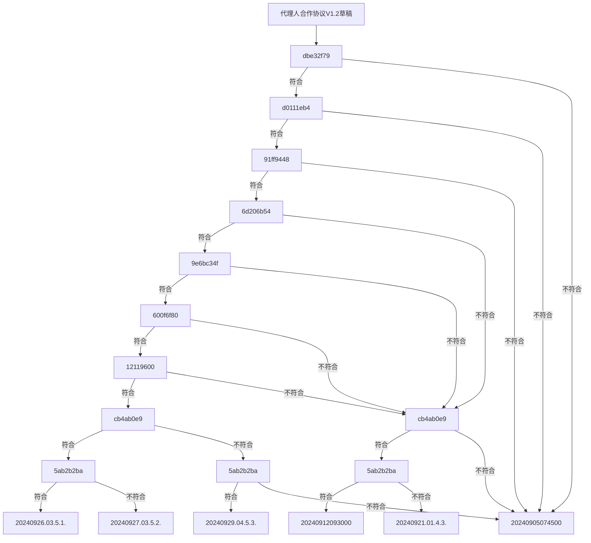

# 2024.09.30.
日小结

根据[ego模型时间接口](https://gitee.com/hyg/blog/blob/master/timeflow.md)，九月补足前两月缺勤。今天绑定模版2(2a)。

- 07:45~12:14	PSMD: [整理9.5.讨论和代理协议](#20240930074500)
- 14:00~14:14	PSMD: [整理default模型](#20240930140000)
- 16:00~16:29	infra: [动态菜单设计。](#20240930160000)

---
season stat:

| task | alloc | sold | hold | todo |
| :---: | ---: | ---: | ---: | ---: |
| total | 17700 | 14071 | 3629 | 4665 |
| PSMD | 7000 | 5477 | 1523 | 990 |
| ego | 4000 | 2206 | 1794 | 795 |
| infra | 2000 | 305 | 1695 | 210 |
| xuemen | 1500 | 241 | 1259 | 510 |
| raw | 500 | 1415 | -915 | 480 |
| learn | 1500 | 2409 | -909 | 960 |
| js | 1200 | 2018 | -818 | 720 |

---
waiting list:

- 30分钟时间片：
  - ego的第1号事项：新版本任务、子任务的数据结构
  - xuemen的第1号事项：整理财务报表
  - xuemen的第2号事项：月初财务工作

- 60分钟时间片：
  - infra的第1号事项：动态菜单设计。
  - js的第1号事项：js class
  - learn的第1号事项：https://proto.school/merkle-dags IPLD,Merkle DAGs, Structuring Data for the Distributed Web
  - ego的第2号事项：schema manifest code v0

- 90分钟时间片：
  - PSMD的第1号事项：整理default模型
  - raw的第1号事项：整理代码，理顺food.js几个成员函数之间的调用关系
  - infra的第3号事项：schema立项。
  - PSMD的第4号事项：整理近期讨论，按照新版manifest text提炼几个有代表性的场景。

- 195分钟时间片：
  - PSMD的第2号事项：machines model
  - xuemen的第3号事项：kernel模型升级
  - ego的第4号事项：新版ego, instance or model, any manifest
  - xuemen的第4号事项：重新设计S2状态下的学门基本管理制度

---
<a href="mailto:huangyg@mars22.com?subject=关于2024.09.30.[整理9.5.讨论和代理协议]任务&body=日期: 2024.09.30.%0D%0A序号: 5%0D%0A手稿:../../draft/2024/09/20240930.01.md%0D%0A---请勿修改邮件主题及以上内容 从下一行开始写您的想法---%0D%0A">[email]</a> | [top](#top) | [index](#index)

## 07:45 ~ 12:14
## PSMD: [整理9.5.讨论和代理协议]

- 规整这个任务的各时间片手稿：
    - 20240905074500.md：维持现状，量入为出。
    - 20240912093000.md：4.1.，以团队建立精干渠道，对内逐渐积累制度。
    - 20240921.01.md：4.3.，主要靠个人建立精干渠道，对内逐渐积累制度。
    - 20240926.03.md：5.1.，以团队融资去建立分销渠道、研发配方。
    - 20240927.03.md：5.2.，以个人融资建立精干渠道，购买配方。
    - 20240929.04.md：5.3.，团队以自有资金建立精干渠道，购买配方。
    - 20240930.04.md：全局建议和一览图

### 全局建议

- 根据不同情况，9月5日收到的《代理人合作协议V1.2草稿.doc》有六套不同建议，因此分别整理。
- 下面框图可以点击，进入详细内容。六套建议都分别给出后续的讨论接口，可以根据情况对接。
- 遇到看不懂的可以讨论，讨论厚仍然感觉内心非常抗拒的，就按照“不符合”处理。
- 经验积累的阶段：
    - 在第一关dbe32f79、d0111eb4之前会犹豫很久，有的人会终生停滞。一旦突破就可以对接其他人才，后面的进程比较稳定。
    - 需要两三个企业（或独立产品）的经验，管理经验积累到符合91ff9448。
    - 再需要两三个企业或独立产品的经验积累，完成6d206b54、9e6bc34f、600f6f80、12119600的，开始进入企业品种的创新阶段。
    - 需要至少一个原创的企业完成经验积累，形成自己的个人风格，具备cb4ab0e9、5ab2b2ba两种能力。

---
<a href="mailto:huangyg@mars22.com?subject=关于2024.09.30.[整理default模型]任务&body=日期: 2024.09.30.%0D%0A序号: 7%0D%0A手稿:../../draft/2024/09/20240930.02.md%0D%0A---请勿修改邮件主题及以上内容 从下一行开始写您的想法---%0D%0A">[email]</a> | [top](#top) | [index](#index)

## 14:00 ~ 14:14
## PSMD: [整理default模型]

- 室外思考。
- 有亲友来访，任务顺延。

---
<a href="mailto:huangyg@mars22.com?subject=关于2024.09.30.[动态菜单设计。]任务&body=日期: 2024.09.30.%0D%0A序号: 9%0D%0A手稿:../../draft/2024/09/20240930.03.md%0D%0A---请勿修改邮件主题及以上内容 从下一行开始写您的想法---%0D%0A">[email]</a> | [top](#top) | [index](#index)

## 16:00 ~ 16:29
## infra: [动态菜单设计。]

- 白名单管理：
    - 本entity有权力进行的操作
    - 本entity有责任进行的操作
- 黑名单管理由通用工单兜底
- 所有操作必须是有限、已知的集合
- protocol的event listener的action负责：
    - 权力：enable、disable签署者entity的action
    - 责任：创建todo item
