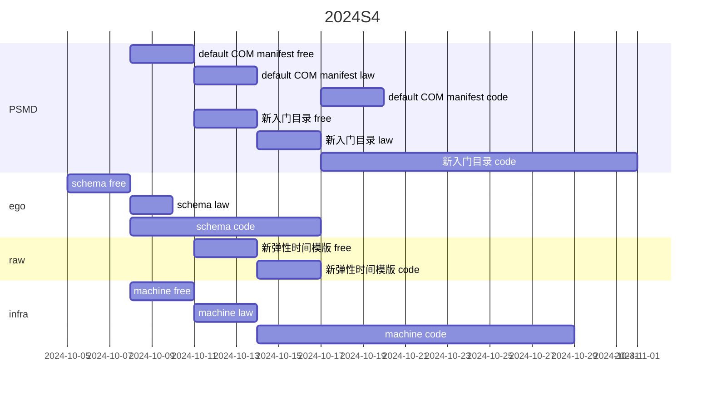

# 2024.10.04.
日小结

<a id="top"></a>
根据[ego模型时间接口](https://gitee.com/hyg/blog/blob/master/timeflow.md)，今天绑定模版1(1a)。

<a id="index"></a>
- 07:45~07:45	infra: [动态菜单设计。](#20241004074500)
- 09:30~09:30	PSMD: [整理default模型](#20241004093000)
- 14:00~14:59	ego: [整理季度任务](#20241004140000)
- 14:30~14:44	ego: [新版本任务、子任务的数据结构](#20241004143000)
- 16:00~16:09	infra: [范例--利用js模块组合实现合同条款的组合。](#20241004160000)

---
season stat:

| task | alloc | sold | hold | todo |
| :---: | ---: | ---: | ---: | ---: |
| total | 13530 | 251 | 13279 | 4635 |
| PSMD | 4000 | 0 | 4000 | 990 |
| ego | 2530 | 196 | 2334 | 825 |
| infra | 2000 | 10 | 1990 | 210 |
| xuemen | 1000 | 45 | 955 | 450 |
| raw | 1000 | 0 | 1000 | 480 |
| learn | 2000 | 0 | 2000 | 960 |
| js | 1000 | 0 | 1000 | 720 |

---
waiting list:


- 30分钟时间片：
  - ego的第1号事项：新版本任务、子任务的数据结构
  - ego的第3号事项：day over的redo部分跳过同名、同时间的todo项。

- 60分钟时间片：
  - learn的第1号事项：https://proto.school/merkle-dags IPLD,Merkle DAGs, Structuring Data for the Distributed Web
  - infra的第1号事项：范例--利用js模块组合实现合同条款的组合。
  - js的第1号事项：js class
  - ego的第2号事项：整理季度任务

- 90分钟时间片：
  - PSMD的第1号事项：整理default模型
  - raw的第1号事项：整理代码，理顺food.js几个成员函数之间的调用关系
  - infra的第3号事项：schema立项。
  - PSMD的第4号事项：整理近期讨论，按照新版manifest text提炼几个有代表性的场景。

- 195分钟时间片：
  - xuemen的第1号事项：kernel模型升级
  - PSMD的第2号事项：machines model
  - xuemen的第2号事项：重新设计S2状态下的学门基本管理制度
  - ego的第5号事项：新版ego, instance or model, any manifest

---
<a href="mailto:huangyg@mars22.com?subject=关于2024.10.04.[动态菜单设计。]任务&body=日期: 2024.10.04.%0D%0A序号: 5%0D%0A手稿:../../draft/2024/10/20241004.01.md%0D%0A---请勿修改邮件主题及以上内容 从下一行开始写您的想法---%0D%0A">[email]</a> | [top](#top) | [index](#index)
<a id="20241004074500"></a>
## 07:45 ~ 07:45
## infra: [动态菜单设计。]

- 身体不舒服，任务顺延。

---
<a href="mailto:huangyg@mars22.com?subject=关于2024.10.04.[整理default模型]任务&body=日期: 2024.10.04.%0D%0A序号: 7%0D%0A手稿:../../draft/2024/10/20241004.02.md%0D%0A---请勿修改邮件主题及以上内容 从下一行开始写您的想法---%0D%0A">[email]</a> | [top](#top) | [index](#index)
<a id="20241004093000"></a>
## 09:30 ~ 09:30
## PSMD: [整理default模型]

- 身体不舒服，任务顺延。

---
<a href="mailto:huangyg@mars22.com?subject=关于2024.10.04.[整理季度任务]任务&body=日期: 2024.10.04.%0D%0A序号: 9%0D%0A手稿:../../draft/2024/10/20241004.03.md%0D%0A---请勿修改邮件主题及以上内容 从下一行开始写您的想法---%0D%0A">[email]</a> | [top](#top) | [index](#index)
<a id="20241004140000"></a>
## 14:00 ~ 14:59
## ego: [整理季度任务]

### 任务排期



- 继续追加时间。

---
<a href="mailto:huangyg@mars22.com?subject=关于2024.10.04.[新版本任务、子任务的数据结构]任务&body=日期: 2024.10.04.%0D%0A序号: 10%0D%0A手稿:../../draft/2024/10/20241004.04.md%0D%0A---请勿修改邮件主题及以上内容 从下一行开始写您的想法---%0D%0A">[email]</a> | [top](#top) | [index](#index)
<a id="20241004143000"></a>
## 14:30 ~ 14:44
## ego: [新版本任务、子任务的数据结构]

### task

```yaml
id: 
name:
parent:
subtask:
    - id:
    - id:
manifest:
time:
    
```

- 继续追加时间。

---
<a href="mailto:huangyg@mars22.com?subject=关于2024.10.04.[范例--利用js模块组合实现合同条款的组合。]任务&body=日期: 2024.10.04.%0D%0A序号: 12%0D%0A手稿:../../draft/2024/10/20241004.05.md%0D%0A---请勿修改邮件主题及以上内容 从下一行开始写您的想法---%0D%0A">[email]</a> | [top](#top) | [index](#index)
<a id="20241004160000"></a>
## 16:00 ~ 16:09
## infra: [范例--利用js模块组合实现合同条款的组合。]

- 复习了模块。