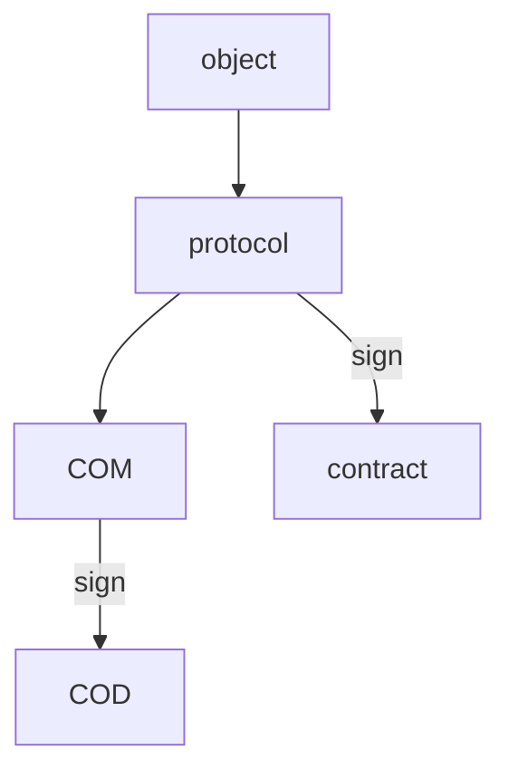
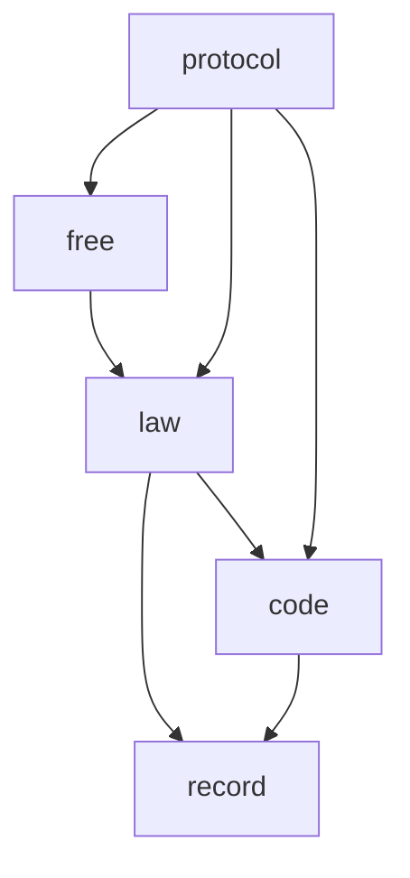

# 2024.10.27.
日小结

根据[ego模型时间接口](https://gitee.com/hyg/blog/blob/master/timeflow.md)，今天绑定模版1(1d)。

- 14:00~14:00	ego: [未进行的todo项，增加特别的特征，不产生draft文件，day log中使用固定提示。](#20241027140000)
- 14:30~15:29	ego: [整理季度任务](#20241027143000)
- 16:00~16:00	PSMD: [整理闫岸家政能力讨论](#20241027160000)

---
season stat:

| task | alloc | sold | hold | todo |
| :---: | ---: | ---: | ---: | ---: |
| total | 13530 | 1711 | 11819 | 4785 |
| PSMD | 4000 | 600 | 3400 | 1050 |
| ego | 2530 | 781 | 1749 | 945 |
| infra | 2000 | 250 | 1750 | 210 |
| xuemen | 1000 | 45 | 955 | 450 |
| raw | 1000 | 0 | 1000 | 390 |
| learn | 2000 | 35 | 1965 | 960 |
| js | 1000 | 0 | 1000 | 780 |

---
waiting list:

- 30分钟时间片：
  - ego的第1号事项：整理季度任务
  - ego的第2号事项：未进行的todo项，增加特别的特征，不产生draft文件，day log中使用固定提示。

- 60分钟时间片：
  - PSMD的第1号事项：整理闫岸家政能力讨论
  - learn的第1号事项：PSMD term in helia dag-json https://www.npmjs.com/package/@helia/dag-json
  - infra的第1号事项：范例--利用js模块组合实现合同条款的组合。
  - raw的第1号事项：熟悉内脏之间的关系

- 90分钟时间片：
  - PSMD的第2号事项：整理default模型
  - infra的第3号事项：schema立项。
  - raw的第3号事项：整理代码，理顺food.js几个成员函数之间的调用关系
  - PSMD的第4号事项：整理近期讨论，按照新版manifest text提炼几个有代表性的场景。

- 195分钟时间片：
  - xuemen的第1号事项：kernel模型升级
  - xuemen的第2号事项：重新设计S2状态下的学门基本管理制度
  - PSMD的第5号事项：machines model
  - ego的第7号事项：新版ego, instance or model, any manifest

---
<a href="mailto:huangyg@mars22.com?subject=关于2024.10.27.[未进行的todo项，增加特别的特征，不产生draft文件，day log中使用固定提示。]任务&body=日期: 2024.10.27.%0D%0A序号: 5%0D%0A手稿:../../draft/2024/10/20241027.01.md%0D%0A---请勿修改邮件主题及以上内容 从下一行开始写您的想法---%0D%0A">[email]</a> | [top](#top) | [index](#index)

## 14:00 ~ 14:00
## ego: [未进行的todo项，增加特别的特征，不产生draft文件，day log中使用固定提示。]

- 继续追加时间。

---
<a href="mailto:huangyg@mars22.com?subject=关于2024.10.27.[整理季度任务]任务&body=日期: 2024.10.27.%0D%0A序号: 6%0D%0A手稿:../../draft/2024/10/20241027.02.md%0D%0A---请勿修改邮件主题及以上内容 从下一行开始写您的想法---%0D%0A">[email]</a> | [top](#top) | [index](#index)

## 14:30 ~ 15:29
## ego: [整理季度任务]

- 整理思路

- protocol metadata指向各manifest metadata。
- code metadata：迭代升级的说明文件。
    - event listeners
    - data models

---
<a href="mailto:huangyg@mars22.com?subject=关于2024.10.27.[整理闫岸家政能力讨论]任务&body=日期: 2024.10.27.%0D%0A序号: 8%0D%0A手稿:../../draft/2024/10/20241027.03.md%0D%0A---请勿修改邮件主题及以上内容 从下一行开始写您的想法---%0D%0A">[email]</a> | [top](#top) | [index](#index)

## 16:00 ~ 16:00
## PSMD: [整理闫岸家政能力讨论]

- 继续追加时间。
