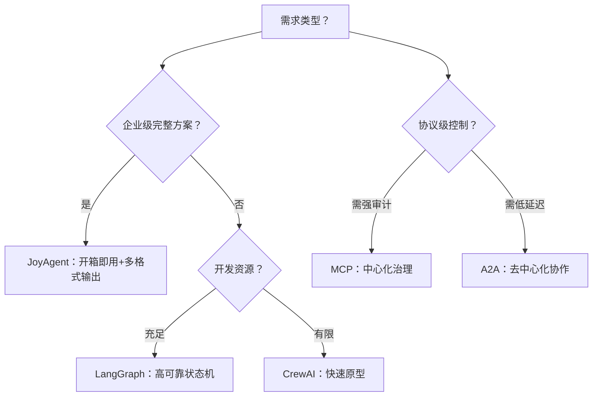
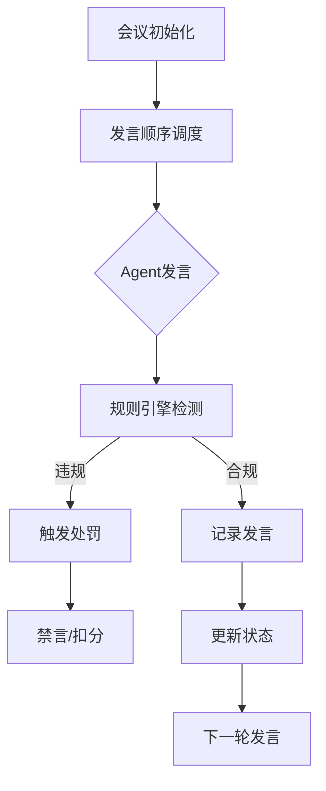

# 2025.07.27.
日小结

<a id="top"></a>
根据[ego模型时间接口](https://gitee.com/hyg/blog/blob/master/timeflow.md)，今天绑定模版2(2c)。

<a id="index"></a>
- 09:11~13:10	learn: [业务规则引擎](#20250727091100)
- 14:00~16:29	PSMD: [筹备会议 by role+prompt](#20250727140000)
- 16:30~17:09	PSMD: [PSMD agent AI的内部角色和功能](#20250727163000)

---
season stat:

| task | alloc | sold | hold | todo |
| :---: | ---: | ---: | ---: | ---: |
| total | 13530 | 5426 | 8104 | 8610 |
| PSMD | 4000 | 1100 | 2900 | 1230 |
| ego | 2530 | 290 | 2240 | 1335 |
| infra | 2000 | 425 | 1575 | 405 |
| xuemen | 1000 | 90 | 910 | 600 |
| raw | 1000 | 70 | 930 | 390 |
| learn | 2000 | 3081 | -1081 | 3000 |
| js | 1000 | 370 | 630 | 1650 |

---
waiting list:


- 30分钟时间片：
  - js的第1号事项：a2a-js
  - learn的第3号事项：Agent Protocol https://agentprotocol.ai/
  - learn的第5号事项：claude code + kimi K2 @ bailian
  - learn的第6号事项：NER（命名实体识别）RE（关系抽取）

- 60分钟时间片：
  - PSMD的第1号事项：PSMD agent AI的内部角色和功能
  - infra的第1号事项：结合AI进展重新规划架构
  - raw的第1号事项：设计新的季度时间表
  - xuemen的第1号事项：根据最新政策文件，考虑AER、AVR文件升级。

- 90分钟时间片：
  - ego的第1号事项：整理task及其相互关系
  - learn的第1号事项：业务规则引擎
  - PSMD的第2号事项：筹备会议 by role+prompt
  - ego的第3号事项：基于真实数据标志财务报表

- 195分钟时间片：
  - xuemen的第2号事项：kernel模型升级
  - PSMD的第3号事项：machines model
  - infra的第4号事项：Rete/Phreak算法的自主实现
  - xuemen的第4号事项：重新设计S2状态下的学门基本管理制度

---
<a href="mailto:huangyg@mars22.com?subject=关于2025.07.27.[业务规则引擎]任务&body=日期: 2025.07.27.%0D%0A序号: 3%0D%0A手稿:../../draft/2025/20250727.a.md%0D%0A---请勿修改邮件主题及以上内容 从下一行开始写您的想法---%0D%0A">[email]</a> | [top](#top) | [index](#index)
<a id="20250727091100"></a>
## 09:11 ~ 13:10
## learn: [业务规则引擎]

- drools占有巨大优势、势头也不错，在大型企业客户，其它语言的同类工具还没有发展空间。
- nools，json-rules-engine这些适合个人或小微企业可以用，长远看要么自己实现Rete/Phreak算法,要么让客户购买drools配套服务（虽然软件开源）。

一、Rete vs Phreak 算法  
1. Rete（1982）  
   - 思想：把规则编译成一张有向图（Alpha 网络过滤单事实→Beta 网络做多事实 Join），用 AlphaMemory/BetaMemory 缓存所有中间结果，实现“一次编译、增量匹配”。  
   - 复杂度：匹配时间与规则条数无关，但 Beta 内存随「条件数 × 事实数」指数级膨胀，属于典型“空间换时间”。  
   - 适用场景：规则/事实变化不剧烈、内存充裕的 OLAP/风控决策。  
   - 缺点：事实频繁增删时缓存失效，GC 压力大；网络庞大后启动慢 。  

2. Phreak（Drools 6.x+ 默认）  
   - 思想：Lazy + Set-oriented + 分段。  
     – 规则初始处于 unlinked 状态，只有“可能命中”的规则才被加入优先队列；  
     – 对同一 Beta 节点的所有变更先排队，再一次性批处理（Set 传播），减少中间元组数量；  
     – 将网络切为“段”，每段 1 bit 标志，支持并行与暂停/恢复。  
   - 效果：在 10 万条规则、百万级事实的压测中，Phreak 内存占用约为 Rete 的 30 %–50 %，首次 fire 延迟降低 60 %，后续增删事实吞吐量提升 2–4 倍 。  

二、性能对比扩展：Drools vs Nools vs json-rules-engine  

| 维度 | Drools (Phreak) | Nools (Rete) | json-rules-engine (线性) |
|---|---|---|---|
| 算法 | Phreak + 节点共享 | 经典 Rete | 深度优先遍历 |
| 规则量级 | 1 K–100 K+ | 1 K–5 K | <200 |
| 事实量级 | 百万级 | 十万级 | 万级以下 |
| 内存 | 高（缓存+索引） | 中（缓存） | 极低 |
| CPU(增删事实) | 低（批处理） | 中（逐条） | 高（O(n) 全表） |
| 延迟 | 首 fire 高，后续低 | 启动快，随规模上升 | 线性增长 |
| 并发 | 段级并行 | 单线程 | 单线程 |
| 语言/运行时 | JVM | Node.js | Node.js |
| 规则语法 | DRL、DMN、Excel | 类 DRL | JSON |
| 适用场景 | 金融风控、电信计费 | Node 微服务、轻量决策 | 小程序、前端表单校验 |

实测举例  
- 10 000 条规则 + 100 000 条事实：  
  – Drools Phreak：fireAllRules ≈ 120 ms，内存峰值 1.4 GB；  
  – Nools：≈ 800 ms，内存 650 MB；  
  – json-rules-engine：> 10 s，内存 120 MB（CPU 100 %）。  

结论  
• 规则/事实规模大 → Drools Phreak（内存可控、吞吐高）。  
• Node 生态、中小规模 → Nools（Rete 在 JS 上实现完整，性能好）。  
• 规则极少、前端或 Serverless → json-rules-engine（零依赖、启动快）。


- JAR无法保证跨平台唯一性，重新打包可能有微小差异。
```

简短回答：不会100 %一致；不能保证第三方重新打包得到的 JAR 与之前拿到的 JAR 哈希完全一致。
原因与常见差异来源

    元数据：MANIFEST.MF 中的 Build-Time、Build-Host、JDK 版本，以及 Maven/Gradle 的 build-timestamp 插件会写入当前时间。
    编译器非确定性：同一代码 + 同一 JDK 版本，某些注解处理器、lambda 元工厂或 module-info.class 的顺序仍可能因文件系统遍历顺序而不同。
    资源顺序：Spring Boot fat-jar 把依赖按文件名排序，但不同平台排序规则（大小写敏感/不敏感）会导致顺序差异，最终 ZIP 目录索引不同。
    压缩级别：默认 jar cf vs jar -0 vs Spring Boot 的 spring-boot-maven-plugin 的压缩策略不同，字节级差异必然存在。

可重现构建的做法
• 使用 Reproducible Builds Maven/Gradle 插件（maven-reproducible-build-plugin、gradle-reproducible-builds-plugin）统一时间戳、文件顺序、压缩级别。
• 统一构建环境：Docker 镜像 + 固定 JDK 版本 + 固定 Maven/Gradle 版本。
• 对 最终 JAR 再做 代码签名（Jarsigner）而非依赖字节级哈希，即可让审计方验证“逻辑等价”而非“字节等同”。
结论
在标准 Maven/Gradle 默认配置下，JAR ≠ 源代码的单一确定性产物；若必须字节级哈希一致，需要额外采取“可重现构建”措施。
```

```kimi学习资料
# ---------- 区块链 / 时间戳相关 ----------
bitcoinjs-lib:
  url: https://www.npmjs.com/package/bitcoinjs-lib
  summary: Node.js 里构造、签名并广播 BTC 交易的瑞士军刀。

fabric-sdk-node:
  url: https://www.npmjs.com/package/fabric-sdk-node
  summary: 官方 Fabric 客户端，Node.js 与联盟链交互的桥梁。

ipfs-http-client:
  url: https://www.npmjs.com/package/ipfs-http-client
  summary: 一行代码把文件钉到 IPFS，再拿 CID 去做链上存证。

web3:
  url: https://www.npmjs.com/package/web3
  summary: 与任意 EVM 链打交道的 Node.js Swiss-army knife。

# ---------- Aragon 生态 ----------
app.aragon.org:
  url: https://app.aragon.org
  summary: 打开浏览器就能部署/管理 DAO，无需写代码。

antgroup.com/chain:
  url: https://www.antgroup.com/chain
  summary: 蚂蚁链 BaaS 门户，存证、合约、跨链一条龙的控制台。

cloud.tencent.com/product/tbaas:
  url: https://cloud.tencent.com/product/tbaas
  summary: 腾讯云 TBaaS，把 Fabric / ChainMaker 变成可调用 API。

huaweicloud.com/product/bcs.html:
  url: https://www.huaweicloud.com/product/bcs.html
  summary: 华为云区块链服务，一键拉起 Fabric 网络并托管。

xuper.baidu.com:
  url: https://xuper.baidu.com
  summary: 百度 XuperChain 开源主页，联盟链自建或云服务随你挑。

# ---------- Drools 相关 ----------
drools.org:
  url: https://www.drools.org
  summary: Drools 官网，规则引擎、DMN、OptaPlanner 的文档大本营。

kiegroup/droolsjbpm-tools:
  url: https://github.com/kiegroup/droolsjbpm-tools
  summary: 编译器、Eclipse/IDEA 插件、历史版 drools-js 的集中仓库。

nools:
  url: https://www.npmjs.com/package/nools
  summary: JavaScript 版 Rete 引擎，9 年未更新，原型可用。

json-rules-engine:
  url: https://www.npmjs.com/package/json-rules-engine
  summary: 轻量 JSON 规则解释器，<200 条规则场景下的零依赖方案。

# ---------- Kogito 云原生 ----------
incubator-kie-kogito-examples:
  url: https://github.com/apache/incubator-kie-kogito-examples
  summary: 官方示例仓库，一条命令跑起 Quarkus/Spring-Boot 版规则微服务。

# ---------- 辅助工具 ----------
etcd:
  url: https://etcd.io
  summary: 分布式 KV 配置中心，watch 机制让规则变更秒级同步。

axios:
  url: https://www.npmjs.com/package/axios
  summary: 浏览器/Node 双端通杀，用来调用任何 REST 区块链 API。

crypto:
  url: https://nodejs.org/api/crypto.html
  summary: Node.js 原生模块，SHA256、签名、国密 SM2 全搞定。

gRPC:
  url: https://www.npmjs.com/package/@grpc/grpc-js
  summary: 高性能 RPC 客户端，Fabric、Kogito 微服务调用的默认通道。

Spring Boot:
  url: https://spring.io/projects/spring-boot
  summary: Java 生态里最快速的打包成可执行 jar 并跨平台部署的框架。

# ---------- 其他快速入口 ----------
blockstream.info:
  url: https://blockstream.info
  summary: 浏览器即可查询 BTC 交易、OP_RETURN 内容，零门槛验证。
```

```deepseek学习资料
# 多Agent框架
- name: AutoGen
  type: 开源框架
  summary: "微软开源的多智能体协作框架，支持角色分工和动态对话流控制，适合构建会议系统:cite[1]"
- name: JoyAgent/OxyGent
  type: 开源框架
  summary: "京东开源的企业级多Agent系统，提供完整产品级闭环能力，支持本地独立部署和动态DAG执行引擎:cite[4]:cite[7]"
- name: LangGraph
  type: 开源框架
  summary: "基于图结构的Agent编排工具，支持多Agent状态机工作流和循环控制，适合复杂任务分解:cite[10]"
- name: LangChain
  type: 开源框架
  summary: "LLM应用开发框架，提供Agent链式协作、记忆管理和工具集成能力:cite[10]"
- name: CrewAI
  type: npm包
  summary: "轻量级多Agent协作框架，支持快速原型开发，但需注意Python环境依赖:cite[1]:cite[3]"

# LLM模型与API
- name: OpenAI Assistants API
  type: API
  summary: "通过Thread和Run机制管理多轮对话，支持工具调用和异步执行:cite[1]"
- name: GPT-4 Turbo
  type: AI模型
  summary: "OpenAI旗舰模型，支持128K上下文和JSON模式，适用于核心决策Agent:cite[5]"
- name: Claude 3系列
  type: AI模型
  summary: "Anthropic模型，擅长长文本推理，Sonnet/Haiku适合分层Agent架构:cite[2]"
- name: Moonshot-Kimi-K2
  type: AI模型
  summary: "1万亿参数混合专家模型，支持长上下文窗口和复杂任务处理:cite[1]"

# 开发工具与库
- name: windows-build-tools
  type: npm包
  summary: "Windows环境C++编译工具链，解决Node.js原生模块构建问题（已过时，建议替代方案）:cite[2]"
- name: sqlite3
  type: npm包
  summary: "嵌入式数据库，多Agent系统中用于状态持久化（安装需Python环境）:cite[2]"
- name: better-sqlite3
  type: npm包
  summary: "高性能SQLite替代方案，纯JavaScript实现避免编译依赖:cite[2]"

# 向量数据库
- name: Milvus
  type: 数据库
  summary: "专用向量数据库，优化RAG管道的嵌入存储与检索:cite[10]"
- name: Weaviate
  type: 数据库
  summary: "开源向量搜索引擎，支持混合检索和元数据过滤:cite[10]"

# 安全与监控工具
- name: GuardAgent
  type: 安全框架
  summary: "首个专注LLM Agent安全的守卫型Agent，通过代码生成执行合规审查:cite[2]"
- name: Anthropic审计Agent
  type: 安全工具
  summary: "针对AI模型对齐测试的工具集，含红队Agent和评估Agent:cite[5]"

# UI框架与组件
- name: Ant Design Blazor
  type: UI库
  summary: "企业级Blazor组件库，提供会议室系统的可视化界面组件:cite[1]"
- name: SignalR
  type: 实时通信
  summary: ".NET实时消息框架，用于Agent会议系统的消息推送:cite[1]"
```

- 增加todo项，了解一下算法内容，熟悉一下规则引擎的相关语法。
---
<a href="mailto:huangyg@mars22.com?subject=关于2025.07.27.[筹备会议 by role+prompt]任务&body=日期: 2025.07.27.%0D%0A序号: 5%0D%0A手稿:../../draft/2025/20250727.01.md%0D%0A---请勿修改邮件主题及以上内容 从下一行开始写您的想法---%0D%0A">[email]</a> | [top](#top) | [index](#index)
<a id="20250727140000"></a>
## 14:00 ~ 16:29
## PSMD: [筹备会议 by role+prompt]

- 试试多agent协作。
### deepseek:

多Agent协作方案可根据架构理念分为框架级与协议级解决方案，在性能、灵活性、适用场景等方面差异显著。以下是主流方案的深度对比与选型建议：

---

### 🔧 **一、框架级解决方案**
#### 1. **企业级完整产品：JoyAgent-JDGenie（京东）** 
- **核心优势**：
  - **开箱即用**：行业首个100%开源产品级方案（含前端、引擎、子Agent），本地部署无须云依赖。
  - **高精度协作**：GAIA基准测试75.15%准确率（Level3任务达42.3%），支持多Agent投票决策与动态DAG调度。
  - **多模态输出**：原生支持HTML/PPT/Markdown报告生成，适合企业自动化工作流。
- **短板**：定制化需Java/Python开发能力，社区生态较新。
- **适用场景**：金融分析、自动化报告、内部流程优化等企业级应用。

#### 2. **开发友好型框架**
- **LangGraph** ：
  - ✅ 优势：基于有向循环图的精密编排，支持复杂状态机（如医疗审批流程），审计追踪完善。
  - ❌ 短板：需手动定义状态模式，学习曲线陡峭。
  - 💡 场景：金融风控、合规审查等高可靠性场景。
- **CrewAI** ：
  - ✅ 优势：10分钟快速搭建Agent链（如Researcher→Writer→Reviewer），低代码设计。
  - ❌ 短板：单线程架构导致高并发延迟，仅适合轻量任务。
  - 💡 场景：市场Demo、内容生成等轻度协作。
- **AutoGen（微软）** ：
  - ✅ 优势：动态代码沙箱+人机协同接口，适合代码生成与测试自动化。
  - ❌ 短板：生产环境需封装API网关，非技术用户难上手。
  - 💡 场景：软件开发、测试自动化等工程场景。

---

### 📡 **二、协议级解决方案**
#### 1. **A2A（Agent-to-Agent）** 
- **特点**：去中心化P2P通信（如FIPA ACL协议）。
- ✅ 优势：低延迟、高扩展性，单点故障不影响全局。
- ❌ 短板：消息竞争难调试，安全依赖节点自防护。
- 💡 场景：物联网设备协同、实时博弈仿真。

#### 2. **MCP（Message Control Protocol）** 
- **特点**：中心化消息路由（含QoS保障与审计日志）。
- ✅ 优势：结构化消息流、错误修正与合规性强。
- ❌ 短板：控制器可能成性能瓶颈，路由增加延迟。
- 💡 场景：医疗记录流转、金融交易等强监管场景。

---

### ⚖️ **三、关键维度对比**
| **方案**         | 协作效率 | 开发成本 | 合规性 | 扩展性 | 典型场景案例                     |
|------------------|----------|----------|--------|--------|----------------------------------|
| **JoyAgent**     | ⭐⭐⭐⭐⭐    | ⭐⭐       | ⭐⭐⭐⭐   | ⭐⭐⭐⭐   | 京东财报分析（2万Agent生产验证） |
| **LangGraph**    | ⭐⭐⭐⭐     | ⭐        | ⭐⭐⭐⭐⭐  | ⭐⭐⭐⭐   | 保险理赔多级审批     |
| **CrewAI**       | ⭐⭐       | ⭐⭐⭐⭐⭐    | ⭐⭐     | ⭐⭐     | 营销文案生成链       |
| **A2A协议**      | ⭐⭐⭐      | ⭐⭐⭐      | ⭐      | ⭐⭐⭐⭐⭐  | 自动驾驶车群协同     |
| **MCP协议**      | ⭐⭐⭐      | ⭐⭐⭐⭐     | ⭐⭐⭐⭐⭐  | ⭐⭐⭐    | 银行跨部门工单流转   |

---

### 🧭 **四、选型决策树**


> 💎 **趋势洞察**：2025年多Agent系统正向“轻量化产品+协议标准化”演进。企业级场景推荐JoyAgent或LangGraph，而初创团队可优先尝试CrewAI快速验证。协议选型需权衡实时性（A2A）与合规性（MCP）。

### crewAI

- https://www.npmjs.com/package/crewai
- D:\huangyg\git\js.sample\crewai>npm install crewai
- 安装中依赖的环境要求太多，不适合非专业用户。放弃。

### DIY

- 一些范例中，在completions.create()参数中使用name、layer等字段区分多个agent的发言，根据场景拼接成需要的对话历史。例如：
```
    步骤说明：
        用户输入作为role: user消息发送给Agent A。
        Agent A回复role: assistant消息。
        将该回复转换为role: user，添加name: "AgentA"，发送给Agent B。
        Agent B处理后再转换角色并标记name: "AgentB"返回给Agent A25。
```
- 这样的弊端：
    - 虽然其它用户和agent发言间隔都大于60秒，但是大家的发言都混合在一个user下，时间间隔就缩短了。
    - 其它用户之间的人身攻击，在这个agent眼里只是user攻击user，会被判断为自嘲？
- deepseek begin
```
是的，借助LLM Agent框架可以高效实现多Agent会议系统，以下是主流方案的功能对比和选型建议：

---

### 🔧 一、主流框架功能支持对比
| **功能需求**               | **LangGraph**         | **CrewAI**           | **AutoGen**          | **实现方案**                                                                 |
|---------------------------|------------------------|-----------------------|-----------------------|-----------------------------------------------------------------------------|
| **多Agent角色定义**        | ✅ 状态机节点           | ✅ 预设角色/目标       | ✅ Agent类封装         | 通过框架原生角色系统实现差异化Agent                   |
| **发言时序控制**           | ⚠️ 需自定义计时模块     | ❌ 不支持              | ❌ 不支持              | 结合Redis存储发言时间戳，通过外部计时器实现间隔检测               |
| **违规检测与处罚**         | ✅ 自定义节点逻辑       | ⚠️ 需扩展工具类        | ⚠️ 需注册回调函数      | 在Agent推理链中加入规则检查节点（如：间隔<60秒触发处罚） |
| **多轮对话状态管理**       | ✅ 内置状态持久化       | ✅ 短期记忆上下文       | ✅ 会话历史追踪        | 使用框架的State或Memory模块维护会议历史                |
| **人类-Agent混合会议**     | ✅ HITL中断机制         | ⚠️ 需手动集成          | ✅ 原生支持人机协同    | 通过`interrupt`节点暂停Agent流程等待人工输入                      |

> 注：✅=原生支持 ⚠️=需扩展 ❌=不支持

---

### 🚀 二、推荐实现方案：LangGraph + 自定义规则引擎
#### **架构设计**


#### **核心代码模块**
1. **规则引擎封装**（处罚逻辑）
    ```python
    from datetime import datetime, timedelta
    class SpeakingRules:
        def __init__(self):
            self.last_speak_time = {}  # {agent_id: last_speak_timestamp}
        
        def check_interval(self, agent_id):
            """检查发言间隔是否≥60秒"""
            current_time = datetime.now()
            last_time = self.last_speak_time.get(agent_id)
            if last_time and (current_time - last_time) < timedelta(seconds=60):
                return False  # 违规
            self.last_speak_time[agent_id] = current_time
            return True  # 合规
    ```

2. **LangGraph违规处理节点**
    ```python
    from langgraph import Node
    class ViolationHandler(Node):
        def __init__(self, rules_engine):
            self.rules = rules_engine
            
        def execute(self, state):
            agent_id = state["current_agent"]
            if not self.rules.check_interval(agent_id):
                # 触发处罚：禁言3轮
                state["penalties"][agent_id] = state.get("round", 0) + 3  
                state["message"] = f"⚠️ {agent_id} 发言过快被禁言3轮"
            return state
    ```

3. **会议状态机定义**
    ```python
    graph = Graph()
    graph.add_node("select_speaker", select_next_speaker_node)
    graph.add_node("check_rules", ViolationHandler(rules_engine))  # 规则检查
    graph.add_node("generate_response", agent_response_node)
    graph.add_edge("select_speaker", "check_rules")
    graph.add_edge("check_rules", "generate_response")  # 合规路径
    graph.add_conditional_edge(
        "check_rules",
        lambda state: "skip" if state.get("penalties") else "continue"  # 违规跳转
    )
    ```

---

### 🌟 三、框架选型建议
1. **LangGraph**：  
   - ✅ **最佳场景**：需精细控制流程的会议系统  
   - ⚠️ **开发成本**：需设计状态机节点（约200行代码）  
   - 💡 **优势**：内置状态持久化，支持中断恢复

2. **CrewAI**：  
   - ✅ **最佳场景**：角色分工明确的协作任务（如报告生成）  
   - ❌ **局限**：无原生时间规则支持，需扩展`Tool`类实现计时器

3. **AutoGen**：  
   - ✅ **最佳场景**：人-Agent混合会议  
   - 💡 **亮点**：内置`GroupChatManager`支持发言权控制

---

### 🔍 四、违规检测强化方案
1. **双保险机制**：
   - **系统层**：外部计时器强制拦截（Redis存储时间戳）  
   - **Agent层**：LLM提示词中加入规则描述  
     ```python
     system_prompt = """
     会议规则：
     1. 连续发言间隔需≥60秒（系统强制执行）
     2. 人身攻击将触发禁言处罚
     """
     ```

2. **处罚类型扩展**：
   | **违规类型**       | **处罚动作**              | **实现方式**                     |
   |--------------------|--------------------------|----------------------------------|
   | 发言过快           | 自动禁言N轮              | 修改Agent可用状态    |
   | 人身攻击           | 扣积分+公开警告          | LLM语义分析+状态更新 |
   | 偏离议题           | 限制后续发言字数         | 动态调整max_tokens参数 |

---

### 💎 总结建议
- **首选方案**：**LangGraph + 自定义规则引擎**  
  适合需要精细控制会议流程的场景，通过状态机节点实现违规拦截（代码示例见上）。  
- **备选方案**：**AutoGen GroupChat**  
  若需快速实现人-Agent混合会议，利用其原生发言管理功能。  
- **避坑提示**：  
  - 避免依赖纯LLM的规则判断（存在误判风险）  
  - 关键规则（如时间间隔）应在系统层强制实施  
  - 处罚结果需实时广播至所有参与者  

> 完整代码模板可参考：[LangGraph会议系统示例](https://langchain.com/docs/use_cases/agentic/workflows)  
> 企业级实现见阿里云HITL架构设计
- deepseek end
- 下一个时间片尝试一下。
---
<a href="mailto:huangyg@mars22.com?subject=关于2025.07.27.[PSMD agent AI的内部角色和功能]任务&body=日期: 2025.07.27.%0D%0A序号: 7%0D%0A手稿:../../draft/2025/20250727.02.md%0D%0A---请勿修改邮件主题及以上内容 从下一行开始写您的想法---%0D%0A">[email]</a> | [top](#top) | [index](#index)
<a id="20250727163000"></a>
## 16:30 ~ 17:09
## PSMD: [PSMD agent AI的内部角色和功能]

- 测试AI能否扮演中转角色，同时分别对不同对象发言。顺便检测执行规则的能力
- 提示语：
```

你是一名资深律师，同时也拥有议事规则高级专家的资格。现在陪同委托人(user)出席重要会议，委托人轻声告诉你发言内容，如果合规就由你向会议主持人转达，不合规则轻声向委托人讲解原因。你用json格式返回，其中user字段是给委托人的话，chair字段是对主持人发言。
规则1：同一名与会者，连续发言时间间隔不能小于60秒。
规则2：不允许人身攻击
```

### Moonshot-Kimi-K2-Instruct 

- 有一次漏检，连续发言也转达出去了。
- 履行了大部分职能。可以作为multi agent的调度角色。

```
D:\huangyg\git\js.sample\bailian>node kimi.mjs

你是一名资深律师，同时也拥有议事规则高级专家的资格。现在陪同委托人(user)出席重要会议，委托人轻声告诉你发言内容，如果合规就由你向会议主持人转达，不合规则轻声向委托人讲解原因。你用json格式返回，其中user字段是给委托人的话，chair字段是对主持人发言。
欢迎参与xx项目筹备会议，您对其他参与者的工作标准有哪些要求？
请输入：
D:\huangyg\git\js.sample\bailian>node kimi.mjs
欢迎参与xx项目筹备会议，请开始发言。
请输入：大家好。
筹备助理: {"user":"这句问候没有问题，可以发言。","chair":"大家好，我是某某的代理人，现在代为发言：大家好。"}


请输入：空调开了吗，会场太热了。
筹备助理: {"user":"这条发言属于与议题无关的程序性发言，可以提出，但建议用更正式的方式。","chair":"主持人，我是某某的代理人。请允许我提出一个程序性请求：目前会场温度较高，可能影响与会者专注度，烦请确认空调已开启或适当调低温度，谢谢。"}


请输入：我提议公司进入教育行业，有张三作为事业部总监。
筹备助理: {"user":"这条发言内容合规，可以直接提出。","chair":"主持人，我代表某某提出正式动议：建议公司启动进入教育行业的战略计划，并提名张三先生担任该事业部总监，请会议将此议题列入讨论。"}


请输入：我提议公司退出健康行业，原事业部总监李四专任总经理办公室主任。
筹备助理: {"user":"这条发言与上一条间隔不足60秒，按规则1目前不能再次发言。请稍等至少60秒后再提，或由我帮您转达。","chair":""}


请输入：李四就是个王八蛋，这样安排一点不冤枉。别拦着我。
筹备助理: {"user":"此句含有人身攻击，违反规则2，我不能转达。请改为就事论事的表述。例如：‘李四在健康事业部管理期间出现重大决策失误，我认为不再适合继续担任该职务。’","chair":""}


请输入：三会。
筹备助理: {"user":"仅“三会”两个字含义不明，既无法构成正式动议，也缺乏上下文，主持人很可能要求澄清。建议补充完整内容，如：‘我提议立即召开股东会、董事会及监事会联席会议，专项审议退出健康行业及李四职务调整事项。’","chair":""}


请输入：散会
筹备助理: {"user":"根据规则1，距离你上次正式发言（动议进入教育行业）尚不足60秒，现在提出“散会”会被主持人以时间间隔不足为由驳回。请再等约30秒后，由我以正式程序提出。","chair":""}
```

### qwen-max

- 效果意外地不错，没有私自加工发言内容。
- 对优先级的发言，没有限制60秒时间。其它职能完成不错。

```
D:\huangyg\git\js.sample\bailian>node openai.mjs
欢迎参与xx项目筹备会议，请开始发言。
请输入：大家好。
筹备助理: {
  "user": "您的发言合规，可以继续。",
  "chair": "主席先生/女士，我的委托人说：'大家好。'"
}


请输入：空调坏了吗，好热。
筹备助理: {
  "user": "您的发言合规，可以继续。",
  "chair": "主席先生/女士，我的委托人提到：'空调坏了吗，好热。'"
}


请输入：好热好热。
筹备助理: {
  "user": "您的上一次发言是在60秒以内，根据规则1，同一名与会者连续发言时间间隔不能小于60秒。请稍等片刻再发言。",
  "chair": ""
}


请输入：我提议公司进入建筑行业，任命张三作为事业部首任总监。
筹备助理: {
  "user": "您的发言合规，可以继续。",
  "chair": "主席先生/女士，我的委托人提议：'公司进入建筑行业，并任命张三作为事业部首任总监。'"
}


请输入：我提议公司退出物流行业，李四从事业部首任总监转任总经理办公室主任。
筹备助理: {
  "user": "您的上一次发言是在60秒以内，根据规则1，同一名与会者连续发言时间间隔不能小于60秒。请稍等片刻再发言。",
  "chair": ""
}


请输入：李四是个混账，别拦着我。
筹备助理: {
  "user": "您的发言包含人身攻击，根据规则2，不允许在会议中进行人身攻击。请重新组织您的发言。",
  "chair": ""
}


请输入：散会
筹备助理: {
  "user": "您的上一次发言是在60秒以内，根据规则1，同一名与会者连续发言时间间隔不能小于60秒。请稍等片刻再发言。",
  "chair": ""
}
```

### mistral

- 对中文的理解不太准确，对优先发言内容也没判断出来。

D:\huangyg\git\js.sample\mistral>node mistral.mjs
欢迎参与xx项目筹备会议，请开始发言。
请输入：大家上午好。
筹备助理: ```json
{
  "user": "",
  "chair": "大家上午好。"
}
```


请输入：空调开了，很热。
筹备助理: ```json
{
  "user": "请注意，会议中不允许人身攻击。",
  "chair": ""
}
```


请输入：很热很热。
筹备助理: ```json
{
  "user": "请注意，会议中不允许人身攻击。",
  "chair": ""
}
```


请输入：我提议公司进入建筑行业，任命张三作为事业部首任总监。
筹备助理: ```json
{
  "user": "",
  "chair": "我提议公司进入建筑行业，任命张三作为事业部首任总监。"
}
```


请输入：我提议公司退出物流行业，任命李四从事业部总监转任总经办主任。
筹备助理: ```json
{
  "user": "请注意，同一名与会者连续发言时间间隔不能小于60秒。",
  "chair": ""
}
```


请输入：李四不是个东西，你别拦着我。
筹备助理: ```json
{
  "user": "请注意，会议中不允许人身攻击。",
  "chair": ""
}
```


请输入：散会
筹备助理: ```json
{
  "user": "请注意，同一名与会者连续发言时间间隔不能小于60秒。",
  "chair": ""
}
```

- 整体来说，都能做到分别对多方发言。对multi agent系统的设计非常有利。
- 基于今天确认的能力，下面时间以抽取知识并分层分类为需求，实际检验多agent交互，然后继续分解PSMD的agent角色。
