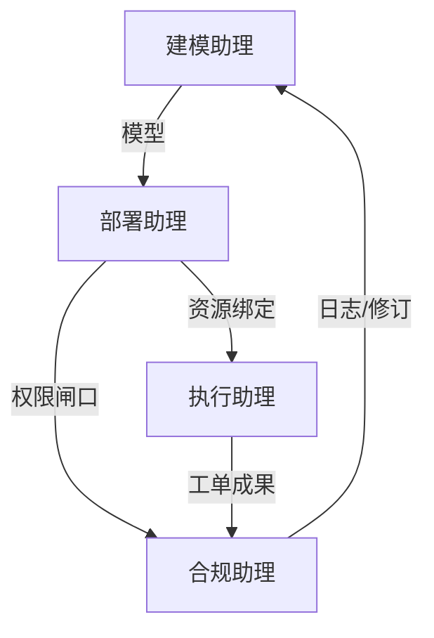
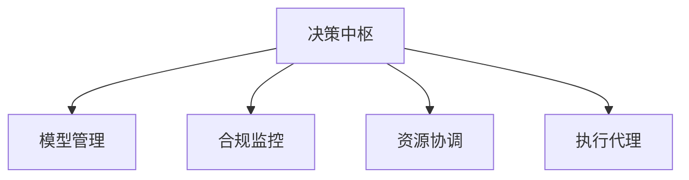
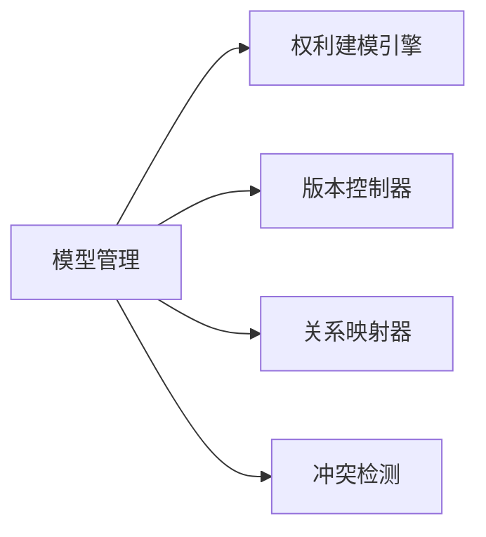
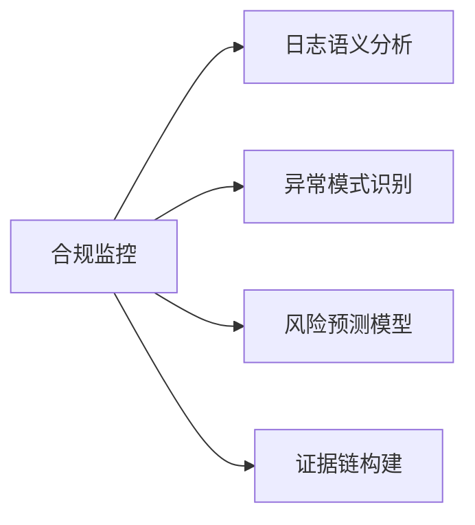
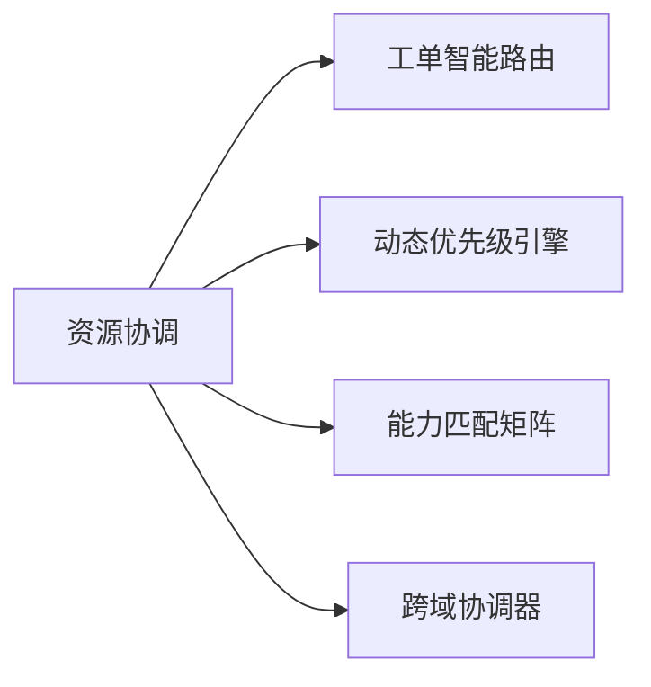
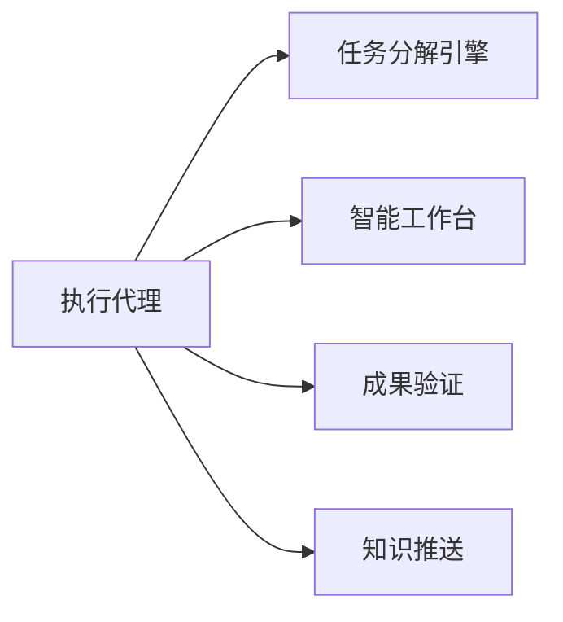

# 2025.07.29.
日小结

<a id="top"></a>
根据[ego模型时间接口](https://gitee.com/hyg/blog/blob/master/timeflow.md)，今天绑定模版1(1d)。

<a id="index"></a>
- 14:00~14:29	js: [a2a-js](#20250729140000)
- 14:30~14:59	js: [graphviz](#20250729143000)
- 16:00~16:59	PSMD: [PSMD agent AI的内部角色和功能](#20250729160000)

---
season stat:

| task | alloc | sold | hold | todo |
| :---: | ---: | ---: | ---: | ---: |
| total | 13530 | 5976 | 7554 | 8670 |
| PSMD | 4000 | 1160 | 2840 | 1170 |
| ego | 2530 | 720 | 1810 | 1335 |
| infra | 2000 | 425 | 1575 | 405 |
| xuemen | 1000 | 90 | 910 | 600 |
| raw | 1000 | 70 | 930 | 390 |
| learn | 2000 | 3081 | -1081 | 3120 |
| js | 1000 | 430 | 570 | 1650 |

---
waiting list:


- 30分钟时间片：
  - js的第1号事项：nodejs中调用jar
  - learn的第3号事项：Agent Protocol https://agentprotocol.ai/
  - learn的第5号事项：claude code + kimi K2 @ bailian
  - learn的第6号事项：NER（命名实体识别）RE（关系抽取）

- 60分钟时间片：
  - infra的第1号事项：结合AI进展重新规划架构
  - raw的第1号事项：设计新的季度时间表
  - xuemen的第1号事项：根据最新政策文件，考虑AER、AVR文件升级。
  - ego的第2号事项：整理js对象检索的代码

- 90分钟时间片：
  - PSMD的第1号事项：筹备会议 by role+prompt
  - ego的第1号事项：整理task及其相互关系
  - learn的第1号事项：业务规则引擎
  - PSMD的第3号事项：子1609:基于公司、合同

- 195分钟时间片：
  - PSMD的第2号事项：machines model
  - xuemen的第2号事项：kernel模型升级
  - infra的第4号事项：Rete/Phreak算法的自主实现
  - xuemen的第4号事项：重新设计S2状态下的学门基本管理制度

---
<a href="mailto:huangyg@mars22.com?subject=关于2025.07.29.[a2a-js]任务&body=日期: 2025.07.29.%0D%0A序号: 5%0D%0A手稿:../../draft/2025/20250729.01.md%0D%0A---请勿修改邮件主题及以上内容 从下一行开始写您的想法---%0D%0A">[email]</a> | [top](#top) | [index](#index)
<a id="20250729140000"></a>
## 14:00 ~ 14:29
## js: [a2a-js]

### https://a2aprotocol.ai/blog/a2a-javascript-sdk-zh

### https://agent2agent.info/zh-cn/docs/examples/javascript/

### read ../../draft/2025/20250726.01.md

#### js: [a2a-js]

- https://a2aprotocol.ai/blog/a2a-javascript-sdk-zh
- https://agent2agent.info/zh-cn/docs/examples/javascript/
- d:\huangyg\git\js.sample\a2a\
- 笔记本故障，工作先返回todo清单。


---
<a href="mailto:huangyg@mars22.com?subject=关于2025.07.29.[graphviz]任务&body=日期: 2025.07.29.%0D%0A序号: 6%0D%0A手稿:../../draft/2025/20250729.02.md%0D%0A---请勿修改邮件主题及以上内容 从下一行开始写您的想法---%0D%0A">[email]</a> | [top](#top) | [index](#index)
<a id="20250729143000"></a>
## 14:30 ~ 14:59
## js: [graphviz]

### https://www.npmjs.com/package/graphviz


---
<a href="mailto:huangyg@mars22.com?subject=关于2025.07.29.[PSMD agent AI的内部角色和功能]任务&body=日期: 2025.07.29.%0D%0A序号: 8%0D%0A手稿:../../draft/2025/20250729.03.md%0D%0A---请勿修改邮件主题及以上内容 从下一行开始写您的想法---%0D%0A">[email]</a> | [top](#top) | [index](#index)
<a id="20250729160000"></a>
## 16:00 ~ 16:59
## PSMD: [PSMD agent AI的内部角色和功能]

### read ../../draft/2025/20250724.03.md

#### PSMD: [PSMD agent AI的内部角色和功能]

- 每个角色都配一个AI助理角色
	- 提取待完成任务，整理素材，评估属性。	
	- 分配时间和工作顺序。
	- 工作所依赖的假设，在工作范围内可能不是唯一的。
		- 列出其它选项，估算范围和比例，评估对工作结果的影响。
	- 提前识别学习任务，整理阅读材料和关键词。

- 建模者：设计核心权利分配模型，明确修订和任免关系。
	- 部署者工作日志 -> 权利分配需求超过模型极限
- 部署者：模型与各项资源的绑定，作为共同体内部最顶级的修订和任免接口。
- 其它角色：由模型规定。
	- 董事：工作日志（尤其是直接指挥）-> 修订规章、任免人员
	- 监事：工作日志 -> 违规
	- 管理员：规章未定义事项 -> 直接指挥（通用工单）
	- 成员：工单（必选、可选、不可选）-> 工作成果
- 继续追加时间。


### read ../../draft/2025/20250725.01.md

#### PSMD: [PSMD agent AI的内部角色和功能]

- mistral基本是一个角色配一个AI。gemini flash和claude的分类也比较粗。
	- mistral推出agent：Instructions,Guardrails,Tone，Knowledge四方面定义，然后表现为chat。
	- https://chat.mistral.ai/agents/e967105b-66e0-43fa-b335-bc1f08f7e784?sample-chat-id=fcfa5748-7945-4722-af43-80e7e5e21f71
- kimi K2抽象出四个agent，从技术视角根据人工职责提取了一些符合AI承担的任务,还推荐了相关技术和术语。
- gemini pro的回答比较周全，四个角色和每个人工职位分别进行交叉分析。分解的功能也比较适合AI承担。
- 豆包也是抽象出四个agent，能从治理视角深入挖掘人工职责中的关键点，同时又有一些肤浅的理解偏差。
- deepseek也是四个agent，但功能更接近传统软件。
- LLM API中的角色：
	- system: 能全局设定模型行为，通常有token限制且不参与对话流.定义模型的全局行为准则，如身份设定、回答风格、知识范围等.对话过长需要截断时，由system提供摘要。
	- user：用户发言。
	- assistant：模型回复的内容,模型对tool的申请，在多轮对话中要连续带着完整历史，以保持连贯性。
	- function: LLM call tool,必须符合预定义schema
	- tool: tool return data,Google的A2A协议用processor代替
	- context: MCP provider data,可动态插入到对话中（如RAG检索结果），在向量检索场景下可以超长。本地代理场景可能用observer代替.
	- coordinator：在多Agent协作中管理任务分派（如Google A2A协议），可能影响计费策略
```
	角色协同机制功能	使用场景	支持平台
	system	设定模型行为	初始化身份、伦理约束	OpenAI, Anthropic Claude
	user	用户输入	提问或指令	所有主流LLM
	assistant	模型回复	生成回答	所有主流LLM
	function	调用外部工具	实时数据获取、计算和评估不同模型的OpenAI, LangChain
	context	注入动态知识	RAG、文档检索	自定义框架（如Co-mate）
	coordinator	多Agent任务协调	复杂工作流（如旅行规划）	LangChain, Google A2A
```	
- 再酝酿消化一下。


## kimi K2

### 企业治理 AI 助理内部角色与功能设计

为每个企业治理角色配备的 AI 助理，内部需划分为 **4 类核心子角色**，形成 **“双环驱动”**（治理环 + 执行环），确保权力分配、合规监督与高效执行。具体设计如下：

---

#### **1. 建模助理（Modeling Agent）**
- **归属角色**：建模者  
- **功能**：  
  - **权利建模**：将治理规则（如董事任免、监事弹劾、成员权限）转化为 **可演算的图模型**（如 DAG + 状态机）。  
  - **版本控制**：记录模型修订历史，支持 **时间回溯**（如董事罢免的因果链）。  
  - **冲突检测**：用形式化验证（如 TLA+）预判规则漏洞（如监事与董事的权限重叠）。  

---

#### **2. 部署助理（Deployment Agent）**
- **归属角色**：部署者  
- **功能**：  
  - **资源绑定**：将模型映射到实际资源（如云权限、实体印章），生成 **不可篡改的绑定凭证**（如区块链锚定）。  
  - **权限闸口**：作为唯一修订/任免接口，执行时需 **多签验证**（如董事+监事+管理员联 合确认）。  
  - **应急熔断**：当检测到恶意修订（如监事伪造董事签名），触发 **全系统权限冻结**。  

---

#### **3. 合规助理（Compliance Agent）**  
- **归属角色**：董事、监事、管理员  
- **细分功能**：  
 子角色**       | **董事场景**                     | **监事场景**                     | **,Tone管理员场景**                  |
  |------------------|----------------------------------|----------------------------------|---------------------------------|
  | **日志审计员**    | 分析董事指挥日志，标记越权行为    | 比对监事报告与董事日志的一致性    | 检查管理员工单是否超越规章授权  |
  | **规则修订员**    | 根据日志生成规章修订建议（需董事确认） | 自动生成违规处罚草案（需监事签字） | 将未定义事项转化为规章补丁提案  |
  | **任免参谋**      | 评估成员绩效，推荐董事候选人       | 标记不合格董事，启动弹劾流程       | 提名管理员候选人（需成员投票）  |

---

#### **4. 执行助理（Execution Agent）**  
- **归属角色**：成员、管理员  
- **功能**：  
  - **工单路由**：  
    - **必选工单**：强制分配（如安全生产任务），AI 监控完成度；  
    - **可选工单**：成员竞标，AI 用 **博弈算法** 匹配最优执行者（如按技能权重 + 历史信用）；  
    - **不可选工单**：AI 识别并屏蔽（如违反规章）。  
  - **成果验证**：  
    - **管理员**：用 AI 比对成果与工单要求（如代码审计、文档规范性）；  
    - **成员**：AI 生成成果摘要，供董事/监事抽查。  

---

### **技术架构示意**  


---

### **关键设计原则**  
1. **权力制衡**：部署助理的修订/任免操作需 **建模助理的规则验证** + **合规助理的多角色联签**。  
2. **可追溯性**：所有 AI 决策记录哈希值，上链存证（如董事用 AI 修订规章的每一次点击）。  
3. **动态适应**：成员通过工单反馈触发 **模型微调**（如频繁出现“不可选工单”，提示修订规则）。  

此设计将治理规则转化为 **可计算、可验证、可进化的 AI 协议**，避免人治漏洞。

## deepseek

基于企业治理角色的AI助理架构分析，我将AI助理内部角色划分为4类核心功能角色，形成协同治理体系：

### AI助理内部角色划分


#### 1. **模型管理角色**（服务建模者/部署者）

- **核心功能**：
  - 可视化权利分配建模（D3.js/GoJS）
  - 自动生成权限拓扑图
  - 模型版本差异对比（Git式管理）
  - 资源绑定关系验证
  - 修订影响预测系统

#### 2. **合规监控角色**（服务监事/董事）

- **核心功能**：
  - 工作日志实时合规扫描
  - 违规行为模式库匹配（含学习进化）
  - 修订痕迹追踪（区块链存证）
  - 自动生成监察报告
  - 任免决策支持分析

#### 3. **资源协调角色**（服务管理员）

- **核心功能**：
  - 未定义事项的工单转化（NLP解析）
  - 成员能力画像维护
  - 工单-成员自适应匹配
  - 资源冲突解决方案生成
  - 跨部门协作通道建立

#### 4. **执行代理角色**（服务成员）

- **核心功能**：
  - 工单智能拆解（WBS生成）
  - 个性化工作台配置
  - 成果质量自动验证
  - 上下文感知知识推荐
  - 能力缺口诊断与学习建议

### 角色协同机制
1. **决策流**：  
   `模型管理 → 资源协调 → 执行代理 → 合规监控 → 模型管理` 形成治理闭环

2. **数据交换**：
   ```mermaid
   graph LR
       D[决策中枢] -->|策略指令| 各角色
       各角色 -->|执行数据| D
       C[合规监控] -->|风险信号| M[模型管理]
       R[资源协调] -->|能力数据| E[执行代理]
   ```

3. **冲突解决**：
   - 三级仲裁机制：
     ```mermaid
     graph TB
         L1[执行代理协商] -->|未解决| L2[资源协调介入]
         L2 -->|未解决| L3[决策中枢裁决]
     ```

### 特殊设计考量
1. **权限沙箱**：每个AI角色运行在独立权限容器，防止越权操作
2. **可解释层**：所有决策生成可视化推理路径
3. **应急接管**：当角色冲突时启动：
   ```python
   def emergency_handover(conflict_level):
       if conflict_level > THRESHOLD:
           activate(decision_core.override_protocol)
           log_to_blockchain(conflict_data)
   ```

> 该架构实现：  
> 1. 治理角色与AI功能1:1映射  
> 2. 通过决策中枢解决职责缝隙问题  
> 3. 内置制衡机制防止AI权力集中  
> 4. 支持未来扩展"其它角色"的自定义AI模块  

最终形成可弹性伸缩的企业治理AI架构，既保障各角色专业支持，又维持整体治理一致性。

## 豆包

```
结合企业治理中各角色的核心职责，其配套 AI 助理可根据功能属性归纳为4 类核心角色，分别聚焦模型支撑、决策辅助、合规监控、任务协同四大领域，具体功能如下：
一、模型支撑类 AI 助理
服务对象：建模者、部署者
核心功能：支撑权利分配模型的设计、落地与动态调整，是企业治理底层规则的 “技术基座”。

    模型构建辅助：为建模者提供权利分配模型设计工具（如可视化规则编辑器），内置典型治理结构模板（如股权分配、层级授权等），自动校验模型逻辑冲突（如 “修订权限与任免权限交叉矛盾”），输出合规性分析报告。
    修订与任免逻辑引擎：固化建模者定义的 “修订触发条件”（如 “董事 3/2 以上同意可修订规章”）和 “任免关联规则”（如 “监事不可任免董事”），形成可执行的代码化规则库，为后续所有修订、任免操作提供底层判定依据。
    资源绑定映射：协助部署者将权利模型与企业资源（如人事系统、财务权限、数据接口）绑定，生成 “模型 - 资源” 关联图谱（如 “董事 A 的直接指挥权对应 XX 部门的工单审批权限”），并自动校验绑定合理性（如 “避免资源权限超出模型规定范围”）。
    权限同步执行：作为部署者的 “顶级接口”，当模型修订或任免发生时，自动同步更新相关资源的权限配置（如 “任免新董事后，即时开通其规章修订系统的操作权限”），并记录同步日志以备追溯。

二、日志与决策辅助类 AI 助理
服务对象：董事、管理员
核心功能：基于日志记录与事项分析，为决策（修订规章、指挥行动）提供智能化支撑。

    工作日志智能结构化：自动抓取董事的 “直接指挥” 行为（如邮件、会议指令、系统操作）和管理员处理的 “规章未定义事项”（如突发业务需求），按 “时间 - 对象 - 内容 - 结果” 结构化记录，生成可追溯的工作日志（支持语音转文字、多端数据聚合）。
    决策建议生成：
        对董事：基于工作日志中的 “直接指挥” 记录，识别需修订的规章条款（如 “多次指挥内容与现有规章冲突”），自动生成规章修订草案（标注冲突点、建议修改方向）；针对任免需求，调取模型支撑类 AI 的 “任免规则库”，输出符合条件的候选人名单（关联其过往工作成果、合规记录）。
        对管理员：分析 “规章未定义事项” 的属性（如紧急度、涉及范围），匹配通用工单模板（如 “跨部门协同类”“临时任务类”），生成直接指挥的工单初稿（明确执行主体、时限、交付标准），并同步推送至相关成员。
    指令跟踪闭环：跟进董事直接指挥、管理员通用工单的执行进度，对逾期事项自动预警（如 “XX 工单超期 2 天，涉及成员 A/B”），并将结果反馈至日志，形成 “指令 - 执行 - 结果” 闭环记录。

三、合规监控类 AI 助理
服务对象：监事
核心功能：以工作日志为核心数据源，监控治理流程中的违规行为，为监事履行监督职责提供依据。

    日志全量聚合与分析：同步抓取董事、管理员、成员的工作日志及工单记录，建立跨角色的日志数据库，通过自然语言处理（NLP）提取关键信息（如 “董事的任免指令”“成员的必选工单完成情况”）。
    违规行为智能识别：基于模型支撑类 AI 提供的规则库，比对日志内容与规章要求，识别违规场景（如 “董事未按规定流程修订规章”“成员未完成必选工单”“管理员指挥内容超出权限”），实时生成违规预警（标注违规类型、关联规章条款）。
    证据链自动固化：对识别的违规行为，自动关联相关日志、工单记录、系统操作痕迹，生成标准化证据包（含时间线、原始记录截图、规则依据），支持监事导出用于后续处理（如公示、追责）。

四、工单与成果管理类 AI 助理
服务对象：成员、管理员（协同）
核心功能：管理工单流转与工作成果，确保成员任务执行的规范性与可追溯性。

    工单精细化分类管理：区分成员的 “必选、可选、不可选” 工单，按优先级推送（必选工单置顶提醒，不可选工单自动屏蔽），支持成员在线接收、确认、反馈进度（如 “必选工单超时未响应时，自动触发二次提醒并同步至管理员”）。
    工作成果结构化归集：自动收集成员提交的工作成果（如文档、数据、系统输出），按工单编号关联存档，生成 “工单 - 成果” 对应表（标注完成质量评分，由管理员或系统自动判定）。
    任务协同支持：针对成员的可选工单，提供协同建议（如 “推荐历史完成同类工单的成员 A 协作”）；协助管理员跟踪通用工单的执行状态，统计各成员的任务完成率（作为董事任免、规章修订的参考数据）。

总结
4 类 AI 助理角色形成 “模型设计 - 落地执行 - 监督校验 - 成果闭环” 的全链路支撑，既贴合各企业角色的核心职责，又通过规则互通（如模型支撑类 AI 的规则库为合规监控类提供判定依据）实现治理流程的智能化协同，最终提升企业治理的效率与规范性。
```

## mistral

```
在企业治理中，为每个角色配备AI助理可以显著提高效率和准确性。根据您提供的角色和职责，我们可以将AI助理的功能分为以下几类：

### 1. 建模者AI助理
- **功能**：
  - **模型设计支持**：协助设计和优化核心权利分配模型。
  - **关系明确化**：帮助明确修订和任免关系，确保模型的清晰性和一致性。
  - **模拟与测试**：提供模拟环境，测试不同模型的有效性和潜在问题。

### 2. 部署者AI助理
- **功能**：
  - **资源绑定**：协助将模型与各项资源进行绑定，确保资源分配的准确性和效率。
  - **接口管理**：作为共同体内部最顶级的修订和任免接口，确保所有操作符合模型规定。
  - **监控与报告**：监控资源使用情况，生成报告并提出优化建议。

### 3. 董事AI助理
- **功能**：
  - **工作日志管理**：记录和管理工作日志，尤其是直接指挥相关的日志。
  - **规章修订支持**：协助修订规章，确保修订过程符合法律和公司政策。
  - **人员任免支持**：提供人员任免的决策支持，包括背景调查和绩效评估。

### 4. 监事AI助理
- **功能**：
  - **工作日志审计**：审计工作日志，确保所有操作符合公司政策和法律法规。
  - **违规检测**：自动检测和报告违规行为，提供详细的违规分析和建议。
  - **合规性报告**：生成合规性报告，确保公司操作的透明性和合规性。

### 5. 管理员AI助理
- **功能**：
  - **规章未定义事项处理**：处理规章中未定义的事项，提供解决方案和建议。
  - **直接指挥支持**：协助管理员进行直接指挥，确保指令的准确性和有效性。
  - **工单管理**：管理通用工单，确保工单的及时处理和跟踪。

### 6. 成员AI助理
- **功能**：
  - **工单管理**：管理必选、可选和不可选工单，确保工单的及时处理和完成。
  - **工作成果跟踪**：跟踪和记录工作成果，提供绩效评估和反馈。
  - **任务协调**：协调成员之间的任务，确保任务的高效完成和资源的优化使用。

通过以上分类和功能描述，可以更好地理解每个角色的AI助理如何协助完成其职责，从而提高整体企业治理的效率和效果。
```
## gemini pro

好的，这是一个非常前沿和有趣的企业治理设想。将AI助理深度整合到每个治理角色中，意味着企业运营的核心逻辑将由数据和模型驱动。

为了支持您提出的这些角色，每个角色的AI助理并非单一功能的工具，而是一个复杂的系统。我们可以将其内部分为**四种核心AI角色**，它们在每个岗位的AI助理中都存在，但具体功能和侧重点各不相同。

这四种AI内部角色是：

1.  **数据感知官 (Data Sentinel)**：负责全面、无偏见地收集和输入信息。
2.  **认知分析师 (Cognitive Analyst)**：负责处理信息，进行分析、建模、模拟和预警。
3.  **任务执行官 (Executive Agent)**：负责根据分析结果生成具体行动、草案和交互界面。
4.  **进化学习引擎 (Evolutionary Engine)**：负责从结果中学习，迭代和优化自身模型。

下面我们来分析这四种AI角色如何服务于企业治理中的每一个人类角色：

-----

### 1\. 建模者 (Modeler) 的AI助理

**人类角色核心职责**：设计核心权利分配模型，明确修订和任免关系。
**AI助理核心目标**：辅助设计出一个公平、高效、且具有鲁棒性的治理模型。

| AI内部角色 | 功能 |
| :--- | :--- |
| **数据感知官** | - 搜集和录入全球顶尖企业治理案例、法律法规、组织行为学理论。\<br\>- 导入公司历史数据，如决策流程、人事变动记录、项目成败案例等。 |
| **认知分析师** | - **核心功能**：基于输入数据，进行**模型推演和压力测试**。例如，模拟在某种权力分配下，当出现市场危机或内部**利益冲突时，系统的决策效率和可能出现的漏洞。**\<br\>- 识别潜在的权力真空、过度集权或决策死锁风险。\<br\>- 计算和评估不同模型的“治理成本”和“决策效率”。 |
| **任务执行官** | - 将建模者的抽象想法，可视化为权力关系图、流程图和规则草案。\<br\>- 生成多版本的治理模型方案，并附上详细的模拟分析报告，供建模者比较和选择。 |
| **进化学习引擎** | - 在模型被部署后，持续追踪模型的实际运行效果，并与当初的模拟结果进行对比。\<br\>- 向建模者提出模型迭代和优化的建议。 |

-----

### 2\. 部署者 (Deployer) 的AI助理

**人类角色核心职责**：将模型与各项资源绑定，作为最顶级的修订和任免接口。
**AI助理核心目标**：确保模型精确、安全、无误地部署到组织架构中，并提供一个绝对安全的执行接口。

| AI内部角色 | 功能 |
| :--- | :--- |
| **数据感知官** | - 实时扫描和映射公司所有可绑定的“资源”，包括：人员账户、资金账户、系统权限、数据访问权、物理资产等。\<br\>- 监听来自“建模者”的最终模型定稿。 |
| **认知分析师** | - **核心功能**：**验证模型与资源的匹配性**。检查是否存在模型要求的功能（如某项审批权）但系统中无对应权限接口的情况。\<br\>- 制定最优的部署步骤，避免在部署过程中出现服务中断或权限混乱。\<br\>- 在执行顶级修订/任免指令前，进行**最终影响分析**，确认指令的后果。 |
| **任务执行官** | - 自动化或半自动化地执行绑定操作（例如，通过API调整系统权限）。\<br\>- 为部署者提供一个极高安全级别的操作界面，用于授权最终的、不可逆的指令（如罢免董事、冻结资金）。该界面可能需要生物识别等多重认证。\<br\>- 生成详细的部署日志和操作记录。 |
| **进化学习引擎** | - 从部署过程中出现的错误或效率瓶颈中学习，优化未来的部署流程。\<br\>- 学习识别异常的、高风险的指令，向部署者发出更强的警告。 |

-----

### 3\. 董事 (Director) 的AI助理

**人类角色核心职责**：通过分析工作日志，进行规章修订和人员任免。
**AI助理核心目标**：将海量的日常运营数据，提炼为战略级的决策洞见。

| AI内部角色 | 功能 |
| :--- | :--- |
| **数据感知官** | - 实时汇聚所有下级成员（管理员、普通成员）的工作日志、工单数据、项目成果、沟通记录（尤其是“直接指挥”记录）。\<br\>- 接入外部市场数据、竞争对手动态。 |
| **认知分析师** | - **核心功能**：**发现趋势与因果关系**。例如，分析出“某项规章的实施，导致跨部门协作工单平均耗时增加20%”，或“某位经理的直接指挥频率越高，其团队成员的主动性工单完成率越低”。\<br\>- 基于数据，识别出需要被提拔或淘汰的人员，并自动生成初步的“任免建议书”，附带数据证据。\<br\>- 识别现有规章的模糊地带或不合理之处，形成“规章修订提案”。 |
| **任务执行官** | - 以数据可视化的方式（Dashboard）向董事呈现公司运营的健康状况。\<br\>- 自动起草规章修订文件和人事任免令，供董事审核和发布。\<br\>- 将董事的“直接指挥”转化为结构化的指令，并追踪其后续影响。 |
| **进化学习引擎** | - 追踪董事决策（修订规章、任免人员）的长期效果。\<br\>- 学习董事的决策偏好，优化未来提案的精准度。 |

-----

### 4\. 监事 (Supervisor) 的AI助理

**人类角色核心职责**：通过分析工作日志，发现违规行为。
**AI助理核心目标**：成为一个全天候、不知疲倦、绝对公正的“电子纪委”。

| AI内部角色 | 功能 |
| :--- | :--- |
| **数据感知官** | - 拥有最高的信息读取权限，扫描全公司的所有工作日志、资金流动、权限变更、通讯记录等。\<br\>- 实时接收并理解所有现行规章和治理模型。 |
| **认知分析师** | - **核心功能**：**实时违规审计**。将每一条发生的数据记录与规则库进行毫秒级比对，自动识别不一致和潜在的违规行为。\<br\>- 不仅能发现明确的违规（如“未经审批的报销”），还能通过模式识别发现可疑的关联行为（如“某几人频繁在项目失败前进行关联交易”）。\<br\>- 对已发现的违规行为进行严重性评级。 |
| **任务执行官** | - 一旦发现违规嫌疑，立即向监事发送警报，并自动打包所有相关的数据证据链。\<br\>- 生成结构化的《违规调查报告》，清晰列出违规事实、涉及人员、违反条款和数据来源。 |
| **进化学习引擎** | - 从监事确认的违规案例中，学习新的、更隐蔽的违规手段，更新自己的审计模型。\<br\>- 根据监事的反馈，调整警报的敏感度，减少误报。 |

-----

### 5\. 管理员 (Administrator) 的AI助理

**人类角色核心职责**：处理规章未定义的灰色地带事项，进行直接指挥。
**AI助理核心目标**：为处理“例外事项”提供最佳的决策支持和操作便利。

| AI内部角色 | 功能 |
| :--- | :--- |
| **数据感知官** | - 专门监听和识别那些无法被现有规章和流程自动处理的“异常工单”或请求。\<br\>- 快速检索知识库中所有可能相关的历史案例和规章。 |
| **认知分析师** | - **核心功能**：**模糊匹配与方案推荐**。分析这个“未定义事项”的本质，从历史案例中寻找最相似的解决方案。\<br\>- 评估不同处理方式可能带来的短期和长期影响（例如，是否会成为一个坏的先例）。\<br\>- 推荐最合适的处理人或资源来执行“通用工单”。 |
| **任务执行官** | - 将“未定义事项”的所有上下文信息、历史参考案例、风险评估结果清晰地呈现给管理员。\<br\>- 提供一个“通用工单”的创建界面，让管理员可以快速、明确地下达“直接指挥”。\<br\>- 指挥下达后，将该事件标记为“待归纳入规章”，并发送给董事的AI助理。 |
| **进化学习引擎** | - **核心功能**：推动“灰色地带”的消除。每当一个未定义事项被处理后，它会自动提炼出一个新的规则或流程草案，提交给“建模者”或“董事”，旨在未来让同类事件可以被自动处理。 |

-----

### 6\. 成员 (Member) 的AI助理

**人类角色核心职责**：完成工单，提交工作成果。
**AI助理核心目标**：成为个人工作效率伙伴和职业发展导航。

| AI内部角色 | 功能 |
| :--- | :--- |
| **数据感知官** | - 接收所有指派的工单（必选、可选）。\<br\>- 记录成员的所有工作过程、成果和耗时。\<br\>- 同步成员的日程表和沟通工具。 |
| **认知分析师** | - **核心功能**：**智能任务管理与调度**。根据工单的优先级、截止日期和成员当前的工作负荷，自动规划最优的工作队列。\<br\>- 在执行任务时，主动提供所需的知识、工具或联系人。\<br\>- 基于成员的技能和历史表现，推荐合适的“可选工单”，帮助其职业发展。 |
| **任务执行官** | - 提供一个清晰的个人工作台（To-do List）。\<br\>- 自动化处理重复性、流程性的工作环节（如填写报告、提交成果）。\<br\>- 辅助成员进行团队协作，如自动预约会议、共享文件。 |
| **进化学习引擎** | - 分析成员的工作习惯，优化任务推荐和时间管理建议。\<br\>- 记录成员完成的技能和成就，形成动态的“能力画像”，为董事和管理员的AI助理提供人才数据。 |

通过这样的设计，AI助理不再是简单的工具，而是深度嵌入治理结构、拥有不同“性格”和“专长”的智能体，共同构成了一个高效、透明、且能自我演进的数字化企业治理生态系统。


### read ../../draft/2025/20250727.02.md

#### PSMD: [PSMD agent AI的内部角色和功能]

- 测试AI能否扮演中转角色，同时分别对不同对象发言。顺便检测执行规则的能力
- 提示语：
```

你是一名资深律师，同时也拥有议事规则高级专家的资格。现在陪同委托人(user)出席重要会议，委托人轻声告诉你发言内容，如果合规就由你向会议主持人转达，不合规则轻声向委托人讲解原因。你用json格式返回，其中user字段是给委托人的话，chair字段是对主持人发言。
规则1：同一名与会者，连续发言时间间隔不能小于60秒。
规则2：不允许人身攻击
```

### Moonshot-Kimi-K2-Instruct 

- 有一次漏检，连续发言也转达出去了。
- 履行了大部分职能。可以作为multi agent的调度角色。

```
D:\huangyg\git\js.sample\bailian>node kimi.mjs

你是一名资深律师，同时也拥有议事规则高级专家的资格。现在陪同委托人(user)出席重要会议，委托人轻声告诉你发言内容，如果合规就由你向会议主持人转达，不合规则轻声向委托人讲解原因。你用json格式返回，其中user字段是给委托人的话，chair字段是对主持人发言。
欢迎参与xx项目筹备会议，您对其他参与者的工作标准有哪些要求？
请输入：
D:\huangyg\git\js.sample\bailian>node kimi.mjs
欢迎参与xx项目筹备会议，请开始发言。
请输入：大家好。
筹备助理: {"user":"这句问候没有问题，可以发言。","chair":"大家好，我是某某的代理人，现在代为发言：大家好。"}


请输入：空调开了吗，会场太热了。
筹备助理: {"user":"这条发言属于与议题无关的程序性发言，可以提出，但建议用更正式的方式。","chair":"主持人，我是某某的代理人。请允许我提出一个程序性请求：目前会场温度较高，可能影响与会者专注度，烦请确认空调已开启或适当调低温度，谢谢。"}


请输入：我提议公司进入教育行业，有张三作为事业部总监。
筹备助理: {"user":"这条发言内容合规，可以直接提出。","chair":"主持人，我代表某某提出正式动议：建议公司启动进入教育行业的战略计划，并提名张三先生担任该事业部总监，请会议将此议题列入讨论。"}


请输入：我提议公司退出健康行业，原事业部总监李四专任总经理办公室主任。
筹备助理: {"user":"这条发言与上一条间隔不足60秒，按规则1目前不能再次发言。请稍等至少60秒后再提，或由我帮您转达。","chair":""}


请输入：李四就是个王八蛋，这样安排一点不冤枉。别拦着我。
筹备助理: {"user":"此句含有人身攻击，违反规则2，我不能转达。请改为就事论事的表述。例如：‘李四在健康事业部管理期间出现重大决策失误，我认为不再适合继续担任该职务。’","chair":""}


请输入：三会。
筹备助理: {"user":"仅“三会”两个字含义不明，既无法构成正式动议，也缺乏上下文，主持人很可能要求澄清。建议补充完整内容，如：‘我提议立即召开股东会、董事会及监事会联席会议，专项审议退出健康行业及李四职务调整事项。’","chair":""}


请输入：散会
筹备助理: {"user":"根据规则1，距离你上次正式发言（动议进入教育行业）尚不足60秒，现在提出“散会”会被主持人以时间间隔不足为由驳回。请再等约30秒后，由我以正式程序提出。","chair":""}
```

### qwen-max

- 效果意外地不错，没有私自加工发言内容。
- 对优先级的发言，没有限制60秒时间。其它职能完成不错。

```
D:\huangyg\git\js.sample\bailian>node openai.mjs
欢迎参与xx项目筹备会议，请开始发言。
请输入：大家好。
筹备助理: {
  "user": "您的发言合规，可以继续。",
  "chair": "主席先生/女士，我的委托人说：'大家好。'"
}


请输入：空调坏了吗，好热。
筹备助理: {
  "user": "您的发言合规，可以继续。",
  "chair": "主席先生/女士，我的委托人提到：'空调坏了吗，好热。'"
}


请输入：好热好热。
筹备助理: {
  "user": "您的上一次发言是在60秒以内，根据规则1，同一名与会者连续发言时间间隔不能小于60秒。请稍等片刻再发言。",
  "chair": ""
}


请输入：我提议公司进入建筑行业，任命张三作为事业部首任总监。
筹备助理: {
  "user": "您的发言合规，可以继续。",
  "chair": "主席先生/女士，我的委托人提议：'公司进入建筑行业，并任命张三作为事业部首任总监。'"
}


请输入：我提议公司退出物流行业，李四从事业部首任总监转任总经理办公室主任。
筹备助理: {
  "user": "您的上一次发言是在60秒以内，根据规则1，同一名与会者连续发言时间间隔不能小于60秒。请稍等片刻再发言。",
  "chair": ""
}


请输入：李四是个混账，别拦着我。
筹备助理: {
  "user": "您的发言包含人身攻击，根据规则2，不允许在会议中进行人身攻击。请重新组织您的发言。",
  "chair": ""
}


请输入：散会
筹备助理: {
  "user": "您的上一次发言是在60秒以内，根据规则1，同一名与会者连续发言时间间隔不能小于60秒。请稍等片刻再发言。",
  "chair": ""
}
```

### mistral

- 对中文的理解不太准确，对优先发言内容也没判断出来。

D:\huangyg\git\js.sample\mistral>node mistral.mjs
欢迎参与xx项目筹备会议，请开始发言。
请输入：大家上午好。
筹备助理: ```json
{
  "user": "",
  "chair": "大家上午好。"
}
```


请输入：空调开了，很热。
筹备助理: ```json
{
  "user": "请注意，会议中不允许人身攻击。",
  "chair": ""
}
```


请输入：很热很热。
筹备助理: ```json
{
  "user": "请注意，会议中不允许人身攻击。",
  "chair": ""
}
```


请输入：我提议公司进入建筑行业，任命张三作为事业部首任总监。
筹备助理: ```json
{
  "user": "",
  "chair": "我提议公司进入建筑行业，任命张三作为事业部首任总监。"
}
```


请输入：我提议公司退出物流行业，任命李四从事业部总监转任总经办主任。
筹备助理: ```json
{
  "user": "请注意，同一名与会者连续发言时间间隔不能小于60秒。",
  "chair": ""
}
```


请输入：李四不是个东西，你别拦着我。
筹备助理: ```json
{
  "user": "请注意，会议中不允许人身攻击。",
  "chair": ""
}
```


请输入：散会
筹备助理: ```json
{
  "user": "请注意，同一名与会者连续发言时间间隔不能小于60秒。",
  "chair": ""
}
```

- 整体来说，都能做到分别对多方发言。对multi agent系统的设计非常有利。
- 基于今天确认的能力，下面时间以抽取知识并分层分类为需求，实际检验多agent交互，然后继续分解PSMD的agent角色。


