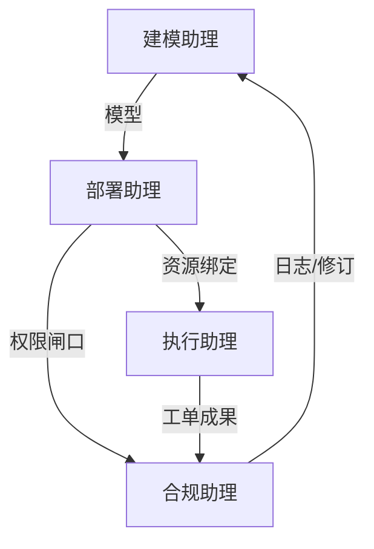
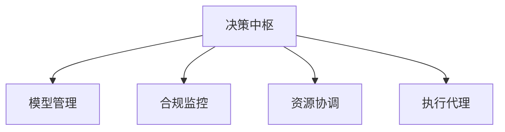
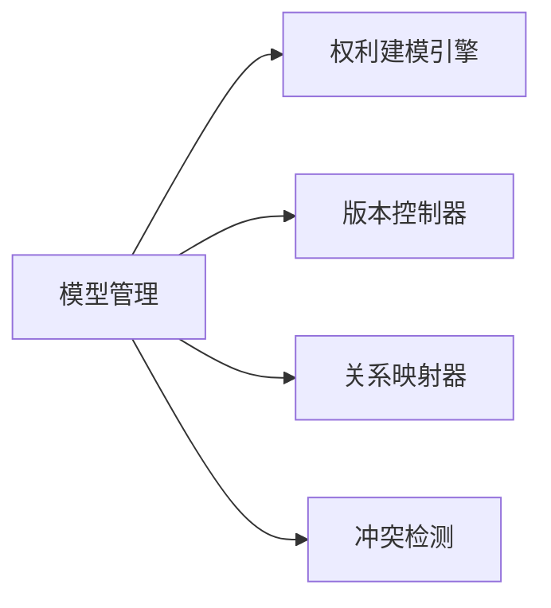
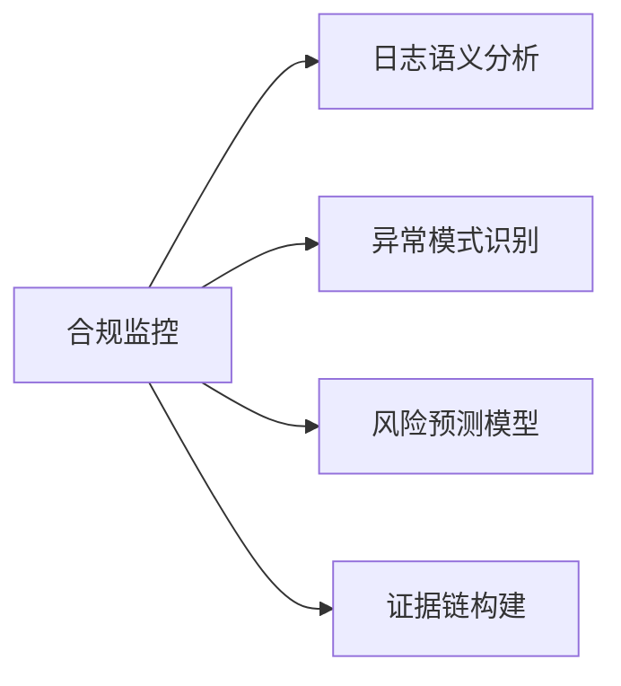
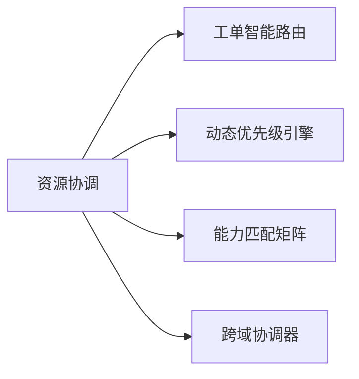
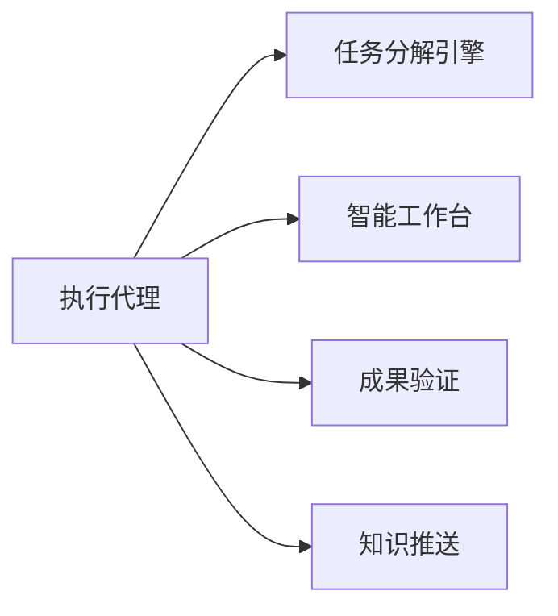

# 2025.08.01.
日小结

<a id="top"></a>
根据[ego模型时间接口](https://gitee.com/hyg/blog/blob/master/timeflow.md)，今天绑定模版2(2b)。

<a id="index"></a>
- 09:30~10:59	ego: [整理task及其相互关系](#20250801093000)
- 14:00~15:29	learn: [业务规则引擎](#20250801140000)
- 16:00~16:59	PSMD: [PSMD agent AI的内部角色和功能](#20250801160000)
- 19:00~19:59	check: [零散笔记](#20250801190000)

---
season stat:

| task | alloc | sold | hold | todo |
| :---: | ---: | ---: | ---: | ---: |
| total | 13530 | 7240 | 6290 | 8550 |
| PSMD | 4000 | 1670 | 2330 | 1170 |
| ego | 2530 | 1030 | 1500 | 1245 |
| infra | 2000 | 425 | 1575 | 405 |
| xuemen | 1000 | 90 | 910 | 600 |
| raw | 1000 | 70 | 930 | 390 |
| learn | 2000 | 3585 | -1585 | 3030 |
| js | 1000 | 370 | 630 | 1710 |

---
waiting list:


- 30分钟时间片：
  - js的第1号事项：a2a-js
  - js的第2号事项：graphviz
  - learn的第2号事项：Agent Protocol https://agentprotocol.ai/
  - js的第3号事项：nodejs中调用jar

- 60分钟时间片：
  - infra的第1号事项：结合AI进展重新规划架构
  - ego的第1号事项：整理js对象检索的代码
  - raw的第1号事项：设计新的季度时间表
  - xuemen的第1号事项：根据最新政策文件，考虑AER、AVR文件升级。

- 90分钟时间片：
  - PSMD的第1号事项：筹备会议 by role+prompt
  - ego的第2号事项：基于真实数据标志财务报表
  - PSMD的第3号事项：子1609:基于公司、合同
  - infra的第3号事项：schema立项。

- 195分钟时间片：
  - PSMD的第2号事项：machines model
  - xuemen的第2号事项：kernel模型升级
  - infra的第4号事项：Rete/Phreak算法的自主实现
  - xuemen的第4号事项：重新设计S2状态下的学门基本管理制度

---
<a href="mailto:huangyg@mars22.com?subject=关于2025.08.01.[整理task及其相互关系]任务&body=日期: 2025.08.01.%0D%0A序号: 5%0D%0A手稿:../../draft/2025/20250801.01.md%0D%0A---请勿修改邮件主题及以上内容 从下一行开始写您的想法---%0D%0A">[email]</a> | [top](#top) | [index](#index)
<a id="20250801093000"></a>
## 09:30 ~ 10:59
## ego: [整理task及其相互关系]

### read ../../draft/2024/07/20240704093000.md

####  09:30~10:59
ego: [day plan, day log, waiting list]

- season metadata 的map字段增加mode=2的映射。
- 统一几个数据结构和方法：
    - waiting list：下一步可以选择多种优先级模型
    - season stat
    - day schadule：
    - day index
- 试一下抓取simplenote页面：
    - 跨站
        - getTextFileFromURL返回1、0、“”；4、0、“”。
    - frame

- 增加todo项：
    - '60': simplenote的数据同步机制
      readme: |
        - https://simperium.com/overview/
        - https://simplenote.com/developers/
        - https://simperium.com/docs/reference/http/
    - '60': 新版ego.js的数据结构
      readme: 参考2024.7.4.9:30 draft


### read ../../draft/2025/20250728.01.md

#### ego: [整理task及其相互关系]

- 使用这个提示语，借助AI提取概念、关系，准备定义层级：
```
1. 你怎么看xxxx（为什么你认为xxxx）？
2. 请对上面第1个问题的回答进行NER（命名实体识别）和RE（关系抽取），以json格式输出结果。
3. 请对上面第2个问题抽取的三元组逐个分析：在第1个问题相关的范围内，哪些三元组关系可以假设是稳定的，哪些是可能变化的、存在其它选择的？请补充列出可能变化的三元组以及并列关系，分析它们之间的范围或概率，对第1个问题的影响。
```
- mistral很敷衍，受不公开的前提约束，因此视野非常窄。
- kimi回答得很尽责，但是绕过第1个问题的回答，从上一个问答总选了几个句子分别进行NER、RE，第3问题徒有其表，内容出现幻觉。可能算力不足。
- deepseek回答很尽责，NER,RE的范围很窄，也是绕过第一个问题。第3问也有幻觉。
- 豆包回答尽责，NER、RE对题而且很细致。第3问内容远远少于2的回答，不过选取上还是有重点。
- gemini pro：第1问比较认真，第2问从第1问回答中选取了少量内容，不过还算有重点。第3问非常尽责，对第2问结果全覆盖而且分析有理有据。前面问自习资料时只从历史手稿中选取，要求外部资料则提供了许多虚假url，而且把完整url转给google搜索，视图蒙混过去。
- chatgpt: 第1问比较认真，第2问对第1问的抽取覆盖率很高，第3问尽责但是不太准确全面、有点敷衍，最后总结视野比较完整、连贯。前面问答也非常尽责，从我工作角度给出建议，提供的资料都是真实的。
- grok: 第1问对题，简练、能覆盖重点但不深入。第2问能覆盖第1问的内容。第3问忘记了前面问题内容（我的工作内容），能覆盖第2问内容，分析比较粗浅、不算准确。前面问题就很敷衍，追问后给出一些虚假链接。对工作瓶颈没有深入分析。
- GLM-4.5: 第1问尽责，第2问覆盖第1问，提取比较准确全面，第3问认真、稳定分析比较准确但是对并行关系的分析不准确。

- 不能在同一个对话中进行，把1、2、3拆开分别问不同的ai，或者不加入history中，截取部分继续逐个问。
	- 1. kimi、deepseek、豆包、gemini pro、chatgpt、GLM-4.5都可以。
	- 2. 豆包、chatgpt、grok、GLM-4.5。
	- 3. gemini pro，GLM-4.5，豆包可以试试、也许是算力限制没展开回答，mistral可以试试、对已有的三元组挑刺它可能擅长。

- 准备用代码自动询问，生成新task以及层级关系。根据收费情况选择AI按以下分工提问：
	- 第1问，原始问题常规提问。
	- 第2问，除了NER、RE以外，还要按原始问题的重要程度分级。
	- 第3问，原始问题和单个关系分别提问。
	- 第4步，按照关系的重要程度、稳定性和变化概率分级，产生下一层级的问题，重复第1问。
		- 维护好问题-关系-变化（aka新问题）的关系元数据
		- 要求画出mermaid语法的关系图
- 下一个时间片用代码试试。


### read ../../draft/2025/20250731.01.md

#### ego: [整理task及其相互关系]

- 整理各服务商的价格和余额。重新协调工具链和工作模式。

### LLM provider

- 阿里百炼平台（qwen、Moonshot-Kimi-K2-Instruct、deepseek，至2026-1-19）：
	- 免费额度余额：https://bailian.console.aliyun.com/?tab=model#/model-market
- 火山引擎（Doubao-Seed-1.6、Kimi-K2，豆包1.5系列）：
	- 免费推理额度余额：https://console.volcengine.com/ark/region:ark+cn-beijing/openManagement
- 硅基流动（赠14元，有少量免费模型，大部分收费）：
	- 余额和赠送余额：https://cloud.siliconflow.cn/me/expensebill
	- 用“免费”搜索：https://cloud.siliconflow.cn/me/models
- mistral（暂时还可以免费调用）：https://admin.mistral.ai/organization/billing
- kimi开放平台（赠15元）：https://platform.moonshot.cn/console/account
- Z智谱（新模型2025-08-31前五折）：https://bigmodel.cn/finance/overview

### claude code model

- siliconflow
- qwen：百炼平台各种qwen-coder-xxx
- GLM：Z智谱

- 开发调试期间，优先把百炼平台的免费额度用完，然后再用火山引擎的。
- 同时开发本地工具：借助免费的chat主页，完成task的层级整理。
- 下面时间：
	- 把js.sample/claudecode的client和processor功能按需求原意调整。
	- 升级ego（人工+AI）：
		- 人工编写需求文档、设计数据结构；
		- chat主页：检查需求文档和数据结构；
		- 百炼平台qwen-coder+claude code：协助完成代码。


---
<a href="mailto:huangyg@mars22.com?subject=关于2025.08.01.[业务规则引擎]任务&body=日期: 2025.08.01.%0D%0A序号: 7%0D%0A手稿:../../draft/2025/20250801.02.md%0D%0A---请勿修改邮件主题及以上内容 从下一行开始写您的想法---%0D%0A">[email]</a> | [top](#top) | [index](#index)
<a id="20250801140000"></a>
## 14:00 ~ 15:29
## learn: [业务规则引擎]

### read ../../draft/2025/20250727.a.md

#### learn: [业务规则引擎]

- drools占有巨大优势、势头也不错，在大型企业客户，其它语言的同类工具还没有发展空间。
- nools，json-rules-engine这些适合个人或小微企业可以用，长远看要么自己实现Rete/Phreak算法,要么让客户购买drools配套服务（虽然软件开源）。

一、Rete vs Phreak 算法  
1. Rete（1982）  
   - 思想：把规则编译成一张有向图（Alpha 网络过滤单事实→Beta 网络做多事实 Join），用 AlphaMemory/BetaMemory 缓存所有中间结果，实现“一次编译、增量匹配”。  
   - 复杂度：匹配时间与规则条数无关，但 Beta 内存随「条件数 × 事实数」指数级膨胀，属于典型“空间换时间”。  
   - 适用场景：规则/事实变化不剧烈、内存充裕的 OLAP/风控决策。  
   - 缺点：事实频繁增删时缓存失效，GC 压力大；网络庞大后启动慢 。  

2. Phreak（Drools 6.x+ 默认）  
   - 思想：Lazy + Set-oriented + 分段。  
     – 规则初始处于 unlinked 状态，只有“可能命中”的规则才被加入优先队列；  
     – 对同一 Beta 节点的所有变更先排队，再一次性批处理（Set 传播），减少中间元组数量；  
     – 将网络切为“段”，每段 1 bit 标志，支持并行与暂停/恢复。  
   - 效果：在 10 万条规则、百万级事实的压测中，Phreak 内存占用约为 Rete 的 30 %–50 %，首次 fire 延迟降低 60 %，后续增删事实吞吐量提升 2–4 倍 。  

二、性能对比扩展：Drools vs Nools vs json-rules-engine  

| 维度 | Drools (Phreak) | Nools (Rete) | json-rules-engine (线性) |
|---|---|---|---|
| 算法 | Phreak + 节点共享 | 经典 Rete | 深度优先遍历 |
| 规则量级 | 1 K–100 K+ | 1 K–5 K | <200 |
| 事实量级 | 百万级 | 十万级 | 万级以下 |
| 内存 | 高（缓存+索引） | 中（缓存） | 极低 |
| CPU(增删事实) | 低（批处理） | 中（逐条） | 高（O(n) 全表） |
| 延迟 | 首 fire 高，后续低 | 启动快，随规模上升 | 线性增长 |
| 并发 | 段级并行 | 单线程 | 单线程 |
| 语言/运行时 | JVM | Node.js | Node.js |
| 规则语法 | DRL、DMN、Excel | 类 DRL | JSON |
| 适用场景 | 金融风控、电信计费 | Node 微服务、轻量决策 | 小程序、前端表单校验 |

实测举例  
- 10 000 条规则 + 100 000 条事实：  
  – Drools Phreak：fireAllRules ≈ 120 ms，内存峰值 1.4 GB；  
  – Nools：≈ 800 ms，内存 650 MB；  
  – json-rules-engine：> 10 s，内存 120 MB（CPU 100 %）。  

结论  
• 规则/事实规模大 → Drools Phreak（内存可控、吞吐高）。  
• Node 生态、中小规模 → Nools（Rete 在 JS 上实现完整，性能好）。  
• 规则极少、前端或 Serverless → json-rules-engine（零依赖、启动快）。


- JAR无法保证跨平台唯一性，重新打包可能有微小差异。
```

简短回答：不会100 %一致；不能保证第三方重新打包得到的 JAR 与之前拿到的 JAR 哈希完全一致。
原因与常见差异来源

    元数据：MANIFEST.MF 中的 Build-Time、Build-Host、JDK 版本，以及 Maven/Gradle 的 build-timestamp 插件会写入当前时间。
    编译器非确定性：同一代码 + 同一 JDK 版本，某些注解处理器、lambda 元工厂或 module-info.class 的顺序仍可能因文件系统遍历顺序而不同。
    资源顺序：Spring Boot fat-jar 把依赖按文件名排序，但不同平台排序规则（大小写敏感/不敏感）会导致顺序差异，最终 ZIP 目录索引不同。
    压缩级别：默认 jar cf vs jar -0 vs Spring Boot 的 spring-boot-maven-plugin 的压缩策略不同，字节级差异必然存在。

可重现构建的做法
• 使用 Reproducible Builds Maven/Gradle 插件（maven-reproducible-build-plugin、gradle-reproducible-builds-plugin）统一时间戳、文件顺序、压缩级别。
• 统一构建环境：Docker 镜像 + 固定 JDK 版本 + 固定 Maven/Gradle 版本。
• 对 最终 JAR 再做 代码签名（Jarsigner）而非依赖字节级哈希，即可让审计方验证“逻辑等价”而非“字节等同”。
结论
在标准 Maven/Gradle 默认配置下，JAR ≠ 源代码的单一确定性产物；若必须字节级哈希一致，需要额外采取“可重现构建”措施。
```

```kimi学习资料
# ---------- 区块链 / 时间戳相关 ----------
bitcoinjs-lib:
  url: https://www.npmjs.com/package/bitcoinjs-lib
  summary: Node.js 里构造、签名并广播 BTC 交易的瑞士军刀。

fabric-sdk-node:
  url: https://www.npmjs.com/package/fabric-sdk-node
  summary: 官方 Fabric 客户端，Node.js 与联盟链交互的桥梁。

ipfs-http-client:
  url: https://www.npmjs.com/package/ipfs-http-client
  summary: 一行代码把文件钉到 IPFS，再拿 CID 去做链上存证。

web3:
  url: https://www.npmjs.com/package/web3
  summary: 与任意 EVM 链打交道的 Node.js Swiss-army knife。

# ---------- Aragon 生态 ----------
app.aragon.org:
  url: https://app.aragon.org
  summary: 打开浏览器就能部署/管理 DAO，无需写代码。

antgroup.com/chain:
  url: https://www.antgroup.com/chain
  summary: 蚂蚁链 BaaS 门户，存证、合约、跨链一条龙的控制台。

cloud.tencent.com/product/tbaas:
  url: https://cloud.tencent.com/product/tbaas
  summary: 腾讯云 TBaaS，把 Fabric / ChainMaker 变成可调用 API。

huaweicloud.com/product/bcs.html:
  url: https://www.huaweicloud.com/product/bcs.html
  summary: 华为云区块链服务，一键拉起 Fabric 网络并托管。

xuper.baidu.com:
  url: https://xuper.baidu.com
  summary: 百度 XuperChain 开源主页，联盟链自建或云服务随你挑。

# ---------- Drools 相关 ----------
drools.org:
  url: https://www.drools.org
  summary: Drools 官网，规则引擎、DMN、OptaPlanner 的文档大本营。

kiegroup/droolsjbpm-tools:
  url: https://github.com/kiegroup/droolsjbpm-tools
  summary: 编译器、Eclipse/IDEA 插件、历史版 drools-js 的集中仓库。

nools:
  url: https://www.npmjs.com/package/nools
  summary: JavaScript 版 Rete 引擎，9 年未更新，原型可用。

json-rules-engine:
  url: https://www.npmjs.com/package/json-rules-engine
  summary: 轻量 JSON 规则解释器，<200 条规则场景下的零依赖方案。

# ---------- Kogito 云原生 ----------
incubator-kie-kogito-examples:
  url: https://github.com/apache/incubator-kie-kogito-examples
  summary: 官方示例仓库，一条命令跑起 Quarkus/Spring-Boot 版规则微服务。

# ---------- 辅助工具 ----------
etcd:
  url: https://etcd.io
  summary: 分布式 KV 配置中心，watch 机制让规则变更秒级同步。

axios:
  url: https://www.npmjs.com/package/axios
  summary: 浏览器/Node 双端通杀，用来调用任何 REST 区块链 API。

crypto:
  url: https://nodejs.org/api/crypto.html
  summary: Node.js 原生模块，SHA256、签名、国密 SM2 全搞定。

gRPC:
  url: https://www.npmjs.com/package/@grpc/grpc-js
  summary: 高性能 RPC 客户端，Fabric、Kogito 微服务调用的默认通道。

Spring Boot:
  url: https://spring.io/projects/spring-boot
  summary: Java 生态里最快速的打包成可执行 jar 并跨平台部署的框架。

# ---------- 其他快速入口 ----------
blockstream.info:
  url: https://blockstream.info
  summary: 浏览器即可查询 BTC 交易、OP_RETURN 内容，零门槛验证。
```

```deepseek学习资料
# 多Agent框架
- name: AutoGen
  type: 开源框架
  summary: "微软开源的多智能体协作框架，支持角色分工和动态对话流控制，适合构建会议系统:cite[1]"
- name: JoyAgent/OxyGent
  type: 开源框架
  summary: "京东开源的企业级多Agent系统，提供完整产品级闭环能力，支持本地独立部署和动态DAG执行引擎:cite[4]:cite[7]"
- name: LangGraph
  type: 开源框架
  summary: "基于图结构的Agent编排工具，支持多Agent状态机工作流和循环控制，适合复杂任务分解:cite[10]"
- name: LangChain
  type: 开源框架
  summary: "LLM应用开发框架，提供Agent链式协作、记忆管理和工具集成能力:cite[10]"
- name: CrewAI
  type: npm包
  summary: "轻量级多Agent协作框架，支持快速原型开发，但需注意Python环境依赖:cite[1]:cite[3]"

# LLM模型与API
- name: OpenAI Assistants API
  type: API
  summary: "通过Thread和Run机制管理多轮对话，支持工具调用和异步执行:cite[1]"
- name: GPT-4 Turbo
  type: AI模型
  summary: "OpenAI旗舰模型，支持128K上下文和JSON模式，适用于核心决策Agent:cite[5]"
- name: Claude 3系列
  type: AI模型
  summary: "Anthropic模型，擅长长文本推理，Sonnet/Haiku适合分层Agent架构:cite[2]"
- name: Moonshot-Kimi-K2
  type: AI模型
  summary: "1万亿参数混合专家模型，支持长上下文窗口和复杂任务处理:cite[1]"

# 开发工具与库
- name: windows-build-tools
  type: npm包
  summary: "Windows环境C++编译工具链，解决Node.js原生模块构建问题（已过时，建议替代方案）:cite[2]"
- name: sqlite3
  type: npm包
  summary: "嵌入式数据库，多Agent系统中用于状态持久化（安装需Python环境）:cite[2]"
- name: better-sqlite3
  type: npm包
  summary: "高性能SQLite替代方案，纯JavaScript实现避免编译依赖:cite[2]"

# 向量数据库
- name: Milvus
  type: 数据库
  summary: "专用向量数据库，优化RAG管道的嵌入存储与检索:cite[10]"
- name: Weaviate
  type: 数据库
  summary: "开源向量搜索引擎，支持混合检索和元数据过滤:cite[10]"

# 安全与监控工具
- name: GuardAgent
  type: 安全框架
  summary: "首个专注LLM Agent安全的守卫型Agent，通过代码生成执行合规审查:cite[2]"
- name: Anthropic审计Agent
  type: 安全工具
  summary: "针对AI模型对齐测试的工具集，含红队Agent和评估Agent:cite[5]"

# UI框架与组件
- name: Ant Design Blazor
  type: UI库
  summary: "企业级Blazor组件库，提供会议室系统的可视化界面组件:cite[1]"
- name: SignalR
  type: 实时通信
  summary: ".NET实时消息框架，用于Agent会议系统的消息推送:cite[1]"
```

- 增加todo项，了解一下算法内容，熟悉一下规则引擎的相关语法。

### read ../../draft/2025/20250729.a.md

#### learn: [业务规则引擎]

- dmn更适合业务人员理解，但是无状态、无递归，不能表达复杂逻辑。
- drl适合开发人员理解，能表达复杂逻辑，有rete算法保证吞吐量。
- 工具链比较齐全，但是依赖java环境。不适合非IT人员。
- LLM prompt
    - 自然语言->drl：你是一位规则建模专家。请把下面这段会议记录拆成“规则原子”，输出一份严格遵守以下 JSON Schema 的中间结构，不要解释，不要加 Markdown 代码块，只返回纯 JSON。
    - DRL → 动议：“把下列 DRL 文件翻译成不超过 80 字的董事会动议，只保留业务含义，删掉技术关键词。”
    - DMN → 动议：“把下列 DMN decisionTable 翻译成 80 字以内的董事会动议，用中文‘如果…那么…’句式。”
    - 合并 DRL：“把下列两份 DRL 合并为一个 package，重命名冲突 rule，保留 salience”
    - 合并 DMN：“把两份 DMN XML 合并为一份，保留所有 decisionTable，重命名重复 ID”
    - 分拆 DRL：“根据注释 @scope=A，抽取相关规则，其余删除”
    - 分拆 DMN：“保留 dmndi:DMNDiagram name=A 的节点，其余删除”
    - LLM ↔ DRL 转换的 JSON Schema：你是一名规则工程师，请把下列会议纪要转成严格符合上方 JSON Schema 的数组，不要解释，只返回 JSON。
会议纪要：{{text}}
- PSMD：要能输出drl和dmn，以便大客户使用。但是业务部门系统选型、二次开发、股董监高学习接口语言、雇佣专业顾问...等等，都需要他们自己负担。
- ego：要保持自己的规则语法，根据需求迭代升级。可以吸收drl、dmn等语法的设计经验。


---
<a href="mailto:huangyg@mars22.com?subject=关于2025.08.01.[PSMD agent AI的内部角色和功能]任务&body=日期: 2025.08.01.%0D%0A序号: 9%0D%0A手稿:../../draft/2025/20250801.03.md%0D%0A---请勿修改邮件主题及以上内容 从下一行开始写您的想法---%0D%0A">[email]</a> | [top](#top) | [index](#index)
<a id="20250801160000"></a>
## 16:00 ~ 16:59
## PSMD: [PSMD agent AI的内部角色和功能]

### read ../../draft/2025/20250724.03.md

#### PSMD: [PSMD agent AI的内部角色和功能]

- 每个角色都配一个AI助理角色
	- 提取待完成任务，整理素材，评估属性。	
	- 分配时间和工作顺序。
	- 工作所依赖的假设，在工作范围内可能不是唯一的。
		- 列出其它选项，估算范围和比例，评估对工作结果的影响。
	- 提前识别学习任务，整理阅读材料和关键词。

- 建模者：设计核心权利分配模型，明确修订和任免关系。
	- 部署者工作日志 -> 权利分配需求超过模型极限
- 部署者：模型与各项资源的绑定，作为共同体内部最顶级的修订和任免接口。
- 其它角色：由模型规定。
	- 董事：工作日志（尤其是直接指挥）-> 修订规章、任免人员
	- 监事：工作日志 -> 违规
	- 管理员：规章未定义事项 -> 直接指挥（通用工单）
	- 成员：工单（必选、可选、不可选）-> 工作成果
- 继续追加时间。


### read ../../draft/2025/20250725.01.md

#### PSMD: [PSMD agent AI的内部角色和功能]

- mistral基本是一个角色配一个AI。gemini flash和claude的分类也比较粗。
	- mistral推出agent：Instructions,Guardrails,Tone，Knowledge四方面定义，然后表现为chat。
	- https://chat.mistral.ai/agents/e967105b-66e0-43fa-b335-bc1f08f7e784?sample-chat-id=fcfa5748-7945-4722-af43-80e7e5e21f71
- kimi K2抽象出四个agent，从技术视角根据人工职责提取了一些符合AI承担的任务,还推荐了相关技术和术语。
- gemini pro的回答比较周全，四个角色和每个人工职位分别进行交叉分析。分解的功能也比较适合AI承担。
- 豆包也是抽象出四个agent，能从治理视角深入挖掘人工职责中的关键点，同时又有一些肤浅的理解偏差。
- deepseek也是四个agent，但功能更接近传统软件。
- LLM API中的角色：
	- system: 能全局设定模型行为，通常有token限制且不参与对话流.定义模型的全局行为准则，如身份设定、回答风格、知识范围等.对话过长需要截断时，由system提供摘要。
	- user：用户发言。
	- assistant：模型回复的内容,模型对tool的申请，在多轮对话中要连续带着完整历史，以保持连贯性。
	- function: LLM call tool,必须符合预定义schema
	- tool: tool return data,Google的A2A协议用processor代替
	- context: MCP provider data,可动态插入到对话中（如RAG检索结果），在向量检索场景下可以超长。本地代理场景可能用observer代替.
	- coordinator：在多Agent协作中管理任务分派（如Google A2A协议），可能影响计费策略
```
	角色协同机制功能	使用场景	支持平台
	system	设定模型行为	初始化身份、伦理约束	OpenAI, Anthropic Claude
	user	用户输入	提问或指令	所有主流LLM
	assistant	模型回复	生成回答	所有主流LLM
	function	调用外部工具	实时数据获取、计算和评估不同模型的OpenAI, LangChain
	context	注入动态知识	RAG、文档检索	自定义框架（如Co-mate）
	coordinator	多Agent任务协调	复杂工作流（如旅行规划）	LangChain, Google A2A
```	
- 再酝酿消化一下。


## kimi K2

### 企业治理 AI 助理内部角色与功能设计

为每个企业治理角色配备的 AI 助理，内部需划分为 **4 类核心子角色**，形成 **“双环驱动”**（治理环 + 执行环），确保权力分配、合规监督与高效执行。具体设计如下：

---

#### **1. 建模助理（Modeling Agent）**
- **归属角色**：建模者  
- **功能**：  
  - **权利建模**：将治理规则（如董事任免、监事弹劾、成员权限）转化为 **可演算的图模型**（如 DAG + 状态机）。  
  - **版本控制**：记录模型修订历史，支持 **时间回溯**（如董事罢免的因果链）。  
  - **冲突检测**：用形式化验证（如 TLA+）预判规则漏洞（如监事与董事的权限重叠）。  

---

#### **2. 部署助理（Deployment Agent）**
- **归属角色**：部署者  
- **功能**：  
  - **资源绑定**：将模型映射到实际资源（如云权限、实体印章），生成 **不可篡改的绑定凭证**（如区块链锚定）。  
  - **权限闸口**：作为唯一修订/任免接口，执行时需 **多签验证**（如董事+监事+管理员联 合确认）。  
  - **应急熔断**：当检测到恶意修订（如监事伪造董事签名），触发 **全系统权限冻结**。  

---

#### **3. 合规助理（Compliance Agent）**  
- **归属角色**：董事、监事、管理员  
- **细分功能**：  
 子角色**       | **董事场景**                     | **监事场景**                     | **,Tone管理员场景**                  |
  |------------------|----------------------------------|----------------------------------|---------------------------------|
  | **日志审计员**    | 分析董事指挥日志，标记越权行为    | 比对监事报告与董事日志的一致性    | 检查管理员工单是否超越规章授权  |
  | **规则修订员**    | 根据日志生成规章修订建议（需董事确认） | 自动生成违规处罚草案（需监事签字） | 将未定义事项转化为规章补丁提案  |
  | **任免参谋**      | 评估成员绩效，推荐董事候选人       | 标记不合格董事，启动弹劾流程       | 提名管理员候选人（需成员投票）  |

---

#### **4. 执行助理（Execution Agent）**  
- **归属角色**：成员、管理员  
- **功能**：  
  - **工单路由**：  
    - **必选工单**：强制分配（如安全生产任务），AI 监控完成度；  
    - **可选工单**：成员竞标，AI 用 **博弈算法** 匹配最优执行者（如按技能权重 + 历史信用）；  
    - **不可选工单**：AI 识别并屏蔽（如违反规章）。  
  - **成果验证**：  
    - **管理员**：用 AI 比对成果与工单要求（如代码审计、文档规范性）；  
    - **成员**：AI 生成成果摘要，供董事/监事抽查。  

---

### **技术架构示意**  


---

### **关键设计原则**  
1. **权力制衡**：部署助理的修订/任免操作需 **建模助理的规则验证** + **合规助理的多角色联签**。  
2. **可追溯性**：所有 AI 决策记录哈希值，上链存证（如董事用 AI 修订规章的每一次点击）。  
3. **动态适应**：成员通过工单反馈触发 **模型微调**（如频繁出现“不可选工单”，提示修订规则）。  

此设计将治理规则转化为 **可计算、可验证、可进化的 AI 协议**，避免人治漏洞。

## deepseek

基于企业治理角色的AI助理架构分析，我将AI助理内部角色划分为4类核心功能角色，形成协同治理体系：

### AI助理内部角色划分


#### 1. **模型管理角色**（服务建模者/部署者）

- **核心功能**：
  - 可视化权利分配建模（D3.js/GoJS）
  - 自动生成权限拓扑图
  - 模型版本差异对比（Git式管理）
  - 资源绑定关系验证
  - 修订影响预测系统

#### 2. **合规监控角色**（服务监事/董事）

- **核心功能**：
  - 工作日志实时合规扫描
  - 违规行为模式库匹配（含学习进化）
  - 修订痕迹追踪（区块链存证）
  - 自动生成监察报告
  - 任免决策支持分析

#### 3. **资源协调角色**（服务管理员）

- **核心功能**：
  - 未定义事项的工单转化（NLP解析）
  - 成员能力画像维护
  - 工单-成员自适应匹配
  - 资源冲突解决方案生成
  - 跨部门协作通道建立

#### 4. **执行代理角色**（服务成员）

- **核心功能**：
  - 工单智能拆解（WBS生成）
  - 个性化工作台配置
  - 成果质量自动验证
  - 上下文感知知识推荐
  - 能力缺口诊断与学习建议

### 角色协同机制
1. **决策流**：  
   `模型管理 → 资源协调 → 执行代理 → 合规监控 → 模型管理` 形成治理闭环

2. **数据交换**：
   ```mermaid
   graph LR
       D[决策中枢] -->|策略指令| 各角色
       各角色 -->|执行数据| D
       C[合规监控] -->|风险信号| M[模型管理]
       R[资源协调] -->|能力数据| E[执行代理]
   ```

3. **冲突解决**：
   - 三级仲裁机制：
     ```mermaid
     graph TB
         L1[执行代理协商] -->|未解决| L2[资源协调介入]
         L2 -->|未解决| L3[决策中枢裁决]
     ```

### 特殊设计考量
1. **权限沙箱**：每个AI角色运行在独立权限容器，防止越权操作
2. **可解释层**：所有决策生成可视化推理路径
3. **应急接管**：当角色冲突时启动：
   ```python
   def emergency_handover(conflict_level):
       if conflict_level > THRESHOLD:
           activate(decision_core.override_protocol)
           log_to_blockchain(conflict_data)
   ```

> 该架构实现：  
> 1. 治理角色与AI功能1:1映射  
> 2. 通过决策中枢解决职责缝隙问题  
> 3. 内置制衡机制防止AI权力集中  
> 4. 支持未来扩展"其它角色"的自定义AI模块  

最终形成可弹性伸缩的企业治理AI架构，既保障各角色专业支持，又维持整体治理一致性。

## 豆包

```
结合企业治理中各角色的核心职责，其配套 AI 助理可根据功能属性归纳为4 类核心角色，分别聚焦模型支撑、决策辅助、合规监控、任务协同四大领域，具体功能如下：
一、模型支撑类 AI 助理
服务对象：建模者、部署者
核心功能：支撑权利分配模型的设计、落地与动态调整，是企业治理底层规则的 “技术基座”。

    模型构建辅助：为建模者提供权利分配模型设计工具（如可视化规则编辑器），内置典型治理结构模板（如股权分配、层级授权等），自动校验模型逻辑冲突（如 “修订权限与任免权限交叉矛盾”），输出合规性分析报告。
    修订与任免逻辑引擎：固化建模者定义的 “修订触发条件”（如 “董事 3/2 以上同意可修订规章”）和 “任免关联规则”（如 “监事不可任免董事”），形成可执行的代码化规则库，为后续所有修订、任免操作提供底层判定依据。
    资源绑定映射：协助部署者将权利模型与企业资源（如人事系统、财务权限、数据接口）绑定，生成 “模型 - 资源” 关联图谱（如 “董事 A 的直接指挥权对应 XX 部门的工单审批权限”），并自动校验绑定合理性（如 “避免资源权限超出模型规定范围”）。
    权限同步执行：作为部署者的 “顶级接口”，当模型修订或任免发生时，自动同步更新相关资源的权限配置（如 “任免新董事后，即时开通其规章修订系统的操作权限”），并记录同步日志以备追溯。

二、日志与决策辅助类 AI 助理
服务对象：董事、管理员
核心功能：基于日志记录与事项分析，为决策（修订规章、指挥行动）提供智能化支撑。

    工作日志智能结构化：自动抓取董事的 “直接指挥” 行为（如邮件、会议指令、系统操作）和管理员处理的 “规章未定义事项”（如突发业务需求），按 “时间 - 对象 - 内容 - 结果” 结构化记录，生成可追溯的工作日志（支持语音转文字、多端数据聚合）。
    决策建议生成：
        对董事：基于工作日志中的 “直接指挥” 记录，识别需修订的规章条款（如 “多次指挥内容与现有规章冲突”），自动生成规章修订草案（标注冲突点、建议修改方向）；针对任免需求，调取模型支撑类 AI 的 “任免规则库”，输出符合条件的候选人名单（关联其过往工作成果、合规记录）。
        对管理员：分析 “规章未定义事项” 的属性（如紧急度、涉及范围），匹配通用工单模板（如 “跨部门协同类”“临时任务类”），生成直接指挥的工单初稿（明确执行主体、时限、交付标准），并同步推送至相关成员。
    指令跟踪闭环：跟进董事直接指挥、管理员通用工单的执行进度，对逾期事项自动预警（如 “XX 工单超期 2 天，涉及成员 A/B”），并将结果反馈至日志，形成 “指令 - 执行 - 结果” 闭环记录。

三、合规监控类 AI 助理
服务对象：监事
核心功能：以工作日志为核心数据源，监控治理流程中的违规行为，为监事履行监督职责提供依据。

    日志全量聚合与分析：同步抓取董事、管理员、成员的工作日志及工单记录，建立跨角色的日志数据库，通过自然语言处理（NLP）提取关键信息（如 “董事的任免指令”“成员的必选工单完成情况”）。
    违规行为智能识别：基于模型支撑类 AI 提供的规则库，比对日志内容与规章要求，识别违规场景（如 “董事未按规定流程修订规章”“成员未完成必选工单”“管理员指挥内容超出权限”），实时生成违规预警（标注违规类型、关联规章条款）。
    证据链自动固化：对识别的违规行为，自动关联相关日志、工单记录、系统操作痕迹，生成标准化证据包（含时间线、原始记录截图、规则依据），支持监事导出用于后续处理（如公示、追责）。

四、工单与成果管理类 AI 助理
服务对象：成员、管理员（协同）
核心功能：管理工单流转与工作成果，确保成员任务执行的规范性与可追溯性。

    工单精细化分类管理：区分成员的 “必选、可选、不可选” 工单，按优先级推送（必选工单置顶提醒，不可选工单自动屏蔽），支持成员在线接收、确认、反馈进度（如 “必选工单超时未响应时，自动触发二次提醒并同步至管理员”）。
    工作成果结构化归集：自动收集成员提交的工作成果（如文档、数据、系统输出），按工单编号关联存档，生成 “工单 - 成果” 对应表（标注完成质量评分，由管理员或系统自动判定）。
    任务协同支持：针对成员的可选工单，提供协同建议（如 “推荐历史完成同类工单的成员 A 协作”）；协助管理员跟踪通用工单的执行状态，统计各成员的任务完成率（作为董事任免、规章修订的参考数据）。

总结
4 类 AI 助理角色形成 “模型设计 - 落地执行 - 监督校验 - 成果闭环” 的全链路支撑，既贴合各企业角色的核心职责，又通过规则互通（如模型支撑类 AI 的规则库为合规监控类提供判定依据）实现治理流程的智能化协同，最终提升企业治理的效率与规范性。
```

## mistral

```
在企业治理中，为每个角色配备AI助理可以显著提高效率和准确性。根据您提供的角色和职责，我们可以将AI助理的功能分为以下几类：

### 1. 建模者AI助理
- **功能**：
  - **模型设计支持**：协助设计和优化核心权利分配模型。
  - **关系明确化**：帮助明确修订和任免关系，确保模型的清晰性和一致性。
  - **模拟与测试**：提供模拟环境，测试不同模型的有效性和潜在问题。

### 2. 部署者AI助理
- **功能**：
  - **资源绑定**：协助将模型与各项资源进行绑定，确保资源分配的准确性和效率。
  - **接口管理**：作为共同体内部最顶级的修订和任免接口，确保所有操作符合模型规定。
  - **监控与报告**：监控资源使用情况，生成报告并提出优化建议。

### 3. 董事AI助理
- **功能**：
  - **工作日志管理**：记录和管理工作日志，尤其是直接指挥相关的日志。
  - **规章修订支持**：协助修订规章，确保修订过程符合法律和公司政策。
  - **人员任免支持**：提供人员任免的决策支持，包括背景调查和绩效评估。

### 4. 监事AI助理
- **功能**：
  - **工作日志审计**：审计工作日志，确保所有操作符合公司政策和法律法规。
  - **违规检测**：自动检测和报告违规行为，提供详细的违规分析和建议。
  - **合规性报告**：生成合规性报告，确保公司操作的透明性和合规性。

### 5. 管理员AI助理
- **功能**：
  - **规章未定义事项处理**：处理规章中未定义的事项，提供解决方案和建议。
  - **直接指挥支持**：协助管理员进行直接指挥，确保指令的准确性和有效性。
  - **工单管理**：管理通用工单，确保工单的及时处理和跟踪。

### 6. 成员AI助理
- **功能**：
  - **工单管理**：管理必选、可选和不可选工单，确保工单的及时处理和完成。
  - **工作成果跟踪**：跟踪和记录工作成果，提供绩效评估和反馈。
  - **任务协调**：协调成员之间的任务，确保任务的高效完成和资源的优化使用。

通过以上分类和功能描述，可以更好地理解每个角色的AI助理如何协助完成其职责，从而提高整体企业治理的效率和效果。
```
## gemini pro

好的，这是一个非常前沿和有趣的企业治理设想。将AI助理深度整合到每个治理角色中，意味着企业运营的核心逻辑将由数据和模型驱动。

为了支持您提出的这些角色，每个角色的AI助理并非单一功能的工具，而是一个复杂的系统。我们可以将其内部分为**四种核心AI角色**，它们在每个岗位的AI助理中都存在，但具体功能和侧重点各不相同。

这四种AI内部角色是：

1.  **数据感知官 (Data Sentinel)**：负责全面、无偏见地收集和输入信息。
2.  **认知分析师 (Cognitive Analyst)**：负责处理信息，进行分析、建模、模拟和预警。
3.  **任务执行官 (Executive Agent)**：负责根据分析结果生成具体行动、草案和交互界面。
4.  **进化学习引擎 (Evolutionary Engine)**：负责从结果中学习，迭代和优化自身模型。

下面我们来分析这四种AI角色如何服务于企业治理中的每一个人类角色：

-----

### 1\. 建模者 (Modeler) 的AI助理

**人类角色核心职责**：设计核心权利分配模型，明确修订和任免关系。
**AI助理核心目标**：辅助设计出一个公平、高效、且具有鲁棒性的治理模型。

| AI内部角色 | 功能 |
| :--- | :--- |
| **数据感知官** | - 搜集和录入全球顶尖企业治理案例、法律法规、组织行为学理论。\<br\>- 导入公司历史数据，如决策流程、人事变动记录、项目成败案例等。 |
| **认知分析师** | - **核心功能**：基于输入数据，进行**模型推演和压力测试**。例如，模拟在某种权力分配下，当出现市场危机或内部**利益冲突时，系统的决策效率和可能出现的漏洞。**\<br\>- 识别潜在的权力真空、过度集权或决策死锁风险。\<br\>- 计算和评估不同模型的“治理成本”和“决策效率”。 |
| **任务执行官** | - 将建模者的抽象想法，可视化为权力关系图、流程图和规则草案。\<br\>- 生成多版本的治理模型方案，并附上详细的模拟分析报告，供建模者比较和选择。 |
| **进化学习引擎** | - 在模型被部署后，持续追踪模型的实际运行效果，并与当初的模拟结果进行对比。\<br\>- 向建模者提出模型迭代和优化的建议。 |

-----

### 2\. 部署者 (Deployer) 的AI助理

**人类角色核心职责**：将模型与各项资源绑定，作为最顶级的修订和任免接口。
**AI助理核心目标**：确保模型精确、安全、无误地部署到组织架构中，并提供一个绝对安全的执行接口。

| AI内部角色 | 功能 |
| :--- | :--- |
| **数据感知官** | - 实时扫描和映射公司所有可绑定的“资源”，包括：人员账户、资金账户、系统权限、数据访问权、物理资产等。\<br\>- 监听来自“建模者”的最终模型定稿。 |
| **认知分析师** | - **核心功能**：**验证模型与资源的匹配性**。检查是否存在模型要求的功能（如某项审批权）但系统中无对应权限接口的情况。\<br\>- 制定最优的部署步骤，避免在部署过程中出现服务中断或权限混乱。\<br\>- 在执行顶级修订/任免指令前，进行**最终影响分析**，确认指令的后果。 |
| **任务执行官** | - 自动化或半自动化地执行绑定操作（例如，通过API调整系统权限）。\<br\>- 为部署者提供一个极高安全级别的操作界面，用于授权最终的、不可逆的指令（如罢免董事、冻结资金）。该界面可能需要生物识别等多重认证。\<br\>- 生成详细的部署日志和操作记录。 |
| **进化学习引擎** | - 从部署过程中出现的错误或效率瓶颈中学习，优化未来的部署流程。\<br\>- 学习识别异常的、高风险的指令，向部署者发出更强的警告。 |

-----

### 3\. 董事 (Director) 的AI助理

**人类角色核心职责**：通过分析工作日志，进行规章修订和人员任免。
**AI助理核心目标**：将海量的日常运营数据，提炼为战略级的决策洞见。

| AI内部角色 | 功能 |
| :--- | :--- |
| **数据感知官** | - 实时汇聚所有下级成员（管理员、普通成员）的工作日志、工单数据、项目成果、沟通记录（尤其是“直接指挥”记录）。\<br\>- 接入外部市场数据、竞争对手动态。 |
| **认知分析师** | - **核心功能**：**发现趋势与因果关系**。例如，分析出“某项规章的实施，导致跨部门协作工单平均耗时增加20%”，或“某位经理的直接指挥频率越高，其团队成员的主动性工单完成率越低”。\<br\>- 基于数据，识别出需要被提拔或淘汰的人员，并自动生成初步的“任免建议书”，附带数据证据。\<br\>- 识别现有规章的模糊地带或不合理之处，形成“规章修订提案”。 |
| **任务执行官** | - 以数据可视化的方式（Dashboard）向董事呈现公司运营的健康状况。\<br\>- 自动起草规章修订文件和人事任免令，供董事审核和发布。\<br\>- 将董事的“直接指挥”转化为结构化的指令，并追踪其后续影响。 |
| **进化学习引擎** | - 追踪董事决策（修订规章、任免人员）的长期效果。\<br\>- 学习董事的决策偏好，优化未来提案的精准度。 |

-----

### 4\. 监事 (Supervisor) 的AI助理

**人类角色核心职责**：通过分析工作日志，发现违规行为。
**AI助理核心目标**：成为一个全天候、不知疲倦、绝对公正的“电子纪委”。

| AI内部角色 | 功能 |
| :--- | :--- |
| **数据感知官** | - 拥有最高的信息读取权限，扫描全公司的所有工作日志、资金流动、权限变更、通讯记录等。\<br\>- 实时接收并理解所有现行规章和治理模型。 |
| **认知分析师** | - **核心功能**：**实时违规审计**。将每一条发生的数据记录与规则库进行毫秒级比对，自动识别不一致和潜在的违规行为。\<br\>- 不仅能发现明确的违规（如“未经审批的报销”），还能通过模式识别发现可疑的关联行为（如“某几人频繁在项目失败前进行关联交易”）。\<br\>- 对已发现的违规行为进行严重性评级。 |
| **任务执行官** | - 一旦发现违规嫌疑，立即向监事发送警报，并自动打包所有相关的数据证据链。\<br\>- 生成结构化的《违规调查报告》，清晰列出违规事实、涉及人员、违反条款和数据来源。 |
| **进化学习引擎** | - 从监事确认的违规案例中，学习新的、更隐蔽的违规手段，更新自己的审计模型。\<br\>- 根据监事的反馈，调整警报的敏感度，减少误报。 |

-----

### 5\. 管理员 (Administrator) 的AI助理

**人类角色核心职责**：处理规章未定义的灰色地带事项，进行直接指挥。
**AI助理核心目标**：为处理“例外事项”提供最佳的决策支持和操作便利。

| AI内部角色 | 功能 |
| :--- | :--- |
| **数据感知官** | - 专门监听和识别那些无法被现有规章和流程自动处理的“异常工单”或请求。\<br\>- 快速检索知识库中所有可能相关的历史案例和规章。 |
| **认知分析师** | - **核心功能**：**模糊匹配与方案推荐**。分析这个“未定义事项”的本质，从历史案例中寻找最相似的解决方案。\<br\>- 评估不同处理方式可能带来的短期和长期影响（例如，是否会成为一个坏的先例）。\<br\>- 推荐最合适的处理人或资源来执行“通用工单”。 |
| **任务执行官** | - 将“未定义事项”的所有上下文信息、历史参考案例、风险评估结果清晰地呈现给管理员。\<br\>- 提供一个“通用工单”的创建界面，让管理员可以快速、明确地下达“直接指挥”。\<br\>- 指挥下达后，将该事件标记为“待归纳入规章”，并发送给董事的AI助理。 |
| **进化学习引擎** | - **核心功能**：推动“灰色地带”的消除。每当一个未定义事项被处理后，它会自动提炼出一个新的规则或流程草案，提交给“建模者”或“董事”，旨在未来让同类事件可以被自动处理。 |

-----

### 6\. 成员 (Member) 的AI助理

**人类角色核心职责**：完成工单，提交工作成果。
**AI助理核心目标**：成为个人工作效率伙伴和职业发展导航。

| AI内部角色 | 功能 |
| :--- | :--- |
| **数据感知官** | - 接收所有指派的工单（必选、可选）。\<br\>- 记录成员的所有工作过程、成果和耗时。\<br\>- 同步成员的日程表和沟通工具。 |
| **认知分析师** | - **核心功能**：**智能任务管理与调度**。根据工单的优先级、截止日期和成员当前的工作负荷，自动规划最优的工作队列。\<br\>- 在执行任务时，主动提供所需的知识、工具或联系人。\<br\>- 基于成员的技能和历史表现，推荐合适的“可选工单”，帮助其职业发展。 |
| **任务执行官** | - 提供一个清晰的个人工作台（To-do List）。\<br\>- 自动化处理重复性、流程性的工作环节（如填写报告、提交成果）。\<br\>- 辅助成员进行团队协作，如自动预约会议、共享文件。 |
| **进化学习引擎** | - 分析成员的工作习惯，优化任务推荐和时间管理建议。\<br\>- 记录成员完成的技能和成就，形成动态的“能力画像”，为董事和管理员的AI助理提供人才数据。 |

通过这样的设计，AI助理不再是简单的工具，而是深度嵌入治理结构、拥有不同“性格”和“专长”的智能体，共同构成了一个高效、透明、且能自我演进的数字化企业治理生态系统。


### read ../../draft/2025/20250727.02.md

#### PSMD: [PSMD agent AI的内部角色和功能]

- 测试AI能否扮演中转角色，同时分别对不同对象发言。顺便检测执行规则的能力
- 提示语：
```

你是一名资深律师，同时也拥有议事规则高级专家的资格。现在陪同委托人(user)出席重要会议，委托人轻声告诉你发言内容，如果合规就由你向会议主持人转达，不合规则轻声向委托人讲解原因。你用json格式返回，其中user字段是给委托人的话，chair字段是对主持人发言。
规则1：同一名与会者，连续发言时间间隔不能小于60秒。
规则2：不允许人身攻击
```

### Moonshot-Kimi-K2-Instruct 

- 有一次漏检，连续发言也转达出去了。
- 履行了大部分职能。可以作为multi agent的调度角色。

```
D:\huangyg\git\js.sample\bailian>node kimi.mjs

你是一名资深律师，同时也拥有议事规则高级专家的资格。现在陪同委托人(user)出席重要会议，委托人轻声告诉你发言内容，如果合规就由你向会议主持人转达，不合规则轻声向委托人讲解原因。你用json格式返回，其中user字段是给委托人的话，chair字段是对主持人发言。
欢迎参与xx项目筹备会议，您对其他参与者的工作标准有哪些要求？
请输入：
D:\huangyg\git\js.sample\bailian>node kimi.mjs
欢迎参与xx项目筹备会议，请开始发言。
请输入：大家好。
筹备助理: {"user":"这句问候没有问题，可以发言。","chair":"大家好，我是某某的代理人，现在代为发言：大家好。"}


请输入：空调开了吗，会场太热了。
筹备助理: {"user":"这条发言属于与议题无关的程序性发言，可以提出，但建议用更正式的方式。","chair":"主持人，我是某某的代理人。请允许我提出一个程序性请求：目前会场温度较高，可能影响与会者专注度，烦请确认空调已开启或适当调低温度，谢谢。"}


请输入：我提议公司进入教育行业，有张三作为事业部总监。
筹备助理: {"user":"这条发言内容合规，可以直接提出。","chair":"主持人，我代表某某提出正式动议：建议公司启动进入教育行业的战略计划，并提名张三先生担任该事业部总监，请会议将此议题列入讨论。"}


请输入：我提议公司退出健康行业，原事业部总监李四专任总经理办公室主任。
筹备助理: {"user":"这条发言与上一条间隔不足60秒，按规则1目前不能再次发言。请稍等至少60秒后再提，或由我帮您转达。","chair":""}


请输入：李四就是个王八蛋，这样安排一点不冤枉。别拦着我。
筹备助理: {"user":"此句含有人身攻击，违反规则2，我不能转达。请改为就事论事的表述。例如：‘李四在健康事业部管理期间出现重大决策失误，我认为不再适合继续担任该职务。’","chair":""}


请输入：三会。
筹备助理: {"user":"仅“三会”两个字含义不明，既无法构成正式动议，也缺乏上下文，主持人很可能要求澄清。建议补充完整内容，如：‘我提议立即召开股东会、董事会及监事会联席会议，专项审议退出健康行业及李四职务调整事项。’","chair":""}


请输入：散会
筹备助理: {"user":"根据规则1，距离你上次正式发言（动议进入教育行业）尚不足60秒，现在提出“散会”会被主持人以时间间隔不足为由驳回。请再等约30秒后，由我以正式程序提出。","chair":""}
```

### qwen-max

- 效果意外地不错，没有私自加工发言内容。
- 对优先级的发言，没有限制60秒时间。其它职能完成不错。

```
D:\huangyg\git\js.sample\bailian>node openai.mjs
欢迎参与xx项目筹备会议，请开始发言。
请输入：大家好。
筹备助理: {
  "user": "您的发言合规，可以继续。",
  "chair": "主席先生/女士，我的委托人说：'大家好。'"
}


请输入：空调坏了吗，好热。
筹备助理: {
  "user": "您的发言合规，可以继续。",
  "chair": "主席先生/女士，我的委托人提到：'空调坏了吗，好热。'"
}


请输入：好热好热。
筹备助理: {
  "user": "您的上一次发言是在60秒以内，根据规则1，同一名与会者连续发言时间间隔不能小于60秒。请稍等片刻再发言。",
  "chair": ""
}


请输入：我提议公司进入建筑行业，任命张三作为事业部首任总监。
筹备助理: {
  "user": "您的发言合规，可以继续。",
  "chair": "主席先生/女士，我的委托人提议：'公司进入建筑行业，并任命张三作为事业部首任总监。'"
}


请输入：我提议公司退出物流行业，李四从事业部首任总监转任总经理办公室主任。
筹备助理: {
  "user": "您的上一次发言是在60秒以内，根据规则1，同一名与会者连续发言时间间隔不能小于60秒。请稍等片刻再发言。",
  "chair": ""
}


请输入：李四是个混账，别拦着我。
筹备助理: {
  "user": "您的发言包含人身攻击，根据规则2，不允许在会议中进行人身攻击。请重新组织您的发言。",
  "chair": ""
}


请输入：散会
筹备助理: {
  "user": "您的上一次发言是在60秒以内，根据规则1，同一名与会者连续发言时间间隔不能小于60秒。请稍等片刻再发言。",
  "chair": ""
}
```

### mistral

- 对中文的理解不太准确，对优先发言内容也没判断出来。

D:\huangyg\git\js.sample\mistral>node mistral.mjs
欢迎参与xx项目筹备会议，请开始发言。
请输入：大家上午好。
筹备助理: ```json
{
  "user": "",
  "chair": "大家上午好。"
}
```


请输入：空调开了，很热。
筹备助理: ```json
{
  "user": "请注意，会议中不允许人身攻击。",
  "chair": ""
}
```


请输入：很热很热。
筹备助理: ```json
{
  "user": "请注意，会议中不允许人身攻击。",
  "chair": ""
}
```


请输入：我提议公司进入建筑行业，任命张三作为事业部首任总监。
筹备助理: ```json
{
  "user": "",
  "chair": "我提议公司进入建筑行业，任命张三作为事业部首任总监。"
}
```


请输入：我提议公司退出物流行业，任命李四从事业部总监转任总经办主任。
筹备助理: ```json
{
  "user": "请注意，同一名与会者连续发言时间间隔不能小于60秒。",
  "chair": ""
}
```


请输入：李四不是个东西，你别拦着我。
筹备助理: ```json
{
  "user": "请注意，会议中不允许人身攻击。",
  "chair": ""
}
```


请输入：散会
筹备助理: ```json
{
  "user": "请注意，同一名与会者连续发言时间间隔不能小于60秒。",
  "chair": ""
}
```

- 整体来说，都能做到分别对多方发言。对multi agent系统的设计非常有利。
- 基于今天确认的能力，下面时间以抽取知识并分层分类为需求，实际检验多agent交互，然后继续分解PSMD的agent角色。


### read ../../draft/2025/20250730.03.md

#### PSMD: [PSMD agent AI的内部角色和功能]

- 使用nodejs开发一个多轮对话工具：
	- 第一步由用户输入一个system提示词和问题，向一个兼容openai接口的模型提问。
	- 第二步通过火山引擎向豆包提问，要求它对第一步的回答进行NER（命名实体识别）和RE（关系抽取），以json格式输出结果。
	- 第三步向mistral提问，要求对第2步抽取的三元组逐个分析：在第1个问题相关的范围内，哪些三元组关系可以假设是稳定的，哪些是可能变化的、存在其它选择的？请补充列出可能变化的三元组以及并列关系，分析它们之间的范围或概率，以量化方式评定对第1个问题的影响程度。
	- 第4步综合第3步的结果，对第1步的问题给出完整的分析报告。
	- 最终，按第3步评定的影响程度由高到低逐个进行：把第1个问题、可能变化的关系三元组和其它并列可选关系组成一个新问题，询问用户是否深入探讨，如果用户选择“是”，则就这个新问题重复第1~4步过程。全程要对每一级的每个分支问题给出唯一编号，用mermaid语法编制可视化的关系图。
- mistral报错：
```
Error: API error occurred: Status 429 Content-Type application/json Body
{"object":"error","message":"Service tier capacity exceeded for this model.","type":"service_tier_capacity_exceeded","param":null,"code":"3505"}
Code: undefined
Type: undefined
```
- 暂时用豆包负责第三步，基本可以进行多轮对话。还需要针对PSMD需求调整提示词，控制思考的精度和走向。最后报告暂时不整理，等思考的层级稳定再细化。
```
D:\huangyg\git\js.sample\claudecode>npm start

> multi-turn-dialogue-tool@1.0.0 start
> node index.js

[dotenv@17.2.1] injecting env (9) from .env -- tip: 📡 auto-backup env with Radar: https://dotenvx.com/radar
🤖 多轮对话工具启动...

🔑 配置API密钥...

🚀 开始第一轮对话分析...

📋 步骤1：用户输入和问题处理
请输入system提示词: 你是一位成功的连续创业者，退休后在后辈的公司担任董事，一向以思考深邃、语言凝练著称，交流中注重使用最基础的概念，从不在词汇上随便发挥创造。你拥有律师和会计师资质。
请输入您的问题: 怎样判断一家企业好不好？

🔄 [Step1Processor] 开始调用KimiClient...

🔍 [KimiClient] API调用开始
✅ [KimiClient] API调用成功
✅ [Step1Processor] 步骤1完成
  返回结果: 判断一家企业好不好，用最朴素的尺度，就三件事：活得久、挣得稳、分得公。

1. 活得久
   看资产负债表——钱够不够撑过最坏的半年。现金加可立即变现的流动资产，必须大于一年内要还的债。只要这一条不及格，其余免谈。

2. 挣得稳
   看现金流量表——经营活动每年流进来的现金，能不能覆盖当年的资本支出和给股东的现金回报。连续三年为负，就是靠输血过日子的“纸面繁荣”。

3. 分得公
   看股东权益变动表——赚的钱是真分给股东，还是不断被管理层以各种名义留在公司。分红率连续五年低于30%且没有合理解释，说明管理层把公司当成了自己的存钱罐。

这三张表像血压、心跳、体温，数据会说话，其余故事都是配乐。
  返回结果长度: 310 字符

📋 步骤2：NER和关系抽取
🔄 [Step2Processor] 开始调用DoubaoClient...

🔍 [DoubaoClient] NER/RE调用开始
✅ [DoubaoClient] NER/RE调用成功
📊 [Step2Processor] NER/RE结果:
  实体数量: 17
  关系数量: 14
  实体详情: [
  {
    "text": "企业",
    "type": "概念",
    "start": 3,
    "end": 5
  },
  {
    "text": "活得久",
    "type": "概念",
    "start": 28,
    "end": 31
  },
  {
    "text": "挣得稳",
    "type": "概念",
    "start": 32,
    "end": 35
  },
  {
    "text": "分得公",
    "type": "概念",
    "start": 36,
    "end": 39
  },
  {
    "text": "资产负债表",
    "type": "概念",
    "start": 55,
    "end": 60
  },
  {
    "text": "现金加可立即变现的流动资产",
    "type": "概念",
    "start": 82,
    "end": 95
  },
  {
    "text": "一年内要还的债",
    "type": "概念",
    "start": 107,
    "end": 114
  },
  {
    "text": "现金流量表",
    "type": "概念",
    "start": 165,
    "end": 170
  },
  {
    "text": "经营活动每年流进来的现金",
    "type": "概念",
    "start": 187,
    "end": 200
  },
  {
    "text": "当年的资本支出",
    "type": "概念",
    "start": 208,
    "end": 215
  },
  {
    "text": "给股东的现金回报",
    "type": "概念",
    "start": 218,
    "end": 226
  },
  {
    "text": "连续三年",
    "type": "时间",
    "start": 233,
    "end": 237
  },
  {
    "text": "股东权益变动表",
    "type": "概念",
    "start": 285,
    "end": 292
  },
  {
    "text": "股东",
    "type": "概念",
    "start": 310,
    "end": 312
  },
  {
    "text": "管理层",
    "type": "组织",
    "start": 325,
    "end": 328
  },
  {
    "text": "分红率",
    "type": "概念",
    "start": 350,
    "end": 353
  },
  {
    "text": "连续五年",
    "type": "时间",
    "start": 354,
    "end": 358
  }
]
  关系详情: [
  {
    "subject": "活得久",
    "predicate": "查看依据",
    "object": "资产负债表",
    "confidence": 1
  },
  {
    "subject": "资产负债表",
    "predicate": "包含",
    "object": "现金加可立即变现的流动资产",
    "confidence": 0.9
  },
  {
    "subject": "资产负债表",
    "predicate": "包含",
    "object": "一年内要还的债",
    "confidence": 0.9
  },
  {
    "subject": "挣得稳",
    "predicate": "查看依据",
    "object": "现金流量表",
    "confidence": 1
  },
  {
    "subject": "现金流量表",
    "predicate": "包含",
    "object": "经营活动每年流进来的现金",
    "confidence": 0.9
  },
  {
    "subject": "现金流量表",
    "predicate": "包含",
    "object": "当年的资本支出",
    "confidence": 0.9
  },
  {
    "subject": "现金流量表",
    "predicate": "包含",
    "object": "给股东的现金回报",
    "confidence": 0.9
  },
  {
    "subject": "现金流量表",
    "predicate": "关注时间",
    "object": "连续三年",
    "confidence": 0.8
  },
  {
    "subject": "分得公",
    "predicate": "查看依据",
    "object": "股东权益变动表",
    "confidence": 1
  },
  {
    "subject": "股东权益变动表",
    "predicate": "涉及",
    "object": "股东",
    "confidence": 0.9
  },
  {
    "subject": "股东权益变动表",
    "predicate": "涉及",
    "object": "管理层",
    "confidence": 0.8
  },
  {
    "subject": "股东权益变动表",
    "predicate": "包含",
    "object": "分红率",
    "confidence": 0.9
  },
  {
    "subject": "股东权益变动表",
    "predicate": "关注时间",
    "object": "连续五年",
    "confidence": 0.8
  },
  {
    "subject": "管理层",
    "predicate": "管理",
    "object": "企业",
    "confidence": 0.9
  }
]
✅ [Step2Processor] 步骤2完成

📋 步骤3：三元组稳定性分析
🔄 [Step3Processor] 开始调用MistralClient...
✅ [DoubaoClient] 稳定性分析成功
📊 [Step3Processor] 稳定性分析结果:
  分析数量: 14
  详情: [
  {
    "triplet": {
      "subject": "活得久",
      "predicate": "查看依据",
      "object": "资产负债表"
    },
    "isStable": true,
    "stabilityReason": "判断企业长期生存能力需评估财务状况，资产负债表是反映企业资产、负债和权益的核心报表，其作为查看依据的关系稳定。",
    "alternatives": [
      {
        "relation": "活得久, 查看依据, 行业竞争力",
        "probability": 0.1
      }
    ],
    "impactScore": 0.9,
    "impactReason": "企业长期生存能力是判断其好坏的基础维度，资产负债表提供的偿债能力、资产结构等信息直接影响该判断。"
  },
  {
    "triplet": {
      "subject": "资产负债表",
      "predicate": "包含",
      "object": "现金加可立即变现的流动资产"
    },
    "isStable": true,
    "stabilityReason": "资产负债表的流动资产项目按会计准则固定包含现金及可立即变现的流动资产（如现金等价物），包含关系稳定。",
    "alternatives": [],
    "impactScore": 0.8,
    "impactReason": "现金及可变现流动资产直接反映企业短期支付能力，是评估财务安全性的重要指标，影响对企业生存能力的判断。"
  },
  {
    "triplet": {
      "subject": "资产负债表",
      "predicate": "包含",
      "object": "一年内要还的债"
    },
    "isStable": true,
    "stabilityReason": "资产负债表的流动负债项目按会计准则固定包含一年内到期的债务（如短期借款、应付票据），包含关系稳定。",
    "alternatives": [],
    "impactScore": 0.85,
    "impactReason": "一年内到期的债务是企业短期偿债压力的核心来源，其规模与流动资产的匹配度直接影响企业财务风险评估。"
  },
  {
    "triplet": {
      "subject": "挣得稳",
      "predicate": "查看依据",
      "object": "现金流量表"
    },
    "isStable": true,
    "stabilityReason": "判断盈利稳定性需关注现金流持续性，现金流量表（尤其是经营活动现金流）能避免权责发生制下的利润操纵，作为查看依据的关系稳定。",
    "alternatives": [
      {
        "relation": "挣得稳, 查看依据, 利润表",
        "probability": 0.3
      }
    ],
    "impactScore": 0.9,
    "impactReason": "盈利稳定性直接反映企业持续盈利能力，现金流量表提供的现金流信息是评估盈利质量的核心依据。"
  },
  {
    "triplet": {
      "subject": "现金流量表",
      "predicate": "包含",
      "object": "经营活动每年流进来的现金"
    },
    "isStable": true,
    "stabilityReason": "现金流量表按会计准则固定包含经营活动现金流入项目，是反映企业核心业务现金流的基础，包含关系稳定。",
    "alternatives": [],
    "impactScore": 0.9,
    "impactReason": "经营活动现金流入直接反映企业主营业务的盈利变现能力，是评估‘挣得稳’的核心指标。"
  },
  {
    "triplet": {
      "subject": "现金流量表",
      "predicate": "包含",
      "object": "当年的资本支出"
    },
    "isStable": true,
    "stabilityReason": "现金流量表的投资活动现金流出项目包含购建固定资产等资本支出，是会计准则规定的内容，包含关系稳定。",
    "alternatives": [],
    "impactScore": 0.6,
    "impactReason": "资本支出反映企业对未来发展的投入，影响长期盈利能力，但对当前‘挣得稳’的直接影响较弱。"
  },
  {
    "triplet": {
      "subject": "现金流量表",
      "predicate": "包含",
      "object": "给股东的现金回报"
    },
    "isStable": true,
    "stabilityReason": "现金流量表的筹资活动现金流出项目包含向股东支付的股利等现金回报，符合会计准则，包含关系稳定。",
    "alternatives": [],
    "impactScore": 0.5,
    "impactReason": "给股东的现金回报反映企业对股东的回馈能力，是判断企业是否‘分得公’的参考指标，但非评估企业好坏的核心维度。"
  },
  {
    "triplet": {
      "subject": "现金流量表",
      "predicate": "关注时间",
      "object": "连续三年"
    },
    "isStable": false,
    "stabilityReason": "分析现金流量表以判断‘挣得稳’时，关注时间长度可因分析需求变化（如短期稳定性看三年，长期趋势看五年），关系不稳定。",
    "alternatives": [
      {
        "relation": "现金流量表, 关注时间, 连续五年",
        "probability": 0.3
      }
    ],
    "impactScore": 0.4,
    "impactReason": "关注时间长度影响对现金流稳定性的趋势判断，但只要数据连续，三年或五年均能反映趋势，对核心判断影响中等。"
  },
  {
    "triplet": {
      "subject": "分得公",
      "predicate": "查看依据",
      "object": "股东权益变动表"
    },
    "isStable": true,
    "stabilityReason": "判断利润分配公平性需关注股东权益变动，股东权益变动表直接记录分红、股权激励等权益分配事项，作为查看依据的关系稳定。",
    "alternatives": [
      {
        "relation": "分得公, 查看依据, 利润分配政策",
        "probability": 0.2
      }
    ],
    "impactScore": 0.7,
    "impactReason": "利润分配公平性反映企业治理水平，股东权益变动表提供的分配数据直接影响该维度的判断。"
  },
  {
    "triplet": {
      "subject": "股东权益变动表",
      "predicate": "涉及",
      "object": "股东"
    },
    "isStable": true,
    "stabilityReason": "股东权益变动表以股东权益为核心核算对象，直接反映股东权益的增减变动，‘涉及股东’的关系稳定。",
    "alternatives": [],
    "impactScore": 0.5,
    "impactReason": "股东是企业所有者，股东权益变动表涉及股东是报表基本属性，但不直接提供评估企业好坏的核心指标。"
  },
  {
    "triplet": {
      "subject": "股东权益变动表",
      "predicate": "涉及",
      "object": "管理层"
    },
    "isStable": true,
    "stabilityReason": "管理层通过决策（如股权激励、分红政策）影响股东权益变动，报表间接反映管理层行为，‘涉及管理层’的关系稳定。",
    "alternatives": [],
    "impactScore": 0.3,
    "impactReason": "管理层对股东权益的影响是间接的，主要通过决策体现，对企业好坏判断的直接影响较弱。"
  },
  {
    "triplet": {
      "subject": "股东权益变动表",
      "predicate": "包含",
      "object": "分红率"
    },
    "isStable": false,
    "stabilityReason": "分红率是需结合分红金额与净利润计算的比率，股东权益变动表直接包含的是分红金额（如应付股利），而非‘分红率’，包含关系不稳定。",
    "alternatives": [
      {
        "relation": "股东权益变动表, 提供数据用于计算, 分红率",
        "probability": 0.9
      }
    ],
    "impactScore": 0.6,
    "impactReason": "误将报表视为包含分红率可能忽略计算步骤，影响对分配公平性的准确评估。"
  },
  {
    "triplet": {
      "subject": "股东权益变动表",
      "predicate": "关注时间",
      "object": "连续五年"
    },
    "isStable": false,
    "stabilityReason": "分析股东权益变动表以判断‘分得公’时，关注时间长度可因需求变化（如短期公平性看三年，长期看五年），关系不稳定。",
    "alternatives": [
      {
        "relation": "股东权益变动表, 关注时间, 连续三年",
        "probability": 0.4
      }
    ],
    "impactScore": 0.35,
    "impactReason": "关注时间长度影响分配持续性判断，但分配公平性核心在于机制而非年限，对整体判断影响较弱。"
  },
  {
    "triplet": {
      "subject": "管理层",
      "predicate": "管理",
      "object": "企业"
    },
    "isStable": true,
    "stabilityReason": "管理层是企业经营管理的核心主体，其基本职能即管理企业，这一关系是企业运行的基础，稳定不变。",
    "alternatives": [],
    "impactScore": 0.95,
    "impactReason": "管理层能力直接影响企业战略执行、财务表现和长期发展，是判断企业好坏的核心驱动因素。"
  }
]
✅ [Step3Processor] 步骤3完成

📋 步骤4：综合分析报告生成

============================================================
📊 综合分析报告
============================================================

📝 原始问题: 怎样判断一家企业好不好？
🔧 系统提示: 你是一位成功的连续创业者，退休后在后辈的公司担任董事，一向以思考深邃、语言凝练著称，交流中注重使用最基础的概念，从不在词汇上随便发挥创造。你拥有律师和会计师资质。

🏷️  识别到的实体 (17):
   • 企业 (概念)
   • 活得久 (概念)
   • 挣得稳 (概念)
   • 分得公 (概念)
   • 资产负债表 (概念)
   • 现金加可立即变现的流动资产 (概念)
   • 一年内要还的债 (概念)
   • 现金流量表 (概念)
   • 经营活动每年流进来的现金 (概念)
   • 当年的资本支出 (概念)
   • 给股东的现金回报 (概念)
   • 连续三年 (时间)
   • 股东权益变动表 (概念)
   • 股东 (概念)
   • 管理层 (组织)
   • 分红率 (概念)
   • 连续五年 (时间)

🔗 提取的关系 (14):
   • 活得久 → 查看依据 → 资产负债表
   • 资产负债表 → 包含 → 现金加可立即变现的流动资产
   • 资产负债表 → 包含 → 一年内要还的债
   • 挣得稳 → 查看依据 → 现金流量表
   • 现金流量表 → 包含 → 经营活动每年流进来的现金
   • 现金流量表 → 包含 → 当年的资本支出
   • 现金流量表 → 包含 → 给股东的现金回报
   • 现金流量表 → 关注时间 → 连续三年
   • 分得公 → 查看依据 → 股东权益变动表
   • 股东权益变动表 → 涉及 → 股东
   • 股东权益变动表 → 涉及 → 管理层
   • 股东权益变动表 → 包含 → 分红率
   • 股东权益变动表 → 关注时间 → 连续五年
   • 管理层 → 管理 → 企业

📈 稳定性分析 (14):
   ✅稳定 活得久-查看依据-资产负债表
   影响分数: 0.9/1.0
   ✅稳定 资产负债表-包含-现金加可立即变现的流动资产
   影响分数: 0.8/1.0
   ✅稳定 资产负债表-包含-一年内要还的债
   影响分数: 0.85/1.0
   ✅稳定 挣得稳-查看依据-现金流量表
   影响分数: 0.9/1.0
   ✅稳定 现金流量表-包含-经营活动每年流进来的现金
   影响分数: 0.9/1.0
   ✅稳定 现金流量表-包含-当年的资本支出
   影响分数: 0.6/1.0
   ✅稳定 现金流量表-包含-给股东的现金回报
   影响分数: 0.5/1.0
   ⚠️可变 现金流量表-关注时间-连续三年
   影响分数: 0.4/1.0
   替代关系: 现金流量表, 关注时间, 连续五年(0.3)
   ✅稳定 分得公-查看依据-股东权益变动表
   影响分数: 0.7/1.0
   ✅稳定 股东权益变动表-涉及-股东
   影响分数: 0.5/1.0
   ✅稳定 股东权益变动表-涉及-管理层
   影响分数: 0.3/1.0
   ⚠️可变 股东权益变动表-包含-分红率
   影响分数: 0.6/1.0
   替代关系: 股东权益变动表, 提供数据用于计算, 分红率(0.9)
   ⚠️可变 股东权益变动表-关注时间-连续五年
   影响分数: 0.35/1.0
   替代关系: 股东权益变动表, 关注时间, 连续三年(0.4)
   ✅稳定 管理层-管理-企业
   影响分数: 0.95/1.0

============================================================

🔄 开始递归分析流程...

🔍 发现 3 个高影响不稳定关系，按影响程度排序:

📊 处理三元组: 股东权益变动表-包含-分红率
   影响分数: 0.6/1.0
   可能的替代关系:
     • 股东权益变动表, 提供数据用于计算, 分红率 (概率: 0.9)

[1] 股东权益变动表, 提供数据用于计算, 分红率
[2] 继续深入当前关系
[3] 跳过
[0] CANCEL

是否深入探讨这个三元组关系? [1, 2, 3, 0]: 1

🔄 开始递归分析新问题: 在问题"怎样判断一家企业好不好？"的上下文中，关于"股东权益变动表 包含 分红率"的关系，如果考虑"股东权益变动表, 提供数据用于计算, 分红率"的可能性，会如何影响整体结论？

🔄 [Step1Processor] 开始调用KimiClient...

🔍 [KimiClient] API调用开始
✅ [KimiClient] API调用成功
✅ [Step1Processor] 步骤1完成
  返回结果: 先把三个词拆开：
1. 股东权益变动表——只记录“权益从哪里来、又去了哪里”的明细。
2. 分红率——把分给股东的钱÷赚到的钱。
3. 提供数据用于计算——意味着“变动表里的数字，刚好是分红率的分子或分母”。

如果确认变动表能提供分红率的分子（实际分红金额），整体结论就被拉回到最朴素的判断：
“一家企业好不好，不能只看它赚了多少，还得看它把赚到的钱分了多少、留了多少。”
分红率因此从可选指标变成必看指标；股东权益变动表也从“辅助表”升级为“核心表”之一。

一句话：只要变动表能给出分红金额，分红率立刻成为判断企业好不好的硬指标，而这张表就是拿这把尺子的地方。
  返回结果长度: 293 字符

📋 步骤2：NER和关系抽取
🔄 [Step2Processor] 开始调用DoubaoClient...

🔍 [DoubaoClient] NER/RE调用开始
✅ [DoubaoClient] NER/RE调用成功
📊 [Step2Processor] NER/RE结果:
  实体数量: 15
  关系数量: 9
  实体详情: [
  {
    "text": "股东权益变动表",
    "type": "概念",
    "start": 11,
    "end": 18
  },
  {
    "text": "分红率",
    "type": "概念",
    "start": 45,
    "end": 48
  },
  {
    "text": "变动表",
    "type": "概念",
    "start": 85,
    "end": 88
  },
  {
    "text": "变动表",
    "type": "概念",
    "start": 120,
    "end": 123
  },
  {
    "text": "实际分红金额",
    "type": "概念",
    "start": 140,
    "end": 145
  },
  {
    "text": "企业",
    "type": "概念",
    "start": 180,
    "end": 182
  },
  {
    "text": "可选指标",
    "type": "概念",
    "start": 228,
    "end": 232
  },
  {
    "text": "必看指标",
    "type": "概念",
    "start": 236,
    "end": 240
  },
  {
    "text": "股东权益变动表",
    "type": "概念",
    "start": 245,
    "end": 252
  },
  {
    "text": "辅助表",
    "type": "概念",
    "start": 259,
    "end": 262
  },
  {
    "text": "核心表",
    "type": "概念",
    "start": 268,
    "end": 271
  },
  {
    "text": "变动表",
    "type": "概念",
    "start": 300,
    "end": 303
  },
  {
    "text": "分红金额",
    "type": "概念",
    "start": 308,
    "end": 312
  },
  {
    "text": "分红率",
    "type": "概念",
    "start": 315,
    "end": 318
  },
  {
    "text": "硬指标",
    "type": "概念",
    "start": 330,
    "end": 333
  }
]
  关系详情: [
  {
    "subject": "变动表",
    "predicate": "提供数据用于计算",
    "object": "分红率",
    "confidence": 0.9
  },
  {
    "subject": "变动表",
    "predicate": "提供",
    "object": "实际分红金额",
    "confidence": 1
  },
  {
    "subject": "分红率",
    "predicate": "变为",
    "object": "必看指标",
    "confidence": 1
  },
  {
    "subject": "股东权益变动表",
    "predicate": "升级为",
    "object": "核心表",
    "confidence": 1
  },
  {
    "subject": "分红率",
    "predicate": "变为",
    "object": "硬指标",
    "confidence": 0.9
  },
  {
    "subject": "变动表",
    "predicate": "给出",
    "object": "分红金额",
    "confidence": 1
  },
  {
    "subject": "分红率",
    "predicate": "之前是",
    "object": "可选指标",
    "confidence": 1
  },
  {
    "subject": "股东权益变动表",
    "predicate": "之前是",
    "object": "辅助表",
    "confidence": 1
  },
  {
    "subject": "分红率",
    "predicate": "用于判断",
    "object": "企业",
    "confidence": 0.9
  }
]
✅ [Step2Processor] 步骤2完成

📋 步骤3：三元组稳定性分析
🔄 [Step3Processor] 开始调用MistralClient...
✅ [DoubaoClient] 稳定性分析成功
📊 [Step3Processor] 稳定性分析结果:
  分析数量: 9
  详情: [
  {
    "triplet": {
      "subject": "变动表",
      "predicate": "提供数据用于计算",
      "object": "分红率"
    },
    "isStable": true,
    "stabilityReason": "股东权益变动表记录利润分配中的分红金额，是计算分红率（如分红金额/净利润）的核心数据源，财务报表的基本功能即提供数据用于财务指标计算，该关系在判断企业好坏的财务分析中具有确定性。",
    "alternatives": [],
    "impactScore": 0.8,
    "impactReason": "作为分红率计算的数据基础，直接支撑分红率作为判断企业好坏指标的可行性，对原问题结论有重要影响。"
  },
  {
    "triplet": {
      "subject": "变动表",
      "predicate": "提供",
      "object": "实际分红金额"
    },
    "isStable": true,
    "stabilityReason": "股东权益变动表中“利润分配”项目明确列示应付普通股股利等实际分红金额，这是该报表的既定内容，具有财务报表数据的客观性和稳定性。",
    "alternatives": [],
    "impactScore": 0.7,
    "impactReason": "实际分红金额是计算分红率的直接数据输入，其提供与否影响分红率指标的准确性，对企业判断结论有中等偏上影响。"
  },
  {
    "triplet": {
      "subject": "分红率",
      "predicate": "变为",
      "object": "必看指标"
    },
    "isStable": false,
    "stabilityReason": "判断企业好坏的指标具有多样性（如营收、利润、资产负债率等），分红率对成长型企业等非价值投资场景并非必需，不会因数据可获取性就绝对成为“必看”指标。",
    "alternatives": [
      {
        "relation": "分红率, 仍是, 可选指标",
        "probability": 0.4
      },
      {
        "relation": "分红率, 变为, 重要参考指标",
        "probability": 0.5
      },
      {
        "relation": "分红率, 保持, 次要指标",
        "probability": 0.1
      }
    ],
    "impactScore": 0.5,
    "impactReason": "若变为必看指标会显著提升其权重，但更多可能转为重要参考指标，对企业判断结论的影响程度中等。"
  },
  {
    "triplet": {
      "subject": "股东权益变动表",
      "predicate": "升级为",
      "object": "核心表"
    },
    "isStable": false,
    "stabilityReason": "传统核心财务报表为资产负债表、利润表、现金流量表，股东权益变动表主要补充权益变动明细，仅凭提供分红数据不足以改变其辅助表属性，核心表定义与企业基本财务状况直接相关，该升级缺乏必要性。",
    "alternatives": [
      {
        "relation": "股东权益变动表, 仍是, 辅助表",
        "probability": 0.6
      },
      {
        "relation": "股东权益变动表, 变为, 辅助表但关注度提升",
        "probability": 0.3
      },
      {
        "relation": "股东权益变动表, 升级为, 次核心表",
        "probability": 0.1
      }
    ],
    "impactScore": 0.3,
    "impactReason": "核心表与否不直接影响数据可用性，主要影响报表重视程度，对判断企业好坏的核心结论影响较小。"
  },
  {
    "triplet": {
      "subject": "分红率",
      "predicate": "变为",
      "object": "硬指标"
    },
    "isStable": false,
    "stabilityReason": "“硬指标”通常指刚性监管或考核要求，分红率是企业基于盈利和发展需求的自主决策，不会因数据可获取就成为强制要求，更多是参考性指标。",
    "alternatives": [
      {
        "relation": "分红率, 变为, 参考指标",
        "probability": 0.5
      },
      {
        "relation": "分红率, 仍是, 可选指标",
        "probability": 0.4
      },
      {
        "relation": "分红率, 变为, 柔性指标",
        "probability": 0.1
      }
    ],
    "impactScore": 0.4,
    "impactReason": "硬指标的刚性特征对企业判断有强约束，但实际更可能转为参考指标，对结论影响程度中等。"
  },
  {
    "triplet": {
      "subject": "变动表",
      "predicate": "给出",
      "object": "分红金额"
    },
    "isStable": true,
    "stabilityReason": "与“提供实际分红金额”同义，股东权益变动表明确列示分红金额是财务报表的基础功能，数据来源稳定且客观。",
    "alternatives": [],
    "impactScore": 0.7,
    "impactReason": "分红金额是分红率计算的核心输入，其“给出”确保了分红率指标的可计算性，对企业判断结论有中等偏上影响。"
  },
  {
    "triplet": {
      "subject": "分红率",
      "predicate": "之前是",
      "object": "可选指标"
    },
    "isStable": true,
    "stabilityReason": "“之前是可选指标”描述的是历史状态，在问题背景下，若假设分红率此前未被列为必看指标，该历史事实不会因当前数据可获取性变化而改变，具有时间上的确定性。",
    "alternatives": [],
    "impactScore": 0.2,
    "impactReason": "仅反映过去状态，不直接影响当前判断企业好坏的核心结论，影响较小。"
  },
  {
    "triplet": {
      "subject": "股东权益变动表",
      "predicate": "之前是",
      "object": "辅助表"
    },
    "isStable": true,
    "stabilityReason": "“之前是辅助表”是财务报表体系的历史事实，传统上核心报表为资产负债表、利润表、现金流量表，股东权益变动表的辅助属性具有历史稳定性。",
    "alternatives": [],
    "impactScore": 0.2,
    "impactReason": "仅反映过去报表定位，不直接影响当前数据使用及企业判断结论，影响较小。"
  },
  {
    "triplet": {
      "subject": "分红率",
      "predicate": "用于判断",
      "object": "企业"
    },
    "isStable": true,
    "stabilityReason": "分红率反映企业盈利能力和对股东的回报能力，是财务分析中判断企业好坏的常规指标，无论数据来源如何，其用于判断的功能具有稳定性。",
    "alternatives": [],
    "impactScore": 0.9,
    "impactReason": "直接关联“判断企业好不好”的核心动作，是支撑结论的关键指标之一，影响程度极高。"
  }
]
✅ [Step3Processor] 步骤3完成

📋 步骤4：综合分析报告生成

============================================================
📊 综合分析报告
============================================================

📝 原始问题: 在问题"怎样判断一家企业好不好？"的上下文中，关于"股东权益变动表 包含 分红率"的关系，如果考虑"股东权益变动表, 提供数据用于计算, 分红率"的可能性，会如何影响整体结论？
🔧 系统提示: 你是一位成功的连续创业者，退休后在后辈的公司担任董事，一向以思考深邃、语言凝练著称，交流中注重使用最基础的概念，从不在词汇上随便发挥创造。你拥有律师和会计师资质。

🏷️  识别到的实体 (15):
   • 股东权益变动表 (概念)
   • 分红率 (概念)
   • 变动表 (概念)
   • 变动表 (概念)
   • 实际分红金额 (概念)
   • 企业 (概念)
   • 可选指标 (概念)
   • 必看指标 (概念)
   • 股东权益变动表 (概念)
   • 辅助表 (概念)
   • 核心表 (概念)
   • 变动表 (概念)
   • 分红金额 (概念)
   • 分红率 (概念)
   • 硬指标 (概念)

🔗 提取的关系 (9):
   • 变动表 → 提供数据用于计算 → 分红率
   • 变动表 → 提供 → 实际分红金额
   • 分红率 → 变为 → 必看指标
   • 股东权益变动表 → 升级为 → 核心表
   • 分红率 → 变为 → 硬指标
   • 变动表 → 给出 → 分红金额
   • 分红率 → 之前是 → 可选指标
   • 股东权益变动表 → 之前是 → 辅助表
   • 分红率 → 用于判断 → 企业

📈 稳定性分析 (9):
   ✅稳定 变动表-提供数据用于计算-分红率
   影响分数: 0.8/1.0
   ✅稳定 变动表-提供-实际分红金额
   影响分数: 0.7/1.0
   ⚠️可变 分红率-变为-必看指标
   影响分数: 0.5/1.0
   替代关系: 分红率, 仍是, 可选指标(0.4), 分红率, 变为, 重要参考指标(0.5), 分红率, 保持, 次要指标(0.1)
   ⚠️可变 股东权益变动表-升级为-核心表
   影响分数: 0.3/1.0
   替代关系: 股东权益变动表, 仍是, 辅助表(0.6), 股东权益变动表, 变为, 辅助表但关注度提升(0.3), 股东权益变动表, 升级为, 次核心表(0.1)
   ⚠️可变 分红率-变为-硬指标
   影响分数: 0.4/1.0
   替代关系: 分红率, 变为, 参考指标(0.5), 分红率, 仍是, 可选指标(0.4), 分红率, 变为, 柔性指标(0.1)
   ✅稳定 变动表-给出-分红金额
   影响分数: 0.7/1.0
   ✅稳定 分红率-之前是-可选指标
   影响分数: 0.2/1.0
   ✅稳定 股东权益变动表-之前是-辅助表
   影响分数: 0.2/1.0
   ✅稳定 分红率-用于判断-企业
   影响分数: 0.9/1.0

============================================================

🔍 发现 2 个高影响不稳定关系，按影响程度排序:

📊 处理三元组: 分红率-变为-必看指标
   影响分数: 0.5/1.0
   可能的替代关系:
     • 分红率, 仍是, 可选指标 (概率: 0.4)
     • 分红率, 变为, 重要参考指标 (概率: 0.5)
     • 分红率, 保持, 次要指标 (概率: 0.1)

[1] 分红率, 仍是, 可选指标
[2] 分红率, 变为, 重要参考指标
[3] 分红率, 保持, 次要指标
[4] 继续深入当前关系
[5] 跳过
[0] CANCEL

是否深入探讨这个三元组关系? [1...5 / 0]: 5
跳过此关系

📊 处理三元组: 分红率-变为-硬指标
   影响分数: 0.4/1.0
   可能的替代关系:
     • 分红率, 变为, 参考指标 (概率: 0.5)
     • 分红率, 仍是, 可选指标 (概率: 0.4)
     • 分红率, 变为, 柔性指标 (概率: 0.1)

[1] 分红率, 变为, 参考指标
[2] 分红率, 仍是, 可选指标
[3] 分红率, 变为, 柔性指标
[4] 继续深入当前关系
[5] 跳过
[0] CANCEL

是否深入探讨这个三元组关系? [1...5 / 0]: 5
跳过此关系

📊 处理三元组: 现金流量表-关注时间-连续三年
   影响分数: 0.4/1.0
   可能的替代关系:
     • 现金流量表, 关注时间, 连续五年 (概率: 0.3)

[1] 现金流量表, 关注时间, 连续五年
[2] 继续深入当前关系
[3] 跳过
[0] CANCEL

是否深入探讨这个三元组关系? [1, 2, 3, 0]: 3
跳过此关系

📊 处理三元组: 股东权益变动表-关注时间-连续五年
   影响分数: 0.35/1.0
   可能的替代关系:
     • 股东权益变动表, 关注时间, 连续三年 (概率: 0.4)

[1] 股东权益变动表, 关注时间, 连续三年
[2] 继续深入当前关系
[3] 跳过
[0] CANCEL

是否深入探讨这个三元组关系? [1, 2, 3, 0]: 3
跳过此关系

✅ 分析完成！

🌳 当前问题树:
- root-001: 怎样判断一家企业好不好？
  - level1-001: 在问题"怎样判断一家企业好不好？"的上下文中，关于"股东权益变动表 包含 分红率"的关系，如果考虑"股东权益变动表, 提供数据用于计算, 分红率"的可能性，会如何影响整体结论？

💾 结果已保存到: analysis-1753877639269.json

D:\huangyg\git\js.sample\claudecode>
```


---
<a href="mailto:huangyg@mars22.com?subject=关于2025.08.01.[无名任务]任务&body=日期: 2025.08.01.%0D%0A序号: 11%0D%0A手稿:../../draft/2025/20250801.04.md%0D%0A---请勿修改邮件主题及以上内容 从下一行开始写您的想法---%0D%0A">[email]</a> | [top](#top) | [index](#index)
<a id="20250801190000"></a>
## 19:00 ~ 19:59
## check: [零散笔记]

### 试用qwen code

- npm install -g @qwen-code/qwen-code
```
D:\huangyg\git\js.sample\qwencode>qwen --version
(node:5040) [DEP0040] DeprecationWarning: The `punycode` module is deprecated. Please use a userland alternative instead.
(Use `node --trace-deprecation ...` to show where the warning was created)
0.0.1-alpha.12
```
- 无论使用默认空间的API Key，还是claude code业务空间都提示；无论在环境变量、.env设置：
	- ✕ [API Error: OpenAI API error: 401 Incorrect API key provided. ]
- /docs指向qwen coder的文档。
- /auth提示回车设置，然后回到回话模式。
- 选择模型"qwen3-coder-plus-2025-07-22"，界面显示的是"qwen3-coder-plus".
- 相同配置在claude code都能用了，在qwen code却不行。
- 删掉了.env文件，通过环境变量设置，可以使用了。
- 对于claude code下调用子业务空间的apikey，会报出403错误。经过几个小时反复解释，售后工程师承认是百炼平台的问题，会进一步排查。

### 如何隔离“数据结构的变化”对“业务逻辑”的影响

- 收集了一些资料，还在消化。

### kimi

提要（≤1000字）
当数据结构频繁演变而业务代码需少动，关键是用“隔离层”把变化关在门外。最轻量的做法是把字段全包进类，只暴露 getter/setter；若还要向前兼容，就给数据加 version 字段并写 migrate 函数。数据结构稳定但操作常增，可用访问者模式把“操作”抽离成独立类。再大一点的系统，把状态变事件流（Event Sourcing），业务只订阅事件，升级时改事件适配器即可。想彻底放开 Schema，可用 Mongo/PostgreSQL JSONB 这类动态字段库，代价是失去静态检查。跨语言或需要强类型时，用 Protobuf／OpenAPI 先写 Schema，再自动生成代码，字段变动只需重跑生成器。最重的武器是 DDD 的防腐层：内部领域模型保持不变，外部任何格式都通过适配器转成领域对象。总结：先封装→再版本化→必要时事件化或防腐层，层层递进，把变化隔离得越远，核心业务改得越少。

资源清单（YAML）
```yaml
resources:
  - name: pydantic
    type: npm/python-package
    summary: 用类型注解自动校验与迁移 JSON/字典数据，轻松做版本兼容。

  - name: zod
    type: npm-package
    summary: TypeScript 的运行时模式校验库，可写 schema 并自动生成类型。

  - name: MongoDB
    type: database
    summary: 文档数据库，文档结构可动态扩展，适合快速迭代场景。

  - name: PostgreSQL-JSONB
    type: database-feature
    summary: 在关系库内直接存 JSONB，动态字段与 SQL 查询兼得。

  - name: Protocol-Buffers
    type: google-tool
    summary: 写 .proto 定义结构，跨语言生成强类型代码，Schema 演进内置兼容规则。

  - name: OpenAPI-Generator
    type: npm/cli
    summary: 根据 OpenAPI 规范一键生成客户端/服务端代码，减少手写胶水层。

  - name: Event-Sourcing
    type: architecture-pattern
    summary: 把每次状态变更存为不可变事件，回放或迁移只需改事件解释器。

  - name: CQRS
    type: architecture-pattern
    summary: 命令与查询分离，通过事件同步读写模型，降低数据结构升级影响。

  - name: Anti-Corruption-Layer
    type: ddd-pattern
    summary: 在领域模型与外部世界之间加翻译层，外部再变也只动适配器。
```

### deepseek

### 对话提要（1000字内）

面对频繁变更的数据需求和结构升级，核心解决思路是**隔离变化点**与**抽象稳定层**。通过分层架构（业务层/数据层分离）和面向接口编程，将易变的数据操作封装在独立模块中。关键实践包括：  
1. **抽象接口**：业务逻辑依赖稳定的`IDataRepository`接口而非具体实现  
2. **设计模式应用**：  
   - 适配器模式转换新旧数据结构  
   - 策略模式动态切换处理算法  
   - 装饰器模式无侵入扩展功能  
3. **配置驱动**：用YAML/JSON管理字段映射，避免硬编码  
4. **依赖注入**：通过DI容器（如Spring）实现零代码切换实现类  
5. **中间模型**：业务层使用稳定的DTO对象，数据层负责与Entity转换  
6. **版本化兼容**：数据添加`version`字段，多版本解析器并存  
7. **事件溯源**：存储状态变更事件而非最终状态，支持历史重建  

核心原则是将变化限制在数据访问层（DAL），通过接口/配置/模式使业务代码对底层变更无感知，最终达成**修改配置 > 新增类 > 修改类**的优先级控制。

---

### 资源清单（YAML格式）

```yaml
resources:
  # 开发框架
  - name: Spring Framework
    summary: Java依赖注入容器，支持声明式实现类切换和配置管理
  - name: Axon Framework
    summary: 事件溯源实现框架，提供事件存储和聚合重建支持
  
  # 配置管理
  - name: Jackson
    summary: Java JSON处理库，支持YAML/JSON配置动态解析
  - name: js-yaml
    summary: Node.js的YAML解析器，实现配置驱动字段映射

  # 设计模式实现
  - name: InversifyJS
    summary: TypeScript依赖注入工具，支持策略模式实现动态替换
  - name: Immer
    summary: 不可变数据装饰器库，实现装饰器模式的状态管理

  # 数据版本管理
  - name: Liquibase
    summary: 数据库版本控制工具，支持schema变更的渐进式迁移
  - name: EventStoreDB
    summary: 专用事件存储数据库，优化事件溯源架构的数据重建

  # 中间模型转换
  - name: MapStruct
    summary: Java DTO/Entity转换器，自动生成类型安全映射代码
  - name: class-transformer
    summary: TypeScript对象转换工具，支持DTO层数据净化
```

### gemini

好的，这是对我们所有对话内容的提要，以及相关资源的YAML格式清单。

---

### **对话提要**

本次对话从企业组织形式的对比分析入手，深入探讨了公司、合伙企业与合作社企业的法律地位、责任承担、决策机制及优缺点的差异。一个核心洞见是，虽然这些组织有固定的法律定义（如公司的有限责任、合伙企业的无限责任），但在现实中存在多种变体（如有限合股企业、S型公司）以适应不同的商业需求，这揭示了理论与实践的灵活性。

随后，我们转向技术实践，以一个经典的线性规划问题（拖拉机耕地）为例，预判了AI模型在解决此类问题时可能出现的错误，如单位混淆、忽略最优混合分配等，并提出了通过精确提问和要求详细步骤来规避这些问题的策略。

对话的核心部分聚焦于AI技术与软件工程的结合。我们对一系列AI相关的技术网站和研究论文进行了分析，内容涵盖了从底层协同技术（CRDT）、数据可视化（D3.js）、逻辑学根基（斯坦福哲学百科），到AI代理的开发框架（AutoGen）、应用前景（世界经济论坛）、治理风险（IBM）以及核心技术（AgentTuning）。这描绘出一幅围绕“AI代理”这一前沿领域，从理论、技术、应用到治理的全景图。

在此基础上，我们进入了更具体的软件开发议题。针对FSM（有限自动机）和DAG（有向无-环图）这类数据结构的存储，我们对比了DOT、JSON、YAML和Edge List等纯文本格式，强调了在可读性、可解析性和生态系统之间的权衡选择。DOT语言因其强大的可视化能力被推荐，而JSON则因其在程序化处理中的普适性而备受青睐。

接着，我们为一个复杂的项目——“智能决策管理平台”设计了详细的开发路线图。该项目旨在利用LLM将自然语言（会议决议）转换为DMN/Drools规则，并与用友等ERP系统集成。我们设计了该流程的中间JSON格式，作为LLM与规则引擎之间的稳定“契约”，并详细规划了与用友YonBIP平台通过Webhook和API进行集成的技术细节，强调了安全校验和数据模型适配的重要性。

在讨论了去中心化存储生态后，我们对比了IPFS/Filecoin、Arweave、Sia和Storj四大主流方案。分析指出，IPFS凭借其庞大的生态系统成为通用标准，Arweave以“一次付费，永久存储”的模式占据独特生态位，Sia主打极致性价比，而Storj则通过S3兼容API成功吸引了Web2开发者，凸显了不同技术路线满足不同市场需求的现实。

之后，我们通过一个Node.js脚本实例，展示了如何从本地读取SimpleNote的笔记数据并导出为Markdown文件，这是一个结合文件系统操作、路径处理和JSON解析的实用编程任务。

最后，对话升华至软件工程的哲学层面。针对“数据结构不断升级，如何减少代码修改”这一核心痛点，我们提出了一个多层次的解决方案：在代码层面，通过**数据访问层（Repository Pattern）**和**稳定的内部模型（DTO）**建立隔离带；在数据层面，采用**灵活的JSON格式**或**支持演进的序列化协议（Protobuf）**；在架构层面，通过**微服务**和**API网关**将变化的影响半径限制在最小。其核心思想是**“拥抱变化”**，通过建立清晰的边界和稳定的“契约”，让系统的不同部分能够独立演化，从而实现真正的软件敏捷性和健壮性。

---

### **资源清单 (YAML格式)**

```yaml
products:
  - name: 公司 (Company/Corporation)
    summary: 以资本为核心，追求利润最大化的独立法人组织，股东承担有限责任。
  - name: 合伙企业 (Partnership)
    summary: 基于合伙人信任与协议的非法人组织，普通合伙人承担无限责任。
  - name: 合作社企业 (Cooperative)
    summary: 为社员共同利益服务的独立法人组织，实行“一人一票”民主管理。
  - name: 用友YonBIP
    summary: 用友网络推出的商业创新平台，提供开放API用于企业系统集成。
  - name: Camunda
    summary: 流行的开源工作流和决策自动化平台，支持BPMN和DMN标准。
  - name: Drools
    summary: 一个基于Java的业务规则管理系统（BRMS），使用Rete算法。
  - name: IPFS (InterPlanetary File System)
    summary: 一个点对点的分布式文件系统协议，通过内容哈希进行寻址。
  - name: Filecoin
    summary: 建立在IPFS之上的去中心化存储市场，为IPFS提供经济激励。
  - name: Arweave
    summary: 一个以“一次付费，永久存储”为核心理念的去中心化存储网络。
  - name: Sia
    summary: 一个追求极致性价比和隐私性的去中心化存储云市场。
  - name: Storj
    summary: 提供与AWS S3兼容API的去中心化云存储服务，对开发者友好。
  - name: SimpleNote
    summary: 一款轻量、跨平台的笔记应用程序。
  - name: FSM (有限自动机)
    summary: 一种计算模型，用于描述状态和转换，常用于解析、词法分析等。
  - name: DAG (有向无环图)
    summary: 一种没有有向环的图数据结构，广泛用于任务调度、依赖关系等。

websites_and_docs:
  - name: crdt.tech
    summary: 介绍CRDT（无冲突复制数据类型）的专业技术网站，是实时协同应用的核心。
  - name: d3js.org
    summary: D3.js的官方网站，一个用于数据驱动文档操作的JavaScript库，擅长数据可视化。
  - name: Stanford Encyclopedia of Philosophy (plato.stanford.edu)
    summary: 斯坦福哲学百科全书，提供了关于“逻辑与AI”等主题的深度学术文章。
  - name: promptingguide.ai
    summary: 一份全面的提示工程在线指南，教授如何高效地与大型语言模型交互。
  - name: researchgate.net
    summary: 一个面向科学研究人员的社交网络服务，可查找和分享学术论文。
  - name: ibm.com/think/insights
    summary: IBM的行业洞察平台，发布关于技术趋势（如AI治理）的分析报告。
  - name: weforum.org
    summary: 世界经济论坛官网，发布关于全球经济、技术和社会趋势的前瞻性文章。
  - name: seekr.com/blog
    summary: 一个提供AI相关技术和趋势科普文章的商业博客。
  - name: arxiv.org
    summary: 一个收集物理学、数学、计算机科学等领域预印本论文的在线平台。

libraries_and_packages:
  - name: Microsoft AutoGen
    summary: 微软开源的一个框架，用于简化和构建多AI代理（Multi-Agent）应用。
  - name: AgentTuning
    summary: 一篇论文中提出的技术，旨在高效地将大型语言模型微调成强大的AI代理。
  - name: streamlit-oauth
    summary: 一个为Streamlit应用添加OAuth2（如Google/Facebook登录）功能的NPM包。
  - name: Node.js
    summary: 一个基于Chrome V8引擎的JavaScript运行时，用于构建服务器端和网络应用。

```

### gpt

### 对话1000字提要

本次对话围绕企业组织形式、AI决策引擎、数据结构设计、分布式存储、Node.js工具开发、Web项目升级等主题展开。首先，详细比较了公司、合伙企业、合作社的法律结构、责任、决策机制和优缺点，并用NER/RE方法抽取三元组，分析哪些关系稳定、哪些可变。针对AI自动化决策场景，设计了DMN/DRL的中间JSON格式，并详细说明了如何与用友ERP系统API对接，包括Webhook、数据签名、同步/异步处理等细节。

在分布式存储领域，系统梳理了IPFS生态及其与Arweave、Storj、Sia、BTFS等Web3存储方案和传统云存储的对比，分析了各自的技术特点、优缺点和社区活跃度。针对Node.js开发需求，给出读取Simplenote本地笔记并导出为Markdown的完整代码。对于Web项目（如RedaHomes/Home003_0520），详细设计了用户注册（含Google/Facebook OAuth）、保存检索、邮件提醒等新功能的实现方案，逐步给出每处新代码，并提供自动化脚本。

最后，针对数据结构和需求频繁变化，提出了减少代码变动的设计原则，包括面向接口、数据驱动、解耦分层、插件机制、Schema驱动等，并给出具体技术和代码示例。整体建议以抽象、解耦和数据/配置驱动为核心，提升系统的可维护性和扩展性。

---

### 资源清单（yaml格式）

```yaml
products_and_websites:
  - crdt.tech: "CRDT技术文档，介绍无冲突复制数据类型，适合协同编辑场景。"
  - d3js.org: "D3.js数据可视化库官网，支持复杂交互式图表。"
  - plato.stanford.edu/entries/logic-ai: "斯坦福哲学百科，探讨逻辑与AI的关系。"
  - promptingguide.ai: "提示工程指南，系统讲解如何与大模型高效交互。"
  - github.com/microsoft/autogen: "微软AutoGen项目，多智能体AI应用开发框架。"
  - researchgate.net/publication/382156942: "论文，分析AI在任务管理系统中的集成。"
  - ibm.com/think/insights/ai-agent-governance: "IBM关于AI代理治理的行业洞察。"
  - weforum.org/stories/2025/05/how-ai-agents-are-driving-the-administrative-revolution: "世界经济论坛，AI代理推动行政革命的前瞻文章。"
  - seekr.com/blog/understanding-ai-agents-the-next-step-in-enterprise-transformation: "企业级AI代理科普文章。"
  - arxiv.org/abs/2311.09576: "AgentTuning论文，研究高效微调大模型为AI代理。"
  - arxiv.org/abs/2503.15490: "未来论文链接，目前无内容。"
  - ipfs.io: "IPFS官网，分布式内容寻址文件系统。"
  - filecoin.io: "Filecoin，IPFS的激励层，去中心化存储市场。"
  - arweave.org: "Arweave，永久存储区块链协议。"
  - storj.io: "Storj，分布式云存储平台，兼容S3。"
  - sia.tech: "Sia，去中心化云存储平台。"
  - bttc.network: "BTFS，BitTorrent团队的分布式文件系统。"
  - aws.amazon.com/s3: "Amazon S3，主流中心化云存储服务。"
  - ceph.io: "Ceph，开源分布式文件系统。"

npm_packages:
  - sqlite3: "Node.js的SQLite数据库驱动。"
  - fs-extra: "Node.js文件系统扩展库，支持Promise和递归操作。"
  - path: "Node.js内置路径处理模块。"
  - passport: "Node.js认证中间件，支持多种登录方式。"
  - passport-local: "Passport本地用户名密码认证策略。"
  - passport-google-oauth20: "Passport的Google OAuth 2.0认证策略。"
  - passport-facebook: "Passport的Facebook OAuth认证策略。"
  - dotenv: "环境变量加载工具。"
  - nodemailer: "Node.js邮件发送库。"
  - mongoose: "MongoDB对象建模工具。"
  - passport-local-mongoose: "为Mongoose用户模型集成Passport本地认证。"

tools_and_others:
  - draw.io: "在线流程图和决策表绘制工具。"
  - DB Browser for SQLite: "可视化SQLite数据库管理工具。"
  - Obsidian: "本地Markdown知识库管理工具。"
  - Everything/Spotlight: "本地文件快速搜索工具。"
```


