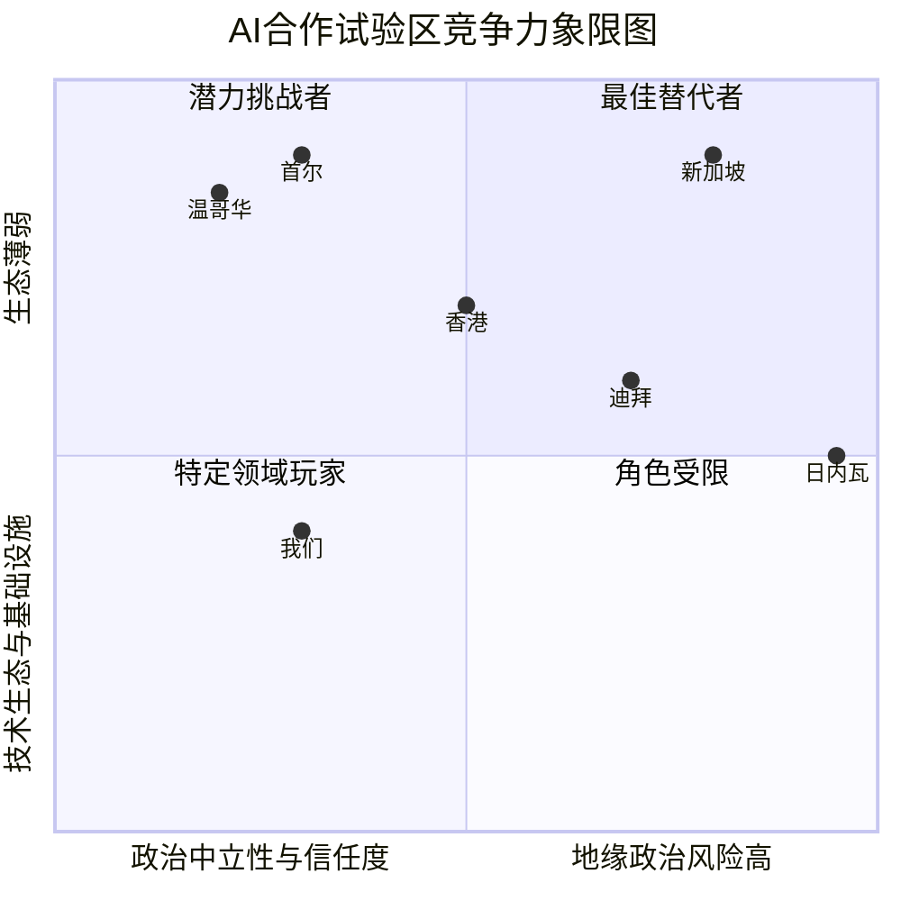

# 2025.08.03.
日小结

<a id="top"></a>
根据[ego模型时间接口](https://gitee.com/hyg/blog/blob/master/timeflow.md)，今天绑定模版1(1d)。

<a id="index"></a>
- 13:00~18:49	ego: [AI特殊监管区设想](#20250803130000)
- 20:50~21:49	check: [零散笔记](#20250803205000)

---
season stat:

| task | alloc | sold | hold | todo |
| :---: | ---: | ---: | ---: | ---: |
| total | 13530 | 7690 | 5840 | 8820 |
| PSMD | 4000 | 1610 | 2390 | 1230 |
| ego | 2530 | 1320 | 1210 | 1365 |
| infra | 2000 | 425 | 1575 | 405 |
| xuemen | 1000 | 90 | 910 | 600 |
| raw | 1000 | 70 | 930 | 390 |
| learn | 2000 | 3805 | -1805 | 3120 |
| js | 1000 | 370 | 630 | 1710 |

---
waiting list:


- 30分钟时间片：
  - ego的第1号事项：AI特殊监管区设想
  - js的第1号事项：a2a-js
  - js的第2号事项：graphviz
  - js的第3号事项：nodejs中调用jar

- 60分钟时间片：
  - PSMD的第1号事项：PSMD agent AI的内部角色和功能
  - infra的第1号事项：结合AI进展重新规划架构
  - raw的第1号事项：设计新的季度时间表
  - xuemen的第1号事项：根据最新政策文件，考虑AER、AVR文件升级。

- 90分钟时间片：
  - learn的第1号事项：业务规则引擎
  - PSMD的第2号事项：筹备会议 by role+prompt
  - ego的第2号事项：整理task及其相互关系
  - infra的第3号事项：schema立项。

- 195分钟时间片：
  - xuemen的第2号事项：kernel模型升级
  - PSMD的第3号事项：machines model
  - infra的第4号事项：Rete/Phreak算法的自主实现
  - xuemen的第4号事项：重新设计S2状态下的学门基本管理制度

---
<a href="mailto:huangyg@mars22.com?subject=关于2025.08.03.[AI特殊监管区设想]任务&body=日期: 2025.08.03.%0D%0A序号: 5%0D%0A手稿:../../draft/2025/20250803.01.md%0D%0A---请勿修改邮件主题及以上内容 从下一行开始写您的想法---%0D%0A">[email]</a> | [top](#top) | [index](#index)
<a id="20250803130000"></a>
## 13:00 ~ 18:49
## ego: [AI特殊监管区设想]

- pdf内容较多，超过ai一次处理的极限。使用GLM4.5和豆包，设计层次递进式的提问prompt:
	- 国际组织的独立性有哪几种情况，怎么判别？以实例介绍一下现实中独立性的极限情况，分析更进一步可以有哪些方向，独立性可能达到什么新层次。
		- 请对不同独立性层级的国际机构的建立和运营，对关键人员的知识结构、能力资历和可能来源、任用案例进行分析，并给出项目的财务量化预估。
	- 请把以上对各种独立性的分析，整理为结构化的json格式。
	- 收集整理相关信息，分析一下各国AI相关基础软硬件工具链的情况，预判将来可能出现的状况、每种预测所依赖的关键节点，并量化评估每种未来状况的可能性。
		- 请结合技术趋势分析、政策分析、市场分析、人才分析、国际关系分析等进一步研究，更准确地预测未来状况，并给出量化的财务预估。
	- 请把以上对AI工具链的预测，整理为结构化的json格式。
	- pdf + 请从这份文档中提取出需要设立的机构，不局限于文档对该机构的描述，根据上下文分析每个机构的独立性需求，选择最佳的实现方式，以分析所得的实现方式为前提对机构建立和运营所需的关键人员，从知识结构和资历、背景等多个纬度进行分析，并给出财务上的量化预估。
	- pdf + 请从这份文档中提取出各项工作内容，按照技术、立法、行政、机构设立等等工作性质重新分类，然后每项工作明确现实中状态：未开始、已开始（已完成的部分和比例）、已完成（完成时间），未完成的量化地评估后续的工作量（人年）和难度，预判各种不同的结果，并对每种结果给出关键节点和量化概率。
	- 请重新按照pdf文件的结构，每个方案合并内部各项任务的分析，对这个项目的工作量、难度、预计进度和可能结果（每种结果给出关键节点、财务收支和概率）进行量化分析。结合前面的分析保持各机构设立运营成本，各工作内容的工作量和难度的关系。
		- 请对“衍生创新设想量化分析”部分的方案也进行分析，合并在一起，进行完整分析。
		- 涉及的新机构的独立性，请结合上面回答划分层级，作为各种将来结果量化分析的一部分。
	- 针对这份文档的内容，香港有哪些竞争对手城市。请对前五名对手城市实施这些工作进行对比分析。
	- 汇总以上所有问题的讨论，针对这份文档编写一份综合性的分析报告，以markdown格式输出，可以嵌入mermaid语法的示意图。语言风格是准确、理性、冷静、中立，突出工作量和财务这类量化分析，不要出现可能被误解为挑衅的内容。
- 在lmarena.ai按照grok vs mistral，deepseek R1 vs kimi K2，chatgpt vs gemini pro三组side by side battle方式，大部分平手，个别差距明显的问题选一个答案，递进提问产生最终报告。
- 漏掉了专利问题。可以自己补充。


- gemini方案综合比较好。
# **关于建立特殊监管机制以促进AI领域国际合作的构想分析报告**

**报告日期:** 2024年5月22日
**报告性质:** 中立性、量化分析与可行性评估

## **摘要**

本报告旨在对一份提议通过在香港建立“AI特殊监管区域”以促进中美在人工智能领域合作的构想进行系统性、多维度的分析。该构想试图利用香港独特的制度优势，创建一个中美双方均可接受的“缓冲区”，在满足商业利益的同时，管控技术与安全风险。

报告将从以下几个层面展开：
1.  **核心构想拆解**: 将宏观构想分解为可执行的工作包。
2.  **量化分析**: 对每个工作包的工作量、财务成本、难度和成功概率进行量化评估。
3.  **治理架构分析**: 深入探讨所需设立机构的人员配置与独立性要求。
4.  **竞争环境分析**: 对比全球其他潜在城市实施此构想的优劣势。
5.  **综合结论**: 对构想的总体可行性、可能路径和风险进行总结。

我们的分析表明，该构想在逻辑上具有高度的创造性和严谨性，但其实施面临地缘政治信任赤字、主权关切和复杂的技术监管挑战。**其核心部分的成功概率较低，但其衍生的、聚焦于全球公共利益的子项目具有更高的现实可行性。**

## **1. 核心构想与实施路径分析**

该构想可通过设立一系列机构和机制，分步解决信任、主权和利益分配的核心矛盾。我们将其归纳为三个核心对策和三个外围举措。

```mermaid
graph TD
    A[构想: 香港AI特殊监管区] --> B{核心挑战};
    B --> C[战略互信赤字];
    B --> D[主权与监管冲突];
    B --> E[商业吸引力不足];

    C --> F[对策一: 技术流程化信任];
    D --> G[对策二: 授权验证模式];
    E --> H[对策三: 创造圈内利益];

    F --> F1[技术分代(N-2)];
    F --> F2[技术托管基金会];
    F --> F3[应用负面清单];

    G --> G1[香港AI管理局(HKAIA)];
    G --> G2[国际验证委员会(IVC)];

    H --> H1[联合专利池];

    A --> I[外围举措: 全球公共利益];
    I --> I1[全球健康数据合作(GHDC)];
    I- -> I2[AI碳足迹认证(AISA)];

```

### **1.1. 核心对策的量化评估**

| 方案 | 核心内容 | 合并工作量 (人年) | 难度 (1-10) | 10年期预计支出 (美元) | 理想结果概率 |
| :--- | :--- | :--- | :--- | :--- | :--- |
| **对策一** | 技术流程化信任 | 330 - 530 | 9 | $10.5亿 - $20.8亿 | 30% |
| **对策二** | 授权验证模式 | 200 - 330 | 8 | $20亿 - $40亿 | 40% |
| **对策三** | 创造圈内利益 | 130 - 200 | 8 | $1亿 - $2亿 | 30% |

*   **分析**: 核心对策的实施成本高昂，工作量巨大，且难度极高。**对策一**的瓶颈在于建立一个全球信任的第三方技术机构，需要巨额的创始基金和政治意愿。**对策二**的挑战在于本地立法和国际协调，需要在维护主权和确保独立性之间取得精妙平衡。**对策三**则高度依赖全球科技巨头的商业意愿。三者环环相扣，任何一环的失败都将导致整个核心构想的失败。

### **1.2. 外围举措的量化评估**

| 举措 | 核心内容 | 合并工作量 (人年) | 难度 (1-10) | 10年期预计支出 (美元) | 理想结果概率 |
| :--- | :--- | :--- | :--- | :--- | :--- |
| **GHDC/AISA** | 全球公共利益项目 | 550 - 950 | 7 | $27亿 - $54亿 | 50% |

*   **分析**: 外围举措虽然工作量更大，需要更广泛的全球协调，但由于其议题不直接触及中美技术竞争的最敏感地带，**难度相对较低，成功概率更高**。它们可以作为建立互信的起点，独立于核心构想先行实施。

## **2. 治理架构与关键人员分析**

构想的成功执行，高度依赖于所设机构的独立性、专业性和权威性。下表分析了关键机构的治理模式和人员需求。

| 机构名称 | 建议模式 | 独立性需求 | 核心职位 | 资历背景要求 | 10年期运营成本 (美元) |
| :--- | :--- | :--- | :--- | :--- | :--- |
| **香港AI区域管理局(HKAIA)** | 香港法定机构 | **行政主导**<br>确保国家主权 | **局长** | 资深法律/金融监管背景的香港高级官员 | $10亿 - $20亿 |
| **国际验证委员会(IVC)** | 独立专家委员会 | **程序独立**<br>确保技术验证中立 | **主席** | 非中美籍的全球顶尖技术/科学领袖 | $10亿 - $20亿 (与HKAIA合并计算) |
| **AI技术托管基金会** | 瑞士/新加坡非营利基金会 | **绝对中立**<br>不受任何国家干预 | **理事会主席** | 全球政治/法律界元老 | $5亿 - $8亿 (不含创始捐赠金) |
| **GHDC/AISA** | 国际组织/行业联盟 | **科学/行业中立**<br>基于共识和专业 | **总干事/主席** | 全球公共卫生领袖/行业标准组织管理者 | $27亿 - $54亿 |

## **3. 竞争环境分析**

香港并非唯一潜在的合作地点。其他城市在特定方面具备优势，可能提供替代性解决方案。



*   **新加坡**: **综合实力最强的竞争者**。在政治中立性、法律体系、技术生态三方面表现均衡，是实施此类构想最现实的替代地点。
*   **日内瓦**: **中立与治理的最佳选择**。在设立需要绝对中立性的国际组织（如技术托管基金会、GHDC）方面，拥有不可替代的优势。
*   **香港**: **优势与风险并存**。其“一国两制”的独特性是整个构想的逻辑起点，提供了中国主权下的合作可能性。然而，这也使其在中美地缘政治博弈中处于风口浪尖，信任基础脆弱。
*   **结论**: **单一城市难以完美承载所有功能**。一个更具现实性的路径可能是“功能解耦，全球布局”，例如：监管验证总部设在日内瓦，商业与技术中心设在新加坡，而香港则可能在获得有限许可的情况下，专注于服务大湾区的特定应用场景。

## **4. 综合结论与战略预判**

1.  **构想的性质**: 这是一个逻辑上自洽但执行上极其困难的战略构想。它更像是一个精确诊断问题的“思想实验”，而非一个近期可行的“施工蓝图”。

2.  **成功的关键瓶颈**: 成功的最大障碍是**中美之间极端脆弱的战略互信**。技术、法律和财务问题虽然复杂，但均是次要的。没有最高层的政治意愿和共识，任何后续工作都无法展开。

3.  **现实的演化路径与概率**:
    *   **理想模式 (完全实现) - 概率 < 5%**: 需要国际关系出现根本性改善。
    *   **降级模式 (准-特殊区域) - 概率 ≈ 25%**: 在非正式谅解下，香港获得部分次尖端技术的有限许可，建立一个规模和影响力都较小的合作区。这是在当前环境下最可能实现的正面结果。
    *   **失败模式 (构想搁置) - 概率 ≈ 70%**: 因缺乏政治互信，项目在启动前或运行初期即告失败。

4.  **建议**:
    *   **分步实施**: 建议优先推动**难度较低、共识较多的外围举措**，如“AI碳足迹认证(AISA)”，以此积累合作经验和信任。
    *   **风险对冲**: 相关方不应将全部希望寄托于此宏大构想。对于中国内地，应继续坚持发展自主可控的技术体系。对于美国企业，应探索其他市场的多元化机会。对于香港，则应在金融科技、Web3、绿色金融等领域寻找其他创新增长点。

本报告认为，虽然在香港建立AI特殊监管区的构想面临巨大挑战，但其所揭示的通过“程序正义”和“技术手段”来构建信任的思路，对未来全球数字治理和管控大国竞争具有重要的参考价值。

---                                                                                                                        *   **日内瓦**: **中立与治理的最佳选择**。在设立需要绝对中立性的国际组织（如技术托管基金会、GHDC）方面，拥有
---
<a href="mailto:huangyg@mars22.com?subject=关于2025.08.03.[无名任务]任务&body=日期: 2025.08.03.%0D%0A序号: 9%0D%0A手稿:../../draft/2025/20250803.04.md%0D%0A---请勿修改邮件主题及以上内容 从下一行开始写您的想法---%0D%0A">[email]</a> | [top](#top) | [index](#index)
<a id="20250803205000"></a>
## 20:50 ~ 21:49
## check: [零散笔记]

借助ai思考的模式：

- 使用单个ai围绕主题发散地交谈，然后整理为一份初稿。
- 简单主题：对初稿使用三步三元提问
- 复杂主题：
	- 选择几个难点，加上时间空间的变化作为子课题，选择两个模型分别拓开战线；
	- 根据回答，调整单步问题的规模，补充整理prompt；
	- 使用升级版prompt，选六个模型分三组battle，一路选择较优回答作为对话历史；
	- 最后统稿，选出优胜的。
