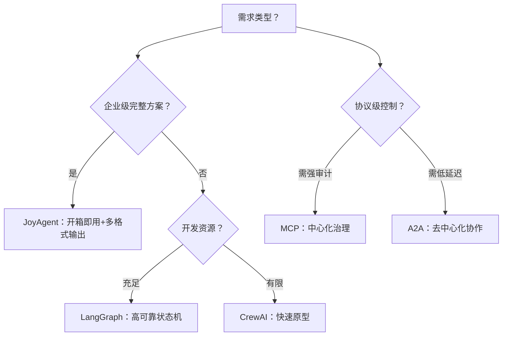
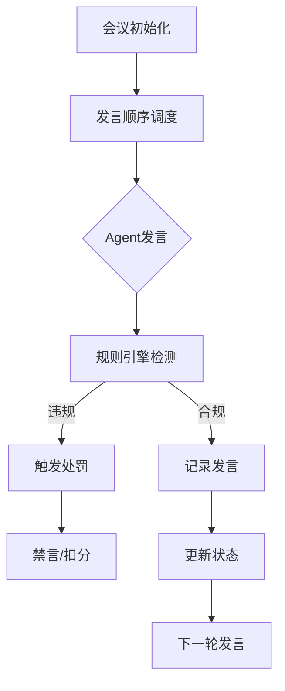

# 2025.08.16.
日小结

<a id="top"></a>
根据[ego模型时间接口](https://gitee.com/hyg/blog/blob/master/timeflow.md)，今天绑定模版1(1e)。

<a id="index"></a>
- 16:00~16:59	PSMD: [筹备会议 by role+prompt](#20250816160000)
- 19:00~19:59	check: [零散笔记](#20250816190000)

---
season stat:

| task | alloc | sold | hold | todo |
| :---: | ---: | ---: | ---: | ---: |
| total | 13530 | 8956 | 4574 | 9690 |
| PSMD | 4000 | 1820 | 2180 | 1080 |
| ego | 2530 | 1460 | 1070 | 1455 |
| infra | 2000 | 545 | 1455 | 285 |
| xuemen | 1000 | 90 | 910 | 660 |
| raw | 1000 | 70 | 930 | 390 |
| learn | 2000 | 4475 | -2475 | 4050 |
| js | 1000 | 496 | 504 | 1770 |

---
waiting list:


- 30分钟时间片：
  - js的第1号事项：nextcloud
  - learn的第1号事项：LegalRuleML（Legal Rule Markup Language）
  - ego的第2号事项：整理simplenote文件，准备转移到webDAV.
  - learn的第2号事项：Tauri + Rust

- 60分钟时间片：
  - raw的第1号事项：设计新的季度时间表
  - xuemen的第1号事项：月度事务
  - raw的第2号事项：熟悉内脏之间的关系
  - xuemen的第2号事项：根据最新政策文件，考虑AER、AVR文件升级。

- 90分钟时间片：
  - infra的第1号事项：schema立项。
  - ego的第1号事项：同步新日志到webDAV。使用新的共享外链。
  - PSMD的第2号事项：子1609:基于公司、合同
  - ego的第3号事项：整理task及其相互关系

- 195分钟时间片：
  - PSMD的第1号事项：machines model
  - infra的第2号事项：Rete/Phreak算法的自主实现
  - xuemen的第3号事项：kernel模型升级
  - xuemen的第5号事项：重新设计S2状态下的学门基本管理制度

---
<a href="mailto:huangyg@mars22.com?subject=关于2025.08.16.[筹备会议 by role+prompt]任务&body=日期: 2025.08.16.%0D%0A序号: 5%0D%0A手稿:../../draft/2025/20250816.01.md%0D%0A---请勿修改邮件主题及以上内容 从下一行开始写您的想法---%0D%0A">[email]</a> | [top](#top) | [index](#index)
<a id="20250816160000"></a>
## 16:00 ~ 16:59
## PSMD: [筹备会议 by role+prompt]

### read ../../draft/2025/20250722.02.md

#### PSMD: [筹备会议 by claude.md]

### 本地代码

- 使用mistral模型。
- 提示语：
```
以下规则已经生效，请检查对话内容是否符合以下规则：
1、到场项目成员报名，由记录员确定出席人数；
[注：记录员验明身份，确定达到合同要求的有效人数，是会议有效力的前提。因此放在第一步骤]

2、按照上一次会议纪要确定会议主持人、记录员，或者选举主持人、记录员；
[注：如果首选的主持人、记录员因故未到场，可能使用后备人员，因此在这里才确定。]

3、主持人宣布会议开始，此后发言全部保存为会议原始材料；
[注：到这个时候主持人才“赴任”。]

4、主持人公布已收到的动议以及提出者；

5、各项目成员提出其它希望讨论的动议，不限发言次序，每条动议发一条；

6、主持人选择一个动议，宣布进入讨论；

7、记录员复述动议；
[注：有的动议可能分散在先后几次发言中，表述比较口语化，因此安排两人互动来确定最终文字。]

8、动议提出者确认复述则进入9、修改复述则回到7、，如果是记录员本人提出的动议，复述后直接进入9；

9、社员根据主持人点名发言。如主持人允许自由发言，项目成员不得在60秒内连续发言两条。
[注：网络交流没有声音互相压制的问题，因此约定不连续发言即可自由发言。或者其他人发言，或者等候60秒即可发出下一条发言。]

10、如果有项目成员发言涉及修改动议，主持人可以决定回到步骤7、。如果修改后的动议表决通过，则原始动议不再讨论和表决；如果修改后的动议未表决通过，则回到原始动议继续讨论、表决。

11、主持人在讨论成熟后，宣布进入当前动议的表决环节，每个项目成员可以发言表决一次；

12、记录员计票并公布结果；
[注：可能出现重复发言，意思不确切的发言，所以安排记录员把关。]

13、主持人可以决定回到步骤6，或者宣布本次会议讨论结束，进入下一步骤；

14、如果涉及多方合同等正式规章的修改，由管理员根据表决结果修改并公布在指定位置；
[注：应该包含非项目成员可以获取的公布方式。]

15、记录员整理并公布会议纪要，涉及多方合同等正式规章的修改，应记载修改前后版本的公布位置；

16、主持人宣布会议结束，步骤2至此发言全部保存为会议原始材料。
[注：所有表决均为记名表决，因此保留全部发言记录备查。]

对以上简略议事规则的改进可以作为动议提出。
主持人会贴出以上步骤原文，表明目前进入哪个步骤。主持人、记录员提示当前步骤，纠正违反议事规则的发言不受条数限制。 

附件31.1. 规章条款的上下级关系，根据制定、修订权定义。
附件31.2. 人员的上下级关系，根据任免权定义。
附件31.3. 严格执行制定、修订程序。上级规章条款未生效（或被实质架空）时，不提交、不讨论下级规章条款。
附件31.4. 严格执行任免程序。上级人员未赴任（或被实质架空）时，不提名、不讨论下级人员。

注释:
- 以“规章条款”为单位。比如某公司章程有一条：股东会三分之二表决权通过可以修订章程。这条本身就在章程里面，所以也能修订自己。（比如修改为：股东会四分之三表决权通过可以修订章程。）这个条款就比章程的其它条款都高一级。无论怎么组合编集，都不影响这种层级关系。
- 比如规章写明A任免B和C，即使在其它文件使用“B是C上级”、“C接受B的指令”这类措辞，本标准下BC平级、都是A下级。A缺席时B讨论C的人选即违规（如果B是章程中有的账号，会立刻被强制注销财产充公）。
- 无法判断时按最坏情况处理，比如因保密制度不能阅读就按未生效、未被执行看待。
- 上级规章制定过程可以讨论规章草案下的工作场景，包括制定下级规章的场景。只有特定上级规章导致特定下级规章草案不能产生，引入讨论才有意义。一旦离开上级规章制定程序的时间、地点、人员这些条件就不能提前讨论下级规章，因为这时上级规章（下级规章制定修订程序）还没有生效，不应该暗示自己的内定角色。
```
- 虽然没有严格按照格式输出，但大概内容都在。对规则理解还有待仔细分析。输出如下：
```
D:\huangyg\git\js.sample\LangChain>node mistral.js
file:///D:/huangyg/git/js.sample/LangChain/node_modules/@langchain/core/dist/output_parsers/openai_tools/json_output_tools_parsers.js:217
            throw new OutputParserException(`Failed to parse. Text: "${JSON.stringify(result, null, 2)}". Error: ${JSON.stringify(zodParsedResult.error?.issues)}`, JSON.stringify(result, null, 2));
                  ^

OutputParserException [Error]: Failed to parse. Text: "{
  "items": [
    {
      "id": 1,
      "content": "黄勇刚(445053)  21:13:55 4、监事公布（管理员发布的）上一次会议纪要的效力；",
      "reason": "违反规则：第4步应为“主持人公布已收到的动议以及提出者”，而不是“监事公布（管理员发布的）上一次会议纪要的效力”。"
    },
    {
      "id": 2,
      "content": "黄勇刚(445053)  21:15:28 6、各社员提出其它希望讨论的动议，不限发言次序，每条动议发一条； 黄勇刚(445053)  21:16:12 8、主持人选择一个动议，宣布进入讨论； 9、记录员复述动议；",
      "reason": "违反规则：第6步应为“各项目成员提出其它希望讨论的动议，不限发言次序，每条动议发一条”，而不是“各社员提出其它希望讨论的动议，不限发言次序，每条动议发一条”。并且第8步和第9步的顺序颠倒了，第8步应为“记录员复述动议”，第9步应为“动议提出者确认复述则进入11、修改复述则回到9、”。"
    },
    {
      "id": 3,
      "content": "黄勇刚(445053)  21:17:26 10、动议提出者确认复述则进入11、修改复述则回到9、；",
      "reason": "违反规则：第10步应为“如果有项目成员发言涉及修改动议，主持人可以决定回到步骤7、。如果修改后的动议表决通过，则原始动议不再讨论和表决；如果修改后的动议未表决通过，则回到原始动议继续讨论、表决。”。"
    },
    {
      "id": 4,
      "content": "黄勇刚(445053)  21:33:32 13、主持人在讨论成熟后，宣布进入当前动议的表决环节，社员可以发言表决一次；",
      "reason": "违反规则：第13步应为“主持人可以决定回到步骤6，或者宣布本次会议讨论结束，进入下一步骤”，而不是“主持人在讨论成熟后，宣布进入当前动议的表决环节，社员可以发言表决一次”。"
    },
    {
      "id": 5,
      "content": "黄勇刚(445053)  21:35:12 13、主持人在讨论成熟后，宣布进入当前动议的表决环节，社员可以发言表决一次；",
      "reason": "违反规则：第13步重复出现，并且内容与规则不符。"
    },
    {
      "id": 6,
      "content": "黄勇刚(445053)  21:37:23 14、记录员计票并公布结果；",
      "reason": "违反规则：第14步应为“如果涉及多方合同等正式规章的修改，由管理员根据表决结果修改并公布在指定位置”，而不是“记录员计票并公布结果”。"
    },
    {
      "id": 7,
      "content": "黄勇刚(445053)  21:38:09 17、记录员整理会议纪要，涉及章程等正式规章的修改，应记载修改前后版本的公布位置； 黄勇刚(445053)  21:38:27 18、记录员公布会议纪要，监事宣布（在下次会议之前）对纪要提出异议的途径；",
      "reason": "违反规则：第17步和第18步的顺序颠倒了，第17步应为“记录员公布会议纪要，涉及多方合同等正式规章的修改，应记载修改前后版本的公布位置”，第18步应为“主持人宣布会议结束，步骤2至此发言全部保存为会议原始材料”。并且第18步的内容与规则不符。"
    }
  ]
}". Error: [{"code":"invalid_type","expected":"array","received":"object","path":[],"message":"Expected array, received object"}]

Troubleshooting URL: https://js.langchain.com/docs/troubleshooting/errors/OUTPUT_PARSING_FAILURE/

    at JsonOutputKeyToolsParser._validateResult (file:///D:/huangyg/git/js.sample/LangChain/node_modules/@langchain/core/dist/output_parsers/openai_tools/json_output_tools_parsers.js:217:19)
    at process.processTicksAndRejections (node:internal/process/task_queues:105:5) {
  llmOutput: '{\n' +
    '  "items": [\n' +
    '    {\n' +
    '      "id": 1,\n' +
    '      "content": "黄勇刚(445053)  21:13:55 4、监事公布（管理员发布的）上一次会议纪要的效力；",\n' +
    '      "reason": "违反规则：第4步应为“主持人公布已收到的动议以及提出者”，而不是“监事公布（管理员发布的）上一次会议纪要的效力”。"\n' +
    '    },\n' +
    '    {\n' +
    '      "id": 2,\n' +
    '      "content": "黄勇刚(445053)  21:15:28 6、各社员提出其它希望讨论的动议，不限发言次序，每条动议发一条； 黄勇刚(445053)  21:16:12 8、主持人选择一个动议，宣布进入讨论； 9、记录员复述动议；",\n' +
    '      "reason": "违反规则：第6步应为“各项目成员提出其它希望讨论的动议，不限发言次序，每条动议发一条”，而不是“各社员提出其它希望讨论的动议，不限发言次序，每条动议发一条”。并且第8步和第9步的顺序颠倒了，第8步应为“记录员复述动议”，第9步应为“动议提出者确认复述则进入11、修改复述则回到9、”。"\n' +
    '    },\n' +
    '    {\n' +
    '      "id": 3,\n' +
    '      "content": "黄勇刚(445053)  21:17:26 10、动议提出者确认复述则进入11、修改复述则回到9、；",\n' +
    '      "reason": "违反规则：第10步应为“如果有项目成员发言涉及修改动议，主持人可以决定回到步骤7、。如果修改后的动议表决通过，则原始动议不再讨论和表决；如果修改后的动议未表决通过，则回到原始动议继续讨论、表决。”。"\n' +
    '    },\n' +
    '    {\n' +
    '      "id": 4,\n' +
    '      "content": "黄勇刚(445053)  21:33:32 13、主持人在讨论成熟后，宣布进入当前动议的表决环节，社员可以发言表决一次；",\n' +
    '      "reason": "违反规则：第13步应为“主持人可以决定回到步骤6，或者宣布本次会议讨论结束，进入下一步骤”，而不是“主持人在讨论成熟后，宣布进入当前动议的表决环节，社员可以发言表决一次”。"\n' +
    '    },\n' +
    '    {\n' +
    '      "id": 5,\n' +
    '      "content": "黄勇刚(445053)  21:35:12 13、主持人在讨论成熟后，宣布进入当前动议的表决环节，社员可以发言表决一次；",\n' +
    '      "reason": "违反规则：第13步重复出现，并且内容与规则不符。"\n' +
    '    },\n' +
    '    {\n' +
    '      "id": 6,\n' +
    '      "content": "黄勇刚(445053)  21:37:23 14、记录员计票并公布结果；",\n' +
    '      "reason": "违反规则：第14步应为“如果涉及多方合同等正式规章的修改，由管理员根据表决结果修改并公布在指定位置”，而不是“记录员计票并公布结果”。"\n' +
    '    },\n' +
    '    {\n' +
    '      "id": 7,\n' +
    '      "content": "黄勇刚(445053)  21:38:09 17、记录员整理会议纪要，涉及章程等正式规章的修改，应记载修改前后版本的公布位置； 黄勇刚(445053)  21:38:27 18、记录员公布会议纪要，监事宣布（在下次会议之前）对纪要提出异议的途径；",\n' +
    '      "reason": "违反规则：第17步和第18步的顺序颠倒了，第17步应为“记录员公布会议纪要，涉及多方合同等正式规章的修改，应记载修改前后版本的公布位置”，第18步应为“主持人宣布会议结束，步骤2至此发言全部保存为会议原始材料”。并且第18步的内容与规则不符。"\n' +
    '    }\n' +
    '  ]\n' +
    '}',
  observation: undefined,
  sendToLLM: false,
  lc_error_code: 'OUTPUT_PARSING_FAILURE'
}

Node.js v22.10.0
```

### 在线问答

- 豆包和deepseek reason可以实际试用。deepseek R1和kimi k2稍差。

- deepseek reason，在https://deepseek.xinyun.cn/
```
[
    {
        "编号": "规则2违规",
        "违规原文": "黄勇刚(445053)  21:13:48\n3、主持人宣布会议开始...\n第八次社员会议现在开始。",
        "违规原因": "未执行规则2要求的'按照上一次会议纪要确定主持人'流程，直接开始会议且未展示主持人产生依据"
    },
    {
        "编号": "规则4违规",
        "违规原文": "黄勇刚(445053)  21:13:55\n4、监事公布（管理员发布的）上一次会议纪要的效力；",
        "违规原因": "规则4要求'主持人公布已收到的动议'，但此处由监事角色执行且内容不符"
    },
    {
        "编号": "规则5违规",
        "违规原文": "黄勇刚(445053)  21:15:00\n5、主持人公布已收到的动议...",
        "违规原因": "规则5应为'各项目成员提出动议'，但实际由主持人单方面公布议题"
    },
    {
        "编号": "规则9违规",
        "违规原文": "黄勇刚(445053)  21:18:20发言与21:18:30发言",
        "违规原因": "同一人在10秒内连续发言2次，违反'不得在60秒内连续发言两条'规定"
    },
    {
        "编号": "规则11违规",
        "违规原文": "闫中天(1781789)  21:35:35未经点名直接表决",
        "违规原因": "在主持人未明确允许自由发言的情况下，成员未经点名擅自表决"
    },
    {
        "编号": "附件31.3违规",
        "违规原文": "讨论'报价单兼临时合同'相关内容",
        "违规原因": "在上级规章（正式合同签订程序）未生效的情况下，讨论基于该规章的下级执行方案"
    },
    {
        "编号": "规则13违规",
        "违规原文": "王彤(313656378)  21:35:24未阅读文件仍参与表决",
        "违规原因": "主持人未确保表决环节前所有成员充分知悉表决内容，违反'讨论成熟后表决'原则"
    },
    {
        "编号": "规则16违规",
        "违规原文": "黄勇刚(445053)  21:38:27提及步骤17、18",
        "违规原因": "规则原文仅列到步骤16，存在擅自扩展步骤编号的违规操作"
    }
]
```

- deepseek R1
```
[
    {
        "编号": 1,
        "违规原文": "黄勇刚(445053) 21:13:55\n4、监事公布（管理员发布的）上一次会议纪要的效力；",
        "违规原因": "规则步骤4要求'主持人公布已收到的动议以及提出者'，但此处篡改为'监事公布会议纪要效力'，违反规则步骤4的定义。"
    },
    {
        "编号": 2,
        "违规原文": "吴为问(26608467) 21:14:31\n上次会议有效。",
        "违规原因": "规则步骤3明确'此后发言全部保存为会议原始材料'，但步骤1（确定出席人数）和步骤2（确定主持人/记录员）尚未执行，吴为问的发言属于在未完成前置步骤时的违规发言。"
    },
    {
        "编号": 3,
        "违规原文": "黄勇刚(445053) 21:16:12\n8、主持人选择一个动议，宣布进入讨论；",
        "违规原因": "规则步骤6要求'主持人选择一个动议'，但此处错误标注为步骤8，造成步骤编号混乱。"
    },
    {
        "编号": 4,
        "违规原文": "黄勇刚(445053) 21:18:20 和 21:18:30 连续发言",
        "违规原因": "规则步骤9规定'项目成员不得在60秒内连续发言两条'，两次发言间隔仅10秒（21:18:20→21:18:30）。"
    },
    {
        "编号": 5,
        "违规原文": "俞磊(340125470) 21:23:07 和 21:23:27 连续发言",
        "违规原因": "规则步骤9规定'项目成员不得在60秒内连续发言两条'，两次发言间隔仅20秒（21:23:07→21:23:27）。"
    },
    {
        "编号": 6,
        "违规原文": "黄勇刚(445053) 21:35:12\n13、主持人在讨论成熟后，宣布进入当前动议的表决环节",
        "违规原因": "规则步骤11对应'宣布进入表决环节'，但此处错误标注为步骤13，造成步骤编号混乱。"
    },
    {
        "编号": 7,
        "违规原文": "闫中天(1781789) 21:35:35\n同意",
        "违规原因": "在主持人尚未完成点名表决流程（规则步骤11）时提前表决，违反表决程序。"
    },
    {
        "编号": 8,
        "违规原文": "黄勇刚(445053) 21:38:09\n17、记录员整理会议纪要...\n黄勇刚(445053) 21:38:27\n18、记录员公布会议纪要...",
        "违规原因": "规则仅定义至步骤16，步骤17/18为擅自添加。且规则步骤15已涵盖'记录员整理并公布会议纪要'，此处重复定义。"
    },
    {
        "编号": 9,
        "违规原文": "黄勇刚(445053) 21:38:27\n18、...监事宣布对纪要提出异议的途径",
        "违规原因": "规则中无'监事宣布异议途径'的步骤，属于擅自添加程序。"
    },
    {
        "编号": 10,
        "违规原文": "吴为问(26608467) 21:37:37\n表决结果：通过",
        "违规原因": "规则步骤12要求'记录员计票并公布结果'，但未说明具体计票依据（如总人数、通过标准），公布内容不完整。"
    },
    {
        "编号": 11,
        "违规原文": "整个会议过程",
        "违规原因": "未执行规则步骤1（记录员确定出席人数）和步骤2（确定主持人/记录员），导致会议合法性基础缺失。"
    }
]
```

- kimi K2
```
[
  {
    "编号": 1,
    "违规原文": "黄勇刚(445053) 21:13:55 4、监事公布（管理员发布的）上一次会议纪要的效力；",
    "违规原因": "未按步骤2先确定主持人、记录员，直接进入步骤4公布会议纪要效力，顺序错误。"
  },
  {
    "编号": 2,
    "违规原文": "黄勇刚(445053) 21:15:00 5、主持人公布已收到的动议以及提出者；\n今天讨论香港大学圣约翰学院的合同。详情见svn项目文档的SJC文件夹。",
    "违规原因": "未按步骤5让各社员先提出动议，直接由主持人公布动议，跳过社员动议提出环节。"
  },
  {
    "编号": 3,
    "违规原文": "黄勇刚(445053) 21:16:12 8、主持人选择一个动议，宣布进入讨论；\n9、记录员复述动议；",
    "违规原因": "未按步骤5-6让社员先提出动议并由主持人选择，直接跳入步骤8-9，流程缺失。"
  },
  {
    "编号": 4,
    "违规原文": "黄勇刚(445053) 21:18:20 这个甲方身上有几个项目，我把花在他了不少时间记录36工时...",
    "违规原因": "主持人连续发言两条（21:18:20和21:18:30），违反自由发言时不得连续发言两条的规则。"
  },
  {
    "编号": 5,
    "违规原文": "黄勇刚(445053) 21:35:12 13、主持人在讨论成熟后，宣布进入当前动议的表决环节...",
    "违规原因": "未明确讨论是否成熟即宣布进入表决，且未按步骤11由主持人点名发言，直接宣布表决，程序不当。"
  },
  {
    "编号": 6,
    "违规原文": "黄勇刚(445053) 21:38:09 17、记录员整理会议纪要...",
    "违规原因": "记录员未按步骤15记载修改前后版本的公布位置，且未提及监事宣布异议途径，记录不完整。"
  }
]
```

- 豆包
```
[
{
"编号": 1,
"违规原文": "无步骤 2 相关内容（未按照上一次会议纪要确定会议主持人、记录员，或选举主持人、记录员）",
"违规原因": "违反规则 2：未执行 “按照上一次会议纪要确定会议主持人、记录员，或者选举主持人、记录员” 的步骤，会议未确定主持人和记录员即开始，不符合会议有效进行的程序要求"
},
{
"编号": 2,
"违规原文": "黄勇刚 (445053) 21:13:55 4、监事公布（管理员发布的）上一次会议纪要的效力；",
"违规原因": "违反规则 4：规则 4 明确为 “主持人公布已收到的动议以及提出者”，此处错误将步骤 4 内容改为 “监事公布上一次会议纪要的效力”，与规则内容不符"
},
{
"编号": 3,
"违规原文": "黄勇刚 (445053) 21:15:28 6、各社员提出其它希望讨论的动议，不限发言次序，每条动议发一条；",
"违规原因": "违反规则 5：规则 5 为 “各项目成员提出其它希望讨论的动议，不限发言次序，每条动议发一条”，此处错误将步骤 5 标为步骤 6，编号与内容不匹配，混淆会议流程步骤"
},
{
"编号": 4,
"违规原文": "黄勇刚 (445053) 21:16:12 8、主持人选择一个动议，宣布进入讨论；",
"违规原因": "违反规则 6：规则 6 为 “主持人选择一个动议，宣布进入讨论”，此处错误将步骤 6 标为步骤 8，编号与内容不匹配，混淆会议流程步骤"
},
{
"编号": 5,
"违规原文": "黄勇刚 (445053) 21:17:26 11、社员根据主持人点名发言。如主持人允许自由发言则不限发言次序，同一名社员不得连续发言两条；",
"违规原因": "违反规则 9：规则 9 为 “社员根据主持人点名发言。如主持人允许自由发言，项目成员不得在 60 秒内连续发言两条”，此处错误将步骤 9 标为步骤 11，编号与内容不匹配，混淆会议流程步骤"
},
{
"编号": 6,
"违规原文": "黄勇刚 (445053) 21:18:20 这个甲方身上有几个项目，我把花在他了不少时间记录 36 工时在这个项目上，吴为问前期整理需求记录 8 工时。项目内部的情况和参与的项目人员单独交待过了。黄勇刚 (445053) 21:18:30 下面自由发言",
"违规原因": "违反规则 9：两条发言间隔仅 10 秒，属于 60 秒内连续发言两条，不符合 “自由发言时不得在 60 秒内连续发言两条” 的规定"
},
{
"编号": 7,
"违规原文": "吴为问 (26608467) 21:21:13 时间有点紧吧 吴为问 (26608467) 21:21:26 现在有几个 PHP 程序员参与？",
"违规原因": "违反规则 9：两条发言间隔仅 13 秒，属于 60 秒内连续发言两条，不符合 “自由发言时不得在 60 秒内连续发言两条” 的规定"
},
{
"编号": 8,
"违规原文": "俞磊 (340125470) 21:21:27 报价单上的工作日是不包含周末的是吧？ 俞磊 (340125470) 21:21:53 恩，好",
"违规原因": "违反规则 9：两条发言间隔仅 26 秒，属于 60 秒内连续发言两条，不符合 “自由发言时不得在 60 秒内连续发言两条” 的规定"
},
{
"编号": 9,
"违规原文": "黄勇刚 (445053) 21:23:17 简增龙、王彤、吴为问好像都能做 php。简增龙时间比较充裕，他还不是社员，没有决策权和分红权，以劳务方式参与。 黄勇刚 (445053) 21:23:46 甲方原因拖延，应该可以顺延验收时间。",
"违规原因": "违反规则 9：两条发言间隔仅 29 秒，属于 60 秒内连续发言两条，不符合 “自由发言时不得在 60 秒内连续发言两条” 的规定"
},
{
"编号": 10,
"违规原文": "俞磊 (340125470) 21:30:07 简增龙后天有时间 俞磊 (340125470) 21:30:31 上午 10 点半可以到学门",
"违规原因": "违反规则 9：两条发言间隔仅 24 秒，属于 60 秒内连续发言两条，不符合 “自由发言时不得在 60 秒内连续发言两条” 的规定"
},
{
"编号": 11,
"违规原文": "黄勇刚 (445053) 21:38:09 17、记录员整理会议纪要，涉及章程等正式规章的修改，应记载修改前后版本的公布位置；",
"违规原因": "违反规则 15：规则 15 为 “记录员整理并公布会议纪要，涉及多方合同等正式规章的修改，应记载修改前后版本的公布位置”，此处错误将步骤 15 标为步骤 17，编号与内容不匹配，混淆会议流程步骤"
},
{
"编号": 12,
"违规原文": "黄勇刚 (445053) 21:38:27 18、记录员公布会议纪要，监事宣布（在下次会议之前）对纪要提出异议的途径；",
"违规原因": "违反规则 16：规则 16 为 “主持人宣布会议结束，步骤 2 至此发言全部保存为会议原始材料”，此处错误将步骤 16 标为步骤 18，编号与内容不匹配，混淆会议流程步骤"
}
]
```

- gemini
```
[
  {
    "编号": "1",
    "违规原文": "黄勇刚(445053)  21:13:55\n4、监事公布（管理员发布的）上一次会议纪要的效力；",
    "违规原因": "根据规则2，会议开始后应首先根据上一次会议纪要确定会议主持人、记录员，或者选举主持人、记录员。而此处主持人直接跳到步骤4，且“监事公布（管理员发布的）上一次会议纪要的效力”这一步骤在提供的简略议事规则中并未提及。"
  },
  {
    "编号": "2",
    "违规原文": "黄勇刚(445053)  21:16:12\n8、主持人选择一个动议，宣布进入讨论；\n9、记录员复述动议；",
    "违规原因": "原始规则中，步骤6是“主持人选择一个动议，宣布进入讨论”，步骤7是“记录员复述动议”，但此处将其合并为8、9，并与原始规则中的步骤号不符。且在原始规则中，步骤8是动议提出者确认复述，步骤9是社员根据主持人点名发言。此处将原始规则中的步骤6和7错误地标记为8和9。"
  },
  {
    "编号": "3",
    "违规原文": "黄勇刚(445053)  21:17:26\n10、动议提出者确认复述则进入11、修改复述则回到9、；\n11、社员根据主持人点名发言。如主持人允许自由发言则不限发言次序，同一名社员不得连续发言两条；",
    "违规原因": "此处将原始规则中的步骤8（动议提出者确认复述）标记为10，将原始规则中的步骤9（社员根据主持人点名发言）标记为11，与原始规则的编号不符。原始规则中没有步骤10和11。"
  },
  {
    "编号": "4",
    "违规原文": "黄勇刚(445053)  21:38:09\n17、记录员整理会议纪要，涉及章程等正式规章的修改，应记载修改前后版本的公布位置；\n黄勇刚(445053)  21:38:27\n18、记录员公布会议纪要，监事宣布（在下次会议之前）对纪要提出异议的途径；",
    "违规原因": "原始规则中，步骤15是“记录员整理并公布会议纪要，涉及多方合同等正式规章的修改，应记载修改前后版本的公布位置”，步骤16是“主持人宣布会议结束”。此处出现了原始规则中不存在的步骤17和18，且内容与原始规则的步骤15和16不符，或额外增加了规则中未提及的环节（如“监事宣布（在下次会议之前）对纪要提出异议的途径”）。"
  }
]
```

- claude
```
{
  "violations": [
    {
      "编号": 1,
      "违规原文": "4、监事公布（管理员发布的）上一次会议纪要的效力；",
      "违规原因": "规则中第4条应为'主持人公布已收到的动议以及提出者'，而不是监事公布会议纪要效力。步骤顺序和内容都不符合规定的议事规则。"
    },
    {
      "编号": 2,
      "违规原文": "6、各社员提出其它希望讨论的动议，不限发言次序，每条动议发一条；",
      "违规原因": "规则中第5条应为'各项目成员提出其它希望讨论的动议'，这里跳过了第5条直接进入第6条，且表述为'社员'而非'项目成员'。"
    },
    {
      "编号": 3,
      "违规原文": "8、主持人选择一个动议，宣布进入讨论；\n9、记录员复述动议；",
      "违规原因": "缺少第7条'记录员复述动议'，直接从第6条跳到第8条，步骤编号错误。应该是第6条主持人选择动议，第7条记录员复述动议。"
    },
    {
      "编号": 4,
      "违规原文": "10、动议提出者确认复述则进入11、修改复述则回到9、；\n11、社员根据主持人点名发言。如主持人允许自由发言则不限发言次序，同一名社员不得连续发言两条；",
      "违规原因": "步骤编号错误，应该是第8条和第9条。且规则原文为'项目成员根据主持人点名发言'和'项目成员不得在60秒内连续发言两条'，这里表述为'社员'且时间限制表述错误。"
    },
    {
      "编号": 5,
      "违规原文": "13、主持人在讨论成熟后，宣布进入当前动议的表决环节，社员可以发言表决一次；",
      "违规原因": "步骤编号错误，应该是第11条。且规则原文为'每个项目成员可以发言表决一次'，这里表述为'社员'。"
    },
    {
      "编号": 6,
      "违规原文": "14、记录员计票并公布结果；",
      "违规原因": "步骤编号错误，应该是第12条。"
    },
    {
      "编号": 7,
      "违规原文": "17、记录员整理会议纪要，涉及章程等正式规章的修改，应记载修改前后版本的公布位置；\n18、记录员公布会议纪要，监事宣布（在下次会议之前）对纪要提出异议的途径；",
      "违规原因": "步骤编号错误，应该是第15条和第16条。且第18条内容不符合规则，规则第16条应为'主持人宣布会议结束'，没有关于监事宣布异议途径的规定。"
    },
    {
      "编号": 8,
      "违规原文": "缺少第13条和第14条的执行",
      "违规原因": "会议流程中缺少规则第13条'主持人可以决定回到步骤6，或者宣布本次会议讨论结束，进入下一步骤'和第14条'如果涉及多方合同等正式规章的修改，由管理员根据表决结果修改并公布在指定位置'的执行。"
    }
  ]
}
```


### 阅读资料

- name: LangChain
  url: https://langchain.com/
  summary: "一个用于构建语言模型应用程序的框架，提供提示工程、调试、微调和模型优化等功能。"
- name: Vellum AI
  url: https://vellum.ai/
  summary: "提供内置测试、版本控制和 A/B 比较功能，适合需要大规模完善提示的开发人员。"
- name: Mirascope
  url: https://github.com/mirascope/mirascope
  summary: "鼓励在代码库中配置提示，确保可重复性和结构化的 NLP 工作流。"
- name: Guidance
  url: https://github.com/guidance/guidance
  summary: "允许用户使用正则表达式和上下文无关语法 (CFG) 来约束提示输出，非常适合控制 LLM 生成的响应。"
- name: Galileo
  url: https://galileo.ai/
  summary: "专注于 LLM 可观测性、错误分析和工作流的微调，提供对数据质量和性能瓶颈的洞察分析。"
- name: AutoGPT
  url: https://github.com/Significant-Gravitas/Auto-GPT
  summary: "开源 AI 平台，可创建完全自主的 AI 智能体，能够收集信息、做出决策并运行多步骤工作流。"
- name: AgentGPT
  url: https://github.com/Significant-Gravitas/AgentGPT
  summary: "基于浏览器的 AI 智能体平台，允许用户实时创建和部署任务驱动的 AI 智能体。"
- name: MetaGPT
  url: https://github.com/metalogicai/MetaGPT
  summary: "开源多智能体框架，用于模拟软件开发团队，将目标分解为竞争分析、用户故事和模型。"
- name: Grip Tape
  url: https://github.com/gradio-app/grip-tape
  summary: "基于 Python 的智能体框架，用于通过结构化依赖关系跟踪来管理长时间运行的 AI 任务。"
- name: LlamaIndex
  url: https://github.com/jerryjliu/llama_index
  summary: "专门处理 RAG 的开源数据编排框架，使开发人员能够针对 AI 应用程序为结构化和非结构化数据编制索引并执行查询。"
- name: Haystack
  url: https://haystack.deepset.ai/
  summary: "开源 NLP 框架，旨在构建 LLM 支持的应用程序，例如智能搜索工具、聊天机器人和 RAG 系统。"
- name: Flowise AI
  url: https://flowiseai.com/
  summary: "低代码或无代码平台，为 LLM 应用程序原型设计和部署提供可视化界面，使开发人员能够使用拖放工具创建模块化工作流。"
- name: Milvus
  url: https://milvus.io/
  summary: "专门构建的矢量数据库，可高效地存储和检索嵌入，从而改进语义搜索和 RAG 管道。"
- name: Weaviate
  url: https://weaviate.io/
  summary: "专门构建的矢量数据库，可高效地存储和检索嵌入，从而改进语义搜索和 RAG 管道。"
- name: Amazon Kendra
  url: https://aws.amazon.com/kendra/
  summary: "强大的企业搜索系统，通过连接到内部文档存储库、wiki 和结构化数据集来增强 AI 生成的响应。"
- name: OpenAI
  url: https://openai.com/
  summary: "直接 AI 模型提供者，让开发人员在不受 LangChain 等开源代码框架限制的情况下开展工作。"
- name: Anthropic
  url: https://anthropic.com/
  summary: "直接 AI 模型提供者，让开发人员在不受 LangChain 等开源代码框架限制的情况下开展工作。"
- name: Hugging Face API
  url: https://huggingface.co/inference-api
  summary: "直接 AI 模型提供者，让开发人员在不受 LangChain 等开源代码框架限制的情况下开展工作。"
- name: BLOOM
  url: https://huggingface.co/bigscience/bloom
  summary: "基于转换器的开源模型，可在 Hugging Face 上使用，提供透明度和微调功能。"
- name: LLaMa
  url: https://github.com/facebookresearch/llama
  summary: "基于转换器的开源模型，可在 Hugging Face 上使用，提供透明度和微调功能。"
- name: Flan-T5
  url: https://huggingface.co/google/flan-t5-large
  summary: "基于转换器的开源模型，可在 Hugging Face 上使用，提供透明度和微调功能。"
- name: IBM watsonx
  url: https://www.ibm.com/cloud/watsonx
  summary: "全面的 AI 工具包，支持 LLM 定制、微调和部署。"
- name: Amazon Bedrock
  url: https://aws.amazon.com/bedrock/
  summary: "托管 AI 服务，可简化由 LLM 提供支持的应用程序的大规模部署。"
- name: Microsoft Azure AI
  url: https://azure.microsoft.com/en-us/products/ai/
  summary: "基于云的平台，为人工智能驱动的自动化提供 LLM 托管、模型微调和工作流编排。"
- name: Kimi K2
  url: https://github.com/MoonshotAI/Kimi-K2
  summary: "由 Moonshot AI 团队开发的 1 万亿参数的混合专家架构语言模型，支持复杂任务和长上下文窗口。"
- name: A2A JavaScript SDK
  url: https://github.com/a2aproject/a2a-js
  summary: "官方 JavaScript SDK，用于运行遵循 Agent2Agent (A2A) 协议的智能体应用程序。"


### read ../../draft/2025/20250725.03.md

#### PSMD: [筹备会议 by claude.md]

- 系统了解了API参数中role字段的可选项，和不同的用途用法。
- 如何设计提示词的组合，让模型通过随意的对话完成会前人物侧写（以便匹配标准模型），还需要斟酌。放在休整时间慢慢想。

### read ../../draft/2025/20250726.03.md

#### PSMD: [筹备会议 by claude.md]

- 改为通过prompt实现特定会议功能。
- 人物侧写：根据标准模型中对角色的定义，由ai通过自然语言对话完成任务侧写，作为筹备工作的一个步骤。
	- 当然，阅读资料并显性地选择是效率最高。如果选择：不阅读文档，则接入ai对话。
- system: 
```
你是一位资深社会调查员，同时拥有心理医生的资质。擅长通过普通对话进行任务侧写。一个筹备中的公司正在发起筹备会议，委托你在会前按照以下附件20~34的工作标准，对会议成员进行鉴别。对话过程可以跟随用户的语言风格进行，内容方面不需要按照附件的次序，不要把注释写在 content 字段中。注意观察用户的情绪和避讳，不需要使用附件的文字。当你认为充分了解用户、继续对话没有必要时，调用submit_profile这个tool，结果以json格式写入参数中。要求对附件20~34逐一做出鉴定，无法判断的部分也注明。
附件的正文：...
```

```
D:\huangyg\git\js.sample\bailian>node openai.mjs
欢迎参与xx项目筹备会议，您对其他参与者的工作标准有哪些要求？
请输入：廉洁、公开、透明。
completion:{
  choices: [
    {
      message: [Object],
      finish_reason: 'tool_calls',
      index: 0,
      logprobs: null
    }
  ],
  object: 'chat.completion',
  usage: {
    prompt_tokens: 2227,
    completion_tokens: 354,
    total_tokens: 2581,
    prompt_tokens_details: { cached_tokens: 0 }
  },
  created: 1753524094,
  system_fingerprint: null,
  model: 'qwen-max',
  id: 'chatcmpl-946185f0-113e-975e-9ff3-acba7b85f2a0'
}
message:{
  content: '',
  role: 'assistant',
  tool_calls: [
    {
      function: [Object],
      index: 0,
      id: 'call_ca98891dc5e042a3b5fd05',
      type: 'function'
    }
  ]
}
侧写结果:
 {
  '附件21预期效果依据': "用户没有提供具体的方案或预期效果，但从其强调的'廉洁、公开、透明'的价值观来看，这可能意味着他们支持基于实践案例（附件21.2）来确保这些原则得到遵循。然而，没有具体信息表明存在强制力法规或开放要约作为支撑。",
  '附件30已有基础制度和人员': '用户表达对于廉洁、公开、透明的支持，暗示着对建立一个有约束力的基础制度环境持积极态度。但没有直接提及有关违约成本高于收益的具体措施或制度设计。',
  '附件31规章条款上下级关系与人员任免': '对话中未涉及到关于规章条款的制定、修订权或是人员任免权的具体讨论，因此无法对这部分内容进行评估。',
  '附件32工作结果公开性': '用户的发言强烈倾向于所有工作结果应对外发布，符合附件32.1的要求。但没有提供足够信息来判断密级规定及保密制度如何影响信息公开的程度。',
  '附件33制定规章明确预期效果': '虽然用户提倡了良好的治理原则，但是没有针对特定规章或其预期效果给出详细的规划或依据，因此难以评估是否符合附件33.1的要求。此外，也未见质询回应情况以进一步验证成员行为。',
  '附件34不同处理方法视为同一规章分支版本': '用户并未提到任何关于不同处理方法或规章分支版本的概念，故此部分无从评价。',
  '总体印象': '用户展现了对组织透明度和诚信的高度重视，但缺乏具体实施方案或细节描述来支持这种价值取向。'
 }
```

- 多轮对话：https://help.aliyun.com/zh/model-studio/multi-round-conversation
- D:\huangyg\git\js.sample\bailian\openai.mjs
- npm i readline
- 以qwen-max模型进行测试：单一agent在system prompt下无法按照附件21~34准确地进行了解。
- 百炼平台的Moonshot-Kimi-K2-Instruct模型表现好很多。
```
完整记录:
 [
  {
    role: 'system',
    content: '\n' +
      '你是一位资深社会调查员，同时拥有心理医生的资质。擅长通过普通对话进行任务侧写。一个筹备中的公司正在发起筹备会议，委托你在会前按照以下附件20~34的工作标准，对会议成员进行鉴别。对话以普通的会务安排为表面理由，最好不要让用户感觉到这是一次心理侧写。对话过程应该跟随用户的语言风格进行，可以主动引导话题但不需要按照附件的次序，覆盖尽可能多附件条款，不要把注释写在 content 字段中。注意观察用户的情绪和避讳，尽量不要使用附件的文字和序号。当你认为充分了解用户、继续对话没有必要时，回复以‘我已了解您的工作标准’开头，然后以json格式写出侧写结果。要求对附件20~34逐一做出鉴定，无法判断的部分也注明。\n' +
      '附件的正文：\n' +
      '附件20. 对于已发生的行为，按照以下方式之一进行核实：\n' +
      ......'
  },
  { role: 'user', content: '我希望大家都公正、廉洁。' },
  {
    role: 'assistant',
    content: '咱们先把会务的“地基”打牢，后面再谈理想。  \n' +
      '您提到“公正、廉洁”，这俩词儿听着简单，落地可不容易——得先让每一步都有迹可循，对吧？我这边负责把会议流程钉死，免得事后有人“各说各话”。比如：\n' +
      '\n' +
      '1. 以后任何决议、签字、付款，我都打算用带时间戳的在线文档同步留痕，所有人实时可见、谁也改不了。您看是直接用企业微信的“汇报”功能，还是咱们单拉一个飞书多维表格？  \n' +
      '2. 另外，如果哪天有人说“我当时可不是这么理解的”，咱们得有个交叉核对的法子：要么让当事各方各写一段自述，再互相批注；要么咱们选个大家都信得过的“记录官”，把过程整理成报告——您觉得哪种更顺？  \n' +
      '3. 还有一个容易被忽略的：规章制度谁订、谁改，这条权力链得先写死。比如章程里说“董事会三分之二才能改章程”，那这条本身就得比别的条款高一级，免得下面的小规矩绕过去。您之前在公司里遇到过“小规定架空大章程”的情况吗？\n' +
      '\n' +
      '咱们先把这三件事定个调，后面的议程、预算、保密级别就都能对齐了。您看从哪件开始聊？'
  },
  {
    role: 'user',
    content: '第1点提议很好，只要带时间戳留痕都可以。具体工具最好不要依赖特定商业公司，以免将来被动。第2点如果是事后争议的话，只能选前面那种了。第3点说的很对，我经常遇到章程被架空的局面，非常头疼。希望这次别重蹈覆辙。'
  },
  {
    role: 'assistant',
    content: '明白了，咱们把“工具中立”和“章程不被架空”这两条当成硬杠杠。  \n' +
      '先说工具：我打算用开源的 Nextcloud + OnlyOffice 部署在我们自己买的小服务器上，时间戳走 RFC3161 标准，文件哈希上链（用公开的 Ethereum 测试链就行，反正只存哈希不花钱）。这样既不绑商业公司，第三方也能随时核验。服务器就放在公司会议室的机柜里，谁都能看得见摸得着，您看可行？\n' +
      '\n' +
      '再说“架空”这事儿——其实根儿上得把“谁能改规则”写死，而且得先让这条规则本身生效，再往下谈任何细则。我初步想法是：  \n' +
      '- 先写一条“顶级条款”：任何对本章程的修订，必须由全体初始成员 100% 同意才能通过，且修订记录按第一条的开源留痕方式公开。  \n' +
      '- 在它生效之前，咱们不讨论任何下级规章、也不提名任何职务。换句话说，章程没锁死之前，谁也不许“提前分蛋糕”。  \n' +
      '- 为防止“人到不齐就拖死”，再加一个 30 天冷静期：30 天内不表态视为同意，但须公开说明沉默理由，留底备查。  \n' +
      '\n' +
      '您以前碰到的章程被架空，是不是往往卡在“人到不齐”或“有人私下搞小章程”？如果这两条能堵住，您觉得还有别的漏洞要补吗？'
  },
  {
    role: 'user',
    content: '我不是很熟悉ethereum，这个问题我先弃权，以后再挺懂行的同事意见。全体初始成员100%同意是非常难以实现的，这等于锁死了规章修订的可能。我建议第一版本需要全体初始成员同意，这个初版规定了各种业务场景以及团队内部矛盾的场景下，能否适应变化的修订程序。'
  },
  {
    role: 'assistant',
    content: '这样设计确实更现实——先用“全体一致”把地基打牢，地基里再留一条“可伸缩的修订通道”，以后就不用每次都 100 % 拉锯。  \n' +
      '我顺着这个思路，把初版章程拆成三块，您看是不是合胃口：\n' +
      '\n' +
      '1. 地基条款（一次性通过）：  \n' +
      '   ‑ 本章程第一版经全体初始成员 100 % 同意后生效。  \n' +
      '   ‑ 地基条款本身永远只能 100 % 才能改，确保“根儿”不变。  \n' +
      '\n' +
      '2. 业务场景条款（地基条款之下）：  \n' +
      '   ‑ 把日常可能出分歧的场景全部写死：预算超支、人员任免、对外签约、数据保密等级……  \n' +
      '   ‑ 同时给每种场景预设一个“修订触发器”，比如：  \n' +
      '     • 预算超支 ≥ 20 % 时，自动触发修订动议；  \n' +
      '     • 团队人数变化 ≥ 30 % 时，允许下调表决比例；  \n' +
      '     • 遇到外部强制法规冲突，可直接启用“应急修订程序”。  \n' +
      '\n' +
      '3. 修订程序条款（也放在地基条款之下）：  \n' +
      '   ‑ 第一版里就把“以后怎么改”写清楚：  \n' +
      '     • 一般修订：出席人数 ≥ 80 %，赞成票 ≥ 75 %；  \n' +
      '     • 紧急修订：出席人数 ≥ 60 %，赞成票 ≥ 2/3，且 24 h 内留痕公开；  \n' +
      '     • 任何修订若与地基条款冲突，立即无效并公示。  \n' +
      '\n' +
      '这样一来，第一版确实需要全体点头，但点完头就把“以后怎么改”锁进章程；后续变动照章办事，不用再 100 % 拉锯。您觉得这些触发器和比例够灵活，还是想把门槛再调高点？'
  },
  {
    role: 'user',
    content: '我非常认同责权利均衡这个原则。因此，包括修订权在内的任何职权，只要明确责任就可以。责任可以是明确的判据，也可以任免程序来定义“像谁负责”，就可以在今天无法预判的场景下，让这个职位的人知道应该考虑谁的利益。'
  },
  {
    role: 'assistant',
    content: '那就把“责权利均衡”做成一条可复用的模板，嵌进每一条职权里。  \n' +
      '我的思路是：给每个职权节点都配一对“责任锚”——\n' +
      '\n' +
      '1. 判据锚：用可量化的外部指标，告诉这位职权人“做到什么程度算尽责”。  \n' +
      '   ‑ 例如财务审批权：判据锚＝“年度预算执行偏差≤5 %”。偏差一旦超过，自动触发问责。  \n' +
      '2. 任免锚：用任免链指明“像谁负责”。  \n' +
      '   ‑ 例如修订权：任免锚＝“由全体初始成员任免的合规官”。合规官失职，初始成员可立即罢免，无需扯皮。\n' +
      '\n' +
      '模板写法（可直接写进第一版章程）：\n' +
      '\n' +
      '“凡被授予××职权者，须同时接受以下两项责任锚：  \n' +
      'a) 判据锚：以【指标/外部法规/案例统计结果】为尽责标准；  \n' +
      'b) 任免锚：由【任免链顶端职位】行使任免权。  \n' +
      '若履职结果未达到判据锚，或任免链顶端职位认定其失职，该职权人须承担章程所规定的个人赔偿责任，并自动失去该职权。”\n' +
      '\n' +
      '这样一来，哪怕是今天完全想不到的新场景，只要按模板给它挂两个锚，责权利就自动对齐：  \n' +
      '- 职权人知道该盯哪个指标、向谁汇报；  \n' +
      '- 其他人也知道谁来问责、怎么换人。  \n' +
      '\n' +
      '您看这种“模板化嵌锚”的方式，能不能把未来不可预判的场景也兜住？'
  },
  {
    role: 'user',
    content: '非常好，只要引号中这一句，它的修订程序（包括参与人员）也是明确的，都在一个规章体系内就可以。'
  },
  {
    role: 'assistant',
    content: '我已了解您的工作标准。  \n' +
      '{"附件20": {"20.1": "已确认使用带时间戳且不可篡改的开源留痕方案（Nextcloud+OnlyOffice+RFC3161哈希上链）。","20.2": "已确认若出现争议，采用涉事各方自述并交叉批注方式核实。","20.3": "暂未讨论保证人机制，留空。"}, "附件21": {"21.1": "未提及强制法规作为依据，留空。","21.2": "未引用外部实践案例，留空。","21.3": "已确认将预期效果纳入考核并接受事后印证公开，符合开放要约要求。"}, "附件30": "已确认：第一版章程将保证违约成本高于收益，且无需额外耗费外部资源。" , "附件31": {"31.1": "已确认：修订权等职权条款的上下级关系以制定/修订权定义，并写入第一版章程。","31.2": "已确认：所有人员上下级关系以任免权定义，并写入第一版章程。","31.3": "已确认：严格执行制定程序，上级规章未生效前不讨论下级规章。","31.4": "已确认：严格执行任免程序，上级人员未赴任前不提名下级人员。"}, "附件32": {"32.1": "已确认：所有工作结果默认公开，对外发布。","32.2": "已确认：顶级规章到保密制度之间的链条全部公开，保密制度不得改变其公开属性。","32.3": "已确认：文档所有用途以同一方式取得，若需改变须走不可抗力判定程序并确保内容一致。","32.4": "已确认：若因保密人员能力不足导致损失，由制定保密条款者承担赔偿责任。"}, "附件33": {"33.1": "已确认：第一版章程将明确所有规章的预期效果。","33.2": "已确认：接到质询时必须提供外部法律或案例统计作为依据。","33.3": "已确认：旧版修订通知仅向仍使用旧版的共同体发送。","33.4": "已确认：若引用其他分支案例，将自动附加切换规章动议。"}, "附件34": {"34.1": "已确认：把“未做规定”也视为一个分支版本。","34.2": "已确认：实际生效的分支即视为支持该分支并反对其他分支。","34.3": "已确认：修订委托若发往反对者将自动转为帮助切换分支的委托。","34.4": "已确认：查询资料时，未规定分支可列出所有分支资料，其他分支只列本分支资料。"}}'
  }
]
```
	  
- mistrla语言精炼、冷静，但是对附件内容理解不够深入，无法主动引导对话覆盖更多条款。
```
  D:\huangyg\git\js.sample\mistral>node mistral.mjs
欢迎参与xx项目筹备会议，您对其他参与者的工作标准有哪些要求？
请输入：我希望大家都廉洁、公正。
筹备助理: 这是一个非常值得尊敬的立场。你能具体谈谈你是如何确保自己和团队在工作中保持廉洁和公正的吗？有没有什么具体的措施或制度？


请输入：我本人可以做到明文明账，也希望其他人都尽量做到。通过这次筹备会议，我想了解其他人的真实工作标准。
筹备助理: 明文明账是一个很好的开始。你能具体说说你是如何实施这一原则的吗？比如说，你是如何记录和公开你的工作流程和决策的？其他人是否可以方便地查阅这些记录？


请输入：我一般使用git发布自己的工作记录，需要时使用openpgp.js进行数字签名。同等效力的其它手段，我也可以适应。
筹备助理: 这听起来是一个非常透明和可追溯的方法。你提到的Git和OpenPGP确实是确保工作记录完整性和不可篡改性的有效工具。你有没有遇到过其他人在使用这些工具时的困难或挑战？他们是如何应对的？


请输入：我遇到过许多不愿公开工作记录的人，借口五花八门。这次创业我已经储备了充足的经验，因此不打算再次妥协。
筹备助理: 我理解你的立场。透明度和责任感在团队合作中确实非常重要。你能举一些具体的例子吗？比如说，你曾经遇到过哪些借口，以及你是如何应对这些借口的？这有助于我们更好地理解你的经验和策略。


请输入：比如很忙。
筹备助理: 这是一个常见的借口。你是如何应对这种情况的？有没有什么具体的策略或方法来说服他们改变态度？


请输入：我想，在筹备会议结束签署的协议中会有一些条款，经过一段时间执行后，能产生具有强制力的规章。就这次会议而言，我想观察其他成员能接受多高强度的纪律。
筹备助理: 这是一个很有前瞻性的想法。你能具体说说你希望在协议中看到哪些条款吗？这些条款如何确保纪律的执行？你是如何衡量纪律的强度的？


请输入：哦，条款的话其实非常简单，就以git上出现的工作记录为准，计算各人的报酬，考核各人的尽责、合规情况。
筹备助理: 这听起来是一个非常清晰和可操作的方法。你有没有考虑过如何处理那些可能会出现的例外情况？比如说，有些工作可能不适合通过Git来记录，或者有些团队成员可能不熟悉Git的使用。你有什么备选方案或补充措施吗？


请输入：你说得很对，所以我也接受其它同等效力的方法。
筹备助理: 这种灵活性是很重要的。你能举个例子吗？比如说，你曾经接受过哪些同等效力的方法？这些方法是如何确保透明度和责任感的？


请输入：应该在筹备会议上会听到这些方法，目前我不打算去预估还没有见到的人。
筹备助理: 明智的决定。那么，你对这次筹备会议有什么具体的期望或目标吗？你希望通过这次会议达到什么样的效果？


请输入：希望能甄别各与会者的真实工作标准，以便我推演团队的业务能力，决定是否加入。
筹备助理: 这是一个非常理性和务实的态度。你有没有考虑过如何在会议中有效地甄别各与会者的真实工作标准？是否有一些具体的问题或方法可以帮助你更好地了解他们？


请输入：这要看筹备会议召集人的能力了。我目前对他了解还不深，是经过朋友介绍来参加的。
筹备助理: 了解了。那你对这次会议的召集人有什么初步的印象或期望吗？你希望他在会议中扮演什么样的角色？


请输入：没有，只知道业务能力和资源，不清楚管理方面的情况。
筹备助理: 明白了。那你对这次会议的整体安排和流程有什么期望或要求吗？比如说，你希望会议的议程是怎样的？有哪些关键议题是你特别关注的？


请输入：希望在随意交流中初步了解，然后转入一个短期的经营协议中，按照目前业务大概是一到三个月时间，然后在期限结束前达成长期的合作协议。我预计能投入半天时间进行初步了解，如果有超过半数的成员能达到我五年前的工作标准，我可以追加投入最多一个季度进行短期合作。
筹备助理: 这是一个非常清晰的计划。你能具体说说你五年前的工作标准是什么样的吗？这些标准包括哪些方面？


请输入：五年前我已经可以明文明账工作了。可以严格遵守规章，如果规章中有互相矛盾的地方，我基本都能通过阅读指出。
筹备助理: 非常感谢你的详细解释。你提到的明文明账和严格遵守规章确实是非常重要的工作标准。你有没有遇到过其他人在这些方面表现出色的例子？或者，你有没有遇到过一些挑战或困难，是如何解决的？


请输入：遇到过许多借口。但以我观察，政府部门基本都能做到明文明账，私企这方面比较差，尤其是高层对普通员工的透明度和诚信度都不高。
筹备助理: 这是一个很有见地的观察。你认为这种差异的原因是什么？政府部门和私企在透明度和诚信度方面有什么本质的不同？


请输入：可能是授权的来源不同吧。但是私企也可以通过调整章程实现相同的透明度和诚信度，这在规章设计方面没有什么难度，主要看成员是否认为自己保持低标准有利可图。
筹备助理: 你提到的授权来源和章程调整确实是关键因素。你有没有遇到过成功通过调整章程提高透明度和诚信度的案例？或者，你有没有一些具体的建议或方法，可以帮助私企在这方面做得更好？


请输入：其实合作社企业应该能达到共和国相似的授权模式。具体的案例和数据在网站 ica.coop 有许多。对于现代人，瓶颈并不是知识。而是他对其他成员的观察和判断。
筹备助理: 你提到的合作社企业和授权模式非常有趣。你能具体说说你是如何通过观察和判断来评估其他成员的吗？有没有一些具体的方法或技巧可以分享？


请输入：主要通过提出严格而对工作效果有益的工作标准，看对方的反应。
比如筹备助理: 这是一个非常有效的方法。你能举一个具体的例子吗？比如说，你曾经提出过哪些严格的工作标准，对方的反应是怎样的？这些反应是如何帮助你评估对方的？


请输入：比如明文明账，对方如果觉得违规可能有利可图，就会找借口拒绝，比如很忙。听到回应后我就可以做出评估了。
筹备助理: 这是一个非常实用的评估方法。你有没有遇到过一些例外情况？比如说，有些人可能确实很忙，但同时也愿意接受这些标准，只是需要更多的时间来适应。你是如何区分这些情况的？


请输入：你说得对，这样的人会提出适当的处罚，来证明自己是确实很忙但是愿意接受、适应的人群来说，处罚强度也对确实为了违规的人群有足够威慑力。如果他们确实是两类人，那他应该能提出鉴别方式。
筹备助理: 你的观察非常敏锐。你能举一个具体的例子吗？比如说，你曾经遇到过哪些人提出过适当的处罚方式？他们是如何提出这些方式的？这些方式是如何帮助你区分真正愿意适应的人和那些只是找借口的人的？


请输入：实际上并没有遇到过你说的愿意接受但是需要适应的人。这就像随地大小便一样，养成习惯的人基本不需要花费额外时间，内心拒绝约束自己的人，再长的时间也不会“适应”。我遇到能适应的人，都是一念之间就适应了。当然，这是针对有资格参与创业筹备会议的人，获得邀请本身就是相当高的标准。
筹备助理: 你的观点非常明确。那么，你对于这次筹备会议的与会者有什么具体的期望或要求呢？你希望他们在哪些方面表现出色？


请输入：希望他们廉洁、公正。
筹备助理: 非常感谢你的分享。根据你提供的信息，我已经对你有了充分的了解。接下来，我将根据附件20~34的工作标准对你进行鉴别。

1. **附件20**：你提到使用Git和OpenPGP来记录和公开工作流程，这符合提供完整、连续、不可删改的记录的要求。你也提到接受其他同等效力的方法，这表明你愿意接受多种核实方式。

2. **附件21**：你希望通过明文明账和严格遵守规章来确保预期效果，这符合通过实践案例的效果来提供依据的要求。

3. **附件30**：你强调透明度和责任感，这表明你认同已有基础制度和人员能保证书面规章的违约成本高于收益的定义。

4. **附件31**：你提到政府部门和私企在透明度和诚信度方面的差异，这表明你理解规章条款和人员的上下级关系，以及严格执行制定、修订程序的重要性。

5. **附件32**：你强调工作记录的公开性，这符合所有人员的所有工作结果默认为公开，对外发布的要求。

6. **附件33**：你提到制定规章要明确预期效果，并且接到质询时必须提供依据，这符合制定规章时提供依据的要求。

7. **附件34**：你提到不同处理方法视为同一规章的不同分支版本，这表明你理解规章使用过程中的问题和修订委托的处理方式。

根据以上分析，我认为你符合附件20~34的工作标准。以下是你的心理侧写结果：
```
```json
{
  "profile": {
    "附件20": "符合",
    "附件21": "符合",
    "附件30": "符合",
    "附件31": "符合",
    "附件32": "符合",
    "附件33": "符合",
    "附件34": "符合"
  }
}
```
- 下个时间片试试多agent协作。


### read ../../draft/2025/20250727.01.md

#### PSMD: [筹备会议 by role+prompt]

- 试试多agent协作。
### deepseek:

多Agent协作方案可根据架构理念分为框架级与协议级解决方案，在性能、灵活性、适用场景等方面差异显著。以下是主流方案的深度对比与选型建议：

---

### 🔧 **一、框架级解决方案**
#### 1. **企业级完整产品：JoyAgent-JDGenie（京东）** 
- **核心优势**：
  - **开箱即用**：行业首个100%开源产品级方案（含前端、引擎、子Agent），本地部署无须云依赖。
  - **高精度协作**：GAIA基准测试75.15%准确率（Level3任务达42.3%），支持多Agent投票决策与动态DAG调度。
  - **多模态输出**：原生支持HTML/PPT/Markdown报告生成，适合企业自动化工作流。
- **短板**：定制化需Java/Python开发能力，社区生态较新。
- **适用场景**：金融分析、自动化报告、内部流程优化等企业级应用。

#### 2. **开发友好型框架**
- **LangGraph** ：
  - ✅ 优势：基于有向循环图的精密编排，支持复杂状态机（如医疗审批流程），审计追踪完善。
  - ❌ 短板：需手动定义状态模式，学习曲线陡峭。
  - 💡 场景：金融风控、合规审查等高可靠性场景。
- **CrewAI** ：
  - ✅ 优势：10分钟快速搭建Agent链（如Researcher→Writer→Reviewer），低代码设计。
  - ❌ 短板：单线程架构导致高并发延迟，仅适合轻量任务。
  - 💡 场景：市场Demo、内容生成等轻度协作。
- **AutoGen（微软）** ：
  - ✅ 优势：动态代码沙箱+人机协同接口，适合代码生成与测试自动化。
  - ❌ 短板：生产环境需封装API网关，非技术用户难上手。
  - 💡 场景：软件开发、测试自动化等工程场景。

---

### 📡 **二、协议级解决方案**
#### 1. **A2A（Agent-to-Agent）** 
- **特点**：去中心化P2P通信（如FIPA ACL协议）。
- ✅ 优势：低延迟、高扩展性，单点故障不影响全局。
- ❌ 短板：消息竞争难调试，安全依赖节点自防护。
- 💡 场景：物联网设备协同、实时博弈仿真。

#### 2. **MCP（Message Control Protocol）** 
- **特点**：中心化消息路由（含QoS保障与审计日志）。
- ✅ 优势：结构化消息流、错误修正与合规性强。
- ❌ 短板：控制器可能成性能瓶颈，路由增加延迟。
- 💡 场景：医疗记录流转、金融交易等强监管场景。

---

### ⚖️ **三、关键维度对比**
| **方案**         | 协作效率 | 开发成本 | 合规性 | 扩展性 | 典型场景案例                     |
|------------------|----------|----------|--------|--------|----------------------------------|
| **JoyAgent**     | ⭐⭐⭐⭐⭐    | ⭐⭐       | ⭐⭐⭐⭐   | ⭐⭐⭐⭐   | 京东财报分析（2万Agent生产验证） |
| **LangGraph**    | ⭐⭐⭐⭐     | ⭐        | ⭐⭐⭐⭐⭐  | ⭐⭐⭐⭐   | 保险理赔多级审批     |
| **CrewAI**       | ⭐⭐       | ⭐⭐⭐⭐⭐    | ⭐⭐     | ⭐⭐     | 营销文案生成链       |
| **A2A协议**      | ⭐⭐⭐      | ⭐⭐⭐      | ⭐      | ⭐⭐⭐⭐⭐  | 自动驾驶车群协同     |
| **MCP协议**      | ⭐⭐⭐      | ⭐⭐⭐⭐     | ⭐⭐⭐⭐⭐  | ⭐⭐⭐    | 银行跨部门工单流转   |

---

### 🧭 **四、选型决策树**


> 💎 **趋势洞察**：2025年多Agent系统正向“轻量化产品+协议标准化”演进。企业级场景推荐JoyAgent或LangGraph，而初创团队可优先尝试CrewAI快速验证。协议选型需权衡实时性（A2A）与合规性（MCP）。

### crewAI

- https://www.npmjs.com/package/crewai
- D:\huangyg\git\js.sample\crewai>npm install crewai
- 安装中依赖的环境要求太多，不适合非专业用户。放弃。

### DIY

- 一些范例中，在completions.create()参数中使用name、layer等字段区分多个agent的发言，根据场景拼接成需要的对话历史。例如：
```
    步骤说明：
        用户输入作为role: user消息发送给Agent A。
        Agent A回复role: assistant消息。
        将该回复转换为role: user，添加name: "AgentA"，发送给Agent B。
        Agent B处理后再转换角色并标记name: "AgentB"返回给Agent A25。
```
- 这样的弊端：
    - 虽然其它用户和agent发言间隔都大于60秒，但是大家的发言都混合在一个user下，时间间隔就缩短了。
    - 其它用户之间的人身攻击，在这个agent眼里只是user攻击user，会被判断为自嘲？
- deepseek begin
```
是的，借助LLM Agent框架可以高效实现多Agent会议系统，以下是主流方案的功能对比和选型建议：

---

### 🔧 一、主流框架功能支持对比
| **功能需求**               | **LangGraph**         | **CrewAI**           | **AutoGen**          | **实现方案**                                                                 |
|---------------------------|------------------------|-----------------------|-----------------------|-----------------------------------------------------------------------------|
| **多Agent角色定义**        | ✅ 状态机节点           | ✅ 预设角色/目标       | ✅ Agent类封装         | 通过框架原生角色系统实现差异化Agent                   |
| **发言时序控制**           | ⚠️ 需自定义计时模块     | ❌ 不支持              | ❌ 不支持              | 结合Redis存储发言时间戳，通过外部计时器实现间隔检测               |
| **违规检测与处罚**         | ✅ 自定义节点逻辑       | ⚠️ 需扩展工具类        | ⚠️ 需注册回调函数      | 在Agent推理链中加入规则检查节点（如：间隔<60秒触发处罚） |
| **多轮对话状态管理**       | ✅ 内置状态持久化       | ✅ 短期记忆上下文       | ✅ 会话历史追踪        | 使用框架的State或Memory模块维护会议历史                |
| **人类-Agent混合会议**     | ✅ HITL中断机制         | ⚠️ 需手动集成          | ✅ 原生支持人机协同    | 通过`interrupt`节点暂停Agent流程等待人工输入                      |

> 注：✅=原生支持 ⚠️=需扩展 ❌=不支持

---

### 🚀 二、推荐实现方案：LangGraph + 自定义规则引擎
#### **架构设计**


#### **核心代码模块**
1. **规则引擎封装**（处罚逻辑）
    ```python
    from datetime import datetime, timedelta
    class SpeakingRules:
        def __init__(self):
            self.last_speak_time = {}  # {agent_id: last_speak_timestamp}
        
        def check_interval(self, agent_id):
            """检查发言间隔是否≥60秒"""
            current_time = datetime.now()
            last_time = self.last_speak_time.get(agent_id)
            if last_time and (current_time - last_time) < timedelta(seconds=60):
                return False  # 违规
            self.last_speak_time[agent_id] = current_time
            return True  # 合规
    ```

2. **LangGraph违规处理节点**
    ```python
    from langgraph import Node
    class ViolationHandler(Node):
        def __init__(self, rules_engine):
            self.rules = rules_engine
            
        def execute(self, state):
            agent_id = state["current_agent"]
            if not self.rules.check_interval(agent_id):
                # 触发处罚：禁言3轮
                state["penalties"][agent_id] = state.get("round", 0) + 3  
                state["message"] = f"⚠️ {agent_id} 发言过快被禁言3轮"
            return state
    ```

3. **会议状态机定义**
    ```python
    graph = Graph()
    graph.add_node("select_speaker", select_next_speaker_node)
    graph.add_node("check_rules", ViolationHandler(rules_engine))  # 规则检查
    graph.add_node("generate_response", agent_response_node)
    graph.add_edge("select_speaker", "check_rules")
    graph.add_edge("check_rules", "generate_response")  # 合规路径
    graph.add_conditional_edge(
        "check_rules",
        lambda state: "skip" if state.get("penalties") else "continue"  # 违规跳转
    )
    ```

---

### 🌟 三、框架选型建议
1. **LangGraph**：  
   - ✅ **最佳场景**：需精细控制流程的会议系统  
   - ⚠️ **开发成本**：需设计状态机节点（约200行代码）  
   - 💡 **优势**：内置状态持久化，支持中断恢复

2. **CrewAI**：  
   - ✅ **最佳场景**：角色分工明确的协作任务（如报告生成）  
   - ❌ **局限**：无原生时间规则支持，需扩展`Tool`类实现计时器

3. **AutoGen**：  
   - ✅ **最佳场景**：人-Agent混合会议  
   - 💡 **亮点**：内置`GroupChatManager`支持发言权控制

---

### 🔍 四、违规检测强化方案
1. **双保险机制**：
   - **系统层**：外部计时器强制拦截（Redis存储时间戳）  
   - **Agent层**：LLM提示词中加入规则描述  
     ```python
     system_prompt = """
     会议规则：
     1. 连续发言间隔需≥60秒（系统强制执行）
     2. 人身攻击将触发禁言处罚
     """
     ```

2. **处罚类型扩展**：
   | **违规类型**       | **处罚动作**              | **实现方式**                     |
   |--------------------|--------------------------|----------------------------------|
   | 发言过快           | 自动禁言N轮              | 修改Agent可用状态    |
   | 人身攻击           | 扣积分+公开警告          | LLM语义分析+状态更新 |
   | 偏离议题           | 限制后续发言字数         | 动态调整max_tokens参数 |

---

### 💎 总结建议
- **首选方案**：**LangGraph + 自定义规则引擎**  
  适合需要精细控制会议流程的场景，通过状态机节点实现违规拦截（代码示例见上）。  
- **备选方案**：**AutoGen GroupChat**  
  若需快速实现人-Agent混合会议，利用其原生发言管理功能。  
- **避坑提示**：  
  - 避免依赖纯LLM的规则判断（存在误判风险）  
  - 关键规则（如时间间隔）应在系统层强制实施  
  - 处罚结果需实时广播至所有参与者  

> 完整代码模板可参考：[LangGraph会议系统示例](https://langchain.com/docs/use_cases/agentic/workflows)  
> 企业级实现见阿里云HITL架构设计
- deepseek end
- 下一个时间片尝试一下。

### read ../../draft/2025/20250810.01.md

#### PSMD: [筹备会议 by role+prompt]

### agent开发

- 腾讯元器：https://yuanqi.tencent.com/
	- 绑定腾讯混元大模型-TurboS，可以调节参数。
	- 可以用提示语规范行为，但太宏观的内容它掌握不了，必须是非常精确的指示。
	- 不能联网，可能可以通过MCP提供一些信息，有待测试。
	- MCP只有SSE模式，没有stdio。
	- 发布后24小时看看怎么使用。
	- 可能适合安排时间、检查会议发言、检查某种特定动议这类具体功能。
- 百度灵境：https://agents.baidu.com/center/
- betteryeah：https://www.betteryeah.com

### IM

- 腾讯公众号可以绑定机器人
- 腾讯会议开放平台，需要申请。

- https://xmtp.org/
	- npm install @xmtp/xmtp-js
- https://www.npmjs.com/package/matrix-js-sdk
- https://www.dialect.to/
	- npm install @dialect-sdk/web3
- https://orbitdb.org 基础上自己开发应用层。
- 抗审核的广播： https://nostr.com/


---
<a href="mailto:huangyg@mars22.com?subject=关于2025.08.16.[无名任务]任务&body=日期: 2025.08.16.%0D%0A序号: 7%0D%0A手稿:../../draft/2025/20250816.02.md%0D%0A---请勿修改邮件主题及以上内容 从下一行开始写您的想法---%0D%0A">[email]</a> | [top](#top) | [index](#index)
<a id="20250816190000"></a>
## 19:00 ~ 19:59
## check: [零散笔记]

- 加速ANP社区治理，提供几份草稿，由需要已经参与工作的社区成员修改后，以自己名义提交。
	- 会议通知（草稿：修改并补充附件内容）
	- 动议1（草稿：由附件一名单中的某位成员修改，如果b.获得通过则提交）
	- 动议2（草稿：由附件一名单中的某位成员修改，如果b.获得通过则提交）
	- 动议1.1.（草稿：由附件一名单中的某位成员修改，如果动议1.获得通过则提交）
	- 动议1.2.（草稿：由附件一名单中的某位成员作为竞聘者修改，如果动议1获得通过则提交）
- url：
	- https://anp-os-community.feishu.cn/wiki/I72ww87Lfij2fckaohrcxEVWnie
	- https://anp-os-community.feishu.cn/wiki/SCMCw8AuxiVlsEk27QrckmpSnPd
	- https://anp-os-community.feishu.cn/wiki/TrobwJQrxim3f8kA0xPcL0GFnGf
	- https://anp-os-community.feishu.cn/wiki/BaYwwTrTDiqgALkWU4ZcDE8Jngc
	- https://anp-os-community.feishu.cn/wiki/DjX6wx5H2i7vg6kujR0cGbKLndc
