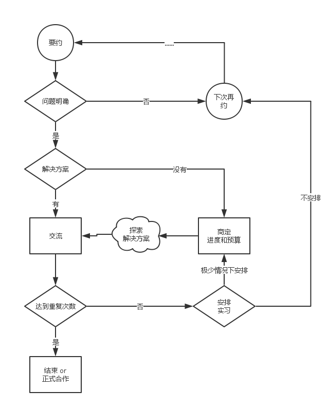

##时间接口
ego模型介绍

最近几年的很少和朋友见面。一个原因是不愿意吃外面东西，更重要的是时间管理上的变化。

而对于了解新接口的朋友，其实时间供应更有保障了。

###时间预约
一提到时间管理，许多人会想到排得满满的时间表。

其实我只记录对外交流时间，对独自工作不做计划。因为按我自己的评价标准，过去最有价值的成就都是不期而至的。在无法预料的时间地点，积累的素材突然联系起来，思路一下子就贯通了。而特意安排的时间收获却越来越少。

为了在状态来临时能立即调出资料、进入沉思，而思考结果要有效地组织起来、投入运用，我决定围绕它的规律重新组织自己。

简而言之，我设计了一套层次化的方法。根据当前状态选择合适的难度，调出较浅一层的资料笔记，细读后做出更深一层的决策。这些决策投入实践后形成新的原始记录，从浅到深推动下一轮迭代。

显然，对外交流只能陈述已有的结果，而不能在交流中强行进入深度思考。为了便于对外交流，我根据以往记录估算了一下时间：每深入一层，适合的时间大概会减到四分之一。也就是说，一个耗时一天的第二层问题，大概会在四天的第一层工作中找到适合它的时间，那就至少要约在五天后讨论结果。如果它是第四层问题，要预留85倍时间（85=64+16+4+1）。

为了保护珍稀时间我把任务划分为四类，设置四个资源池。除非是某个资源池的共享者，调动资源就需要承担成本。它们的时间成本定在1:4:16:64，更详细的信息在[ego模型](https://github.com/hyg/ego/blob/master/ego.com.md)
中。根据这个模型可以合理安排时间和预算。

###交流内容
只有极少数朋友能够联手探索、共同总结，大部分只想听现成的解决方案。  
联手探索的要安排实践时间；其他的可以直接探讨方案，只是要稍微注意下效率。

为什么要注意效率呢，因为常识能解决的就不是问题，所谓问题，就是按习惯去处理会搞砸。而扭转习惯需要一定次数的重复，重复就涉及效率。

重复次数不到有许多表现。  
懦弱的人会转移话题，然后又再次试探。直接一些的会问：有没有不改这个习惯（or 代价更小）的办法？而最糟糕的是下意识地阻塞信息、剪裁记录，他们既想延续形式上的讨论，又害怕听到解决方案。  
其实每个人的问题都卡在他的极限，背后都是顽固的习惯。重复十次很正常，终生循环也不奇怪，不然怎么叫做极限呢。三五次就突破极限已经十分罕见。

寻找代价更小的方案是人之常情。有的人重复次数少，究其原因是能给定一个合理期限，到期则择优实施。突破极限取决于能否把外界压力传递到自己的行为上。

交流效率，就在于准确地识别对方的状况。  
重复次数未到，增加讨论时间是没用的。如果不及时打住，只会听到越来越可笑的理由。极少数的情况下可以建立实习项目，帮助新手体验改进方案。但既然幻想着代价更小的方案就很难真心参与，最终效果都不理想。

所以，现在我控制方法是这样的：

真正值得交流的难题，大多不会有绝对可靠的理论，连可参考的案例都非常稀缺。这个层次的交流主要是收集第一手的实践记录，使用它们延长自己的知识参照系、从互锁矛盾中理出主次，运用到实战中提高胜率。  
真正的交流只发生在联手探索的朋友之间，他们是不存在重复问题的。

###具体安排
今后大部分时间投入在几个产品上：

* infra：下一代共同体的基础设施，包括协作网络、信任网络、联合提货权。
* PSMD：线下的共同体建模与实施。
* ITW：人机协同能力的实训。
* Case：中药方分享平台。

除了合作方约定会面时见外，都根据当天状况投放。为此我已简化后勤。

每年春秋我会各安排一次封闭交流，与朋友共同整理半年来的收获。有原创模型和第一手实践记录的朋友可以在七月份后通过[俱乐部](https://github.com/hyg/ego/blob/master/club.com.md)报名，使用外来模型遇到困难的可以通过[PSMD项目](https://github.com/xuemen/PSMD/blob/master/com.md)报名。

有问题、有实践、有记录但没时间一起整理的，可以在线交流。在我看来，共同成长仅次于共同成就，是人际关系的基础。

有具体问题、有相关材料的可以在线提出要约，然后按问题类别约定讨论时间。而无法明确提出问题、也没有相关记录的，以后我不安排时间去听了。

以上安排会逐渐转入软件管理。不仅时间管理，收支也会围绕这套方法重新组织。也就是说，各资源池的资源都是收费的，具体方案见各模型文件。